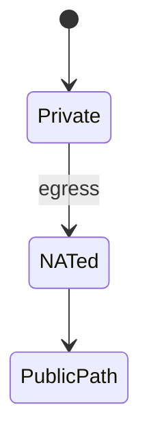
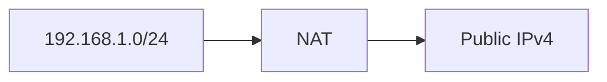

# IPv4

<TopicMeta />

<Prerequisites />

::: tip Published
This page meets the handbook **published** bar: deep explanation, ≥10 common mistakes, and official references. Further engine-level errata welcome via PR.
:::

## Introduction

**IPv4** uses 32-bit addresses (`203.0.113.10`). Public addresses are scarce; **RFC1918 private ranges** plus **NAT** let many devices share one public IP. Most of the web still speaks IPv4.

## Why does it exist?

NAT affects WebRTC, callbacks, and logging. Exhaustion drives CGNAT pain on mobile.

## Historical Background

Classful addressing → CIDR → NAT era → address markets + IPv6 pressure.

## Mental Model

~4.3B addresses; many reserved. Your laptop likely has `192.168.x.x` privately.

## Internal Workflow

1. Assign address/mask.
2. Packet leaves via default gateway.
3. NAT translates private→public at edge.

## Lifecycle



## Browser Perspective

Usually invisible until IPv6-only or WebRTC.

## JavaScript Engine Perspective

Not applicable.

## React Perspective

Not applicable.

## Next.js Perspective

Not applicable.

## Server Perspective

Listen 0.0.0.0 carefully; firewall.

## Network Perspective

CIDR prefixes and routing aggregation.

## Memory Perspective

Not applicable.

## Performance

NAT itself is cheap vs loss; CGNAT carrier issues can break uncommon protocols.

## Production Example

Webhook provider needed public ingress; laptop behind NAT used a tunnel.

## Code Examples

```text
Private: 10.0.0.0/8, 172.16.0.0/12, 192.168.0.0/16
Loopback: 127.0.0.0/8
```

## Diagrams



## Common Mistakes

1. Using public IPs on private nets casually
2. Assuming source IP uniquely identifies a user behind CGNAT
3. Forgetting 127.0.0.1 vs 0.0.0.0 bind meaning
4. Hardcoding Class C mental model
5. Ignoring broadcast domains
6. Treating IP geolocation as precise
7. Overlooking an edge case #1 specific to 02-internet.ipv4 in production traffic
8. Overlooking an edge case #2 specific to 02-internet.ipv4 in production traffic
9. Overlooking an edge case #3 specific to 02-internet.ipv4 in production traffic
10. Overlooking an edge case #4 specific to 02-internet.ipv4 in production traffic


## Best Practices

- Document private ranges in VPC design
- Don’t auth by IP alone

## Anti-patterns

- Exposing RDP/SSH on all 0.0.0.0 without controls

## Comparison

| Feature | IPv4 |
| --- | --- |
| Bits | 32 |
| NAT | Widespread |
| Broadcast | Yes (LAN) |

## Interview Questions

### Easy

**Q:** How many bits in an IPv4 address?

**A:** 32 bits.

### Medium

**Q:** Why is NAT common?

**A:** IPv4 scarcity — many private hosts share scarce public addresses.

### Hard

**Q:** Why is CGNAT hard for peer-to-peer?

**A:** Carrier NAT hides many subscribers behind shared IPs with restrictive mappings, complicating inbound hole punching.

## Summary

- IPv4 is 32-bit and scarce
- Private ranges + NAT dominate LANs
- Don’t treat IP as user identity
- Still the default path for many users

## References

- [RFC 791 — IPv4](https://www.rfc-editor.org/rfc/rfc791)
- [RFC 1918 — Private addresses](https://www.rfc-editor.org/rfc/rfc1918)

<RelatedTopics />


Prev: [`02-internet.ip`](/02-internet/ip/) · Next: [`02-internet.ipv6`](/02-internet/ipv6/)
