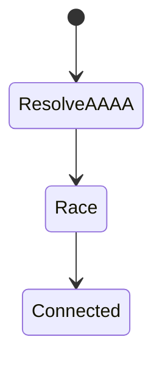
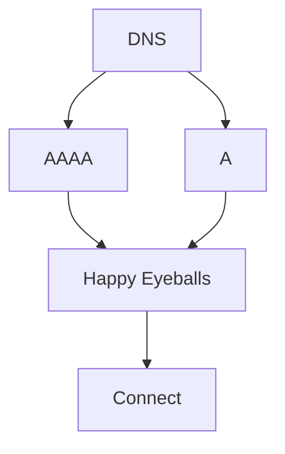

# IPv6

<TopicMeta />

<Prerequisites />

::: tip Published
This page meets the handbook **published** bar: deep explanation, ≥10 common mistakes, and official references. Further engine-level errata welcome via PR.
:::

## Introduction

**IPv6** uses 128-bit addresses to restore end-to-end addressing at Internet scale. Browsers use **Happy Eyeballs** to race IPv6/IPv4 connections so broken v6 paths don’t brick the web.

## Why does it exist?

Some networks are IPv6-first. Dual-stack misconfig (AAAA published but blackholed) causes mysterious timeouts if Happy Eyeballs fails or is slow.

## Historical Background

Designed in the 1990s; deployment accelerated with mobile operators and hyperscalers.

## Mental Model

Huge address space; notation with hextets and `::` compression. Often SLAAC/DHCPv6 at edges.

## Internal Workflow

1. DNS AAAA lookup.
2. Client may attempt v6 and v4 in parallel (Happy Eyeballs).
3. First successful connect wins.

## Lifecycle



## Browser Perspective

Happy Eyeballs v2 algorithms reduce v6 pain.

## JavaScript Engine Perspective

Not applicable.

## React Perspective

Not applicable.

## Next.js Perspective

Not applicable.

## Server Perspective

Serve dual-stack; test AAAA reachability.

## Network Perspective

Security groups must allow v6; logs should store v6.

## Memory Perspective

Not applicable.

## Performance

Broken AAAA is worse than no AAAA. Monitor v6 success ratios.

## Production Example

Published AAAA to wrong LB → 5s timeouts for v6-preferring clients. Removed AAAA until fixed.

## Code Examples

```bash
dig AAAA example.com +short
curl -6 -vI https://example.com
```

## Diagrams



## Common Mistakes

1. Publishing AAAA without working data plane
2. Firewall only updated for v4
3. Assuming no NAT means no security need
4. UI validators rejecting valid v6 literals
5. Forgetting scoped link-local addresses
6. Logging pipelines dropping v6
7. Overlooking an edge case #1 specific to 02-internet.ipv6 in production traffic
8. Overlooking an edge case #2 specific to 02-internet.ipv6 in production traffic
9. Overlooking an edge case #3 specific to 02-internet.ipv6 in production traffic
10. Overlooking an edge case #4 specific to 02-internet.ipv6 in production traffic


## Best Practices

- Dual-stack test in CI/synthetic
- Only publish working AAAA
- Support v6 in ACL/CDN config

## Anti-patterns

- IPv6 as checkbox without monitoring

## Comparison

| | IPv4 | IPv6 |
| --- | --- | --- |
| Length | 32-bit | 128-bit |
| NAT | Common | Uncommon |
| Fragmentation | Host/router history | Mostly end hosts |

## Interview Questions

### Easy

**Q:** How long is an IPv6 address?

**A:** 128 bits.

### Medium

**Q:** What is Happy Eyeballs?

**A:** A client algorithm that races IPv6 and IPv4 connection attempts to improve user-visible success/latency.

### Hard

**Q:** Why can adding AAAA regress availability?

**A:** If IPv6 routing is broken, clients may wait on failing v6 attempts before falling back — perceived outage.

## Summary

- IPv6 provides vast addressing
- Dual-stack is the pragmatic mode
- Don’t publish broken AAAA
- Browsers race v4/v6

## References

- [RFC 8200 — IPv6](https://www.rfc-editor.org/rfc/rfc8200)
- [RFC 8305 — Happy Eyeballs v2](https://www.rfc-editor.org/rfc/rfc8305)

<RelatedTopics />


Prev: [`02-internet.ipv4`](/02-internet/ipv4/) · Next: [`02-internet.tcp`](/02-internet/tcp/)
