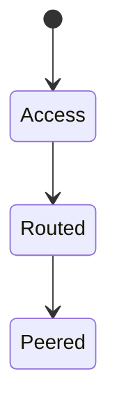

# ISP

<TopicMeta />

<Prerequisites />

::: tip Published
This page meets the handbook **published** bar: deep explanation, ≥10 common mistakes, and official references. Further engine-level errata welcome via PR.
:::

## Introduction

An **ISP** provides Internet access — last-mile connectivity, public IPs or CGNAT, and routing toward the rest of the Internet via peering/transit. Your users’ latency and packet loss often start at their ISP.

## Why does it exist?

RUM regional differences frequently map to ISP quality, peering disputes, or congested last miles — not your React code.

## Historical Background

Dial-up ISPs → broadband → mobile carriers as ISPs → zero-rating and middlebox era.

## Mental Model

Home router → ISP access network → ISP backbone → peering/IXP/transit → destination AS.

## Internal Workflow

1. Customer modem authenticates.
2. ISP assigns address/prefix.
3. Traffic routed per ISP policies.
4. Interconnects hand off to other networks.

## Lifecycle



## Browser Perspective

Captive portals hijack HTTP until login.

## JavaScript Engine Perspective

Not applicable.

## React Perspective

Not applicable.

## Next.js Perspective

Not applicable.

## Server Perspective

Not applicable.

## Network Perspective

Peering quality can beat raw distance. Bad peering ⇒ high latency to a “nearby” CDN.

## Memory Perspective

Not applicable.

## Performance

Measure per-ASN if possible; don’t only average globally.

## Production Example

Checkout failures spiked on one mobile carrier; MTU/ICMP blackhole; fixed with MSS clamping awareness.

## Code Examples

```bash
# See your public IP as ISP presents it
curl https://api.ipify.org
```

## Diagrams


## Common Mistakes

1. Blaming origin for ISP packet loss
2. Ignoring CGNAT issues for peer-to-peer
3. Assuming all users have symmetric fiber
4. Forgetting captive portals
5. Using only wired-office metrics
6. Equating VPN path with normal ISP path
7. Overlooking an edge case #1 specific to 02-internet.isp in production traffic
8. Overlooking an edge case #2 specific to 02-internet.isp in production traffic
9. Overlooking an edge case #3 specific to 02-internet.isp in production traffic
10. Overlooking an edge case #4 specific to 02-internet.isp in production traffic


## Best Practices

- RUM by geography/ASN
- Tolerant timeouts
- Test on real mobile networks

## Anti-patterns

- Design requiring <20ms RTT for correctness

## Comparison

| Access | Typical traits |
| --- | --- |
| Fiber | Low loss, low latency |
| Cable | Shared segment congestion |
| Mobile | Variable RTT, radio states |

## Interview Questions

### Easy

**Q:** What does an ISP do?

**A:** Provides customer access to the Internet and routes their traffic to other networks.

### Medium

**Q:** Why can two users in one city see different latency to your site?

**A:** Different ISPs, peering paths, and congestion — not just physical distance.

### Hard

**Q:** How can peering disputes affect your frontend?

**A:** Traffic may detour through congested transit, raising TTFB/asset load times even if your origin is healthy.

## Summary

- ISPs connect users to the Internet
- Peering shapes latency
- Mobile last miles vary wildly
- Measure beyond averages

## References

- [RFC 4271 — BGP](https://www.rfc-editor.org/rfc/rfc4271)
- [Cloudflare Learning — What is an ISP](https://www.cloudflare.com/learning/dns/glossary/internet-service-provider-isp/)

<RelatedTopics />


Prev: [`02-internet.server`](/02-internet/server/) · Next: [`02-internet.router`](/02-internet/router/)
