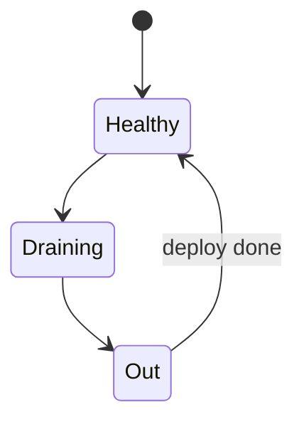
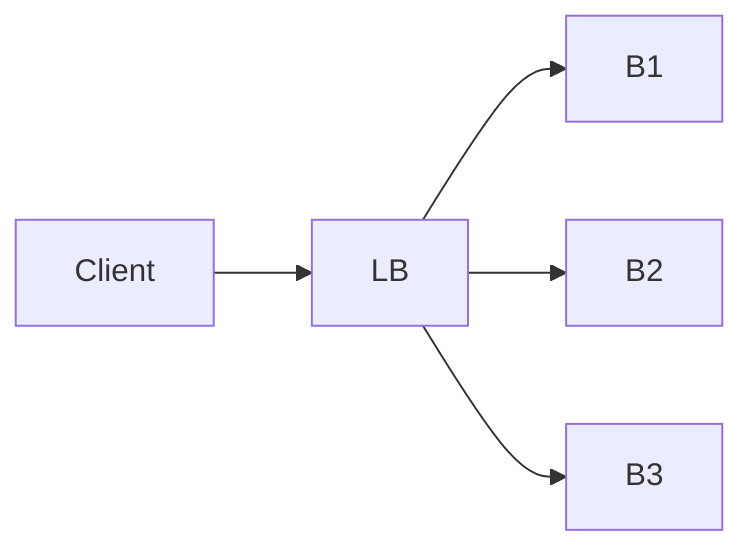

# Load Balancing Basics

<TopicMeta />

<Prerequisites />

::: tip Published
This page meets the handbook **published** bar: deep explanation, ≥10 common mistakes, and official references. Further engine-level errata welcome via PR.
:::

## Introduction

A **load balancer (LB)** distributes traffic across multiple backends for scale and availability. L4 balances connections/packets; L7 balances HTTP requests with routing/sticky sessions/WAF features.

## Why does it exist?

One server fails or saturates. LBs + health checks make horizontal scale practical.

## Historical Background

Hardware ADC appliances → cloud LBs → service meshes / API gateways.

## Mental Model

Clients see one VIP/name; LB picks a healthy instance by algorithm (round robin, least conn, consistent hash).

## Internal Workflow

1. Health checks mark targets.
2. Client connects to LB.
3. LB selects backend; proxies.
4. On failure, retry/another target (carefully).

## Lifecycle



## Browser Perspective

Usually unaware; retries may double POSTs — design idempotency.

## JavaScript Engine Perspective

Not applicable.

## React Perspective

Not applicable.

## Next.js Perspective

Platform LBs front Node/Edge instances.

## Server Perspective

Stateless apps + external session store beat sticky sessions when possible.

## Network Perspective

LB terminates TCP/TLS often; backends may see LB as connection peer.

## Memory Perspective

Not applicable.

## Performance

Cross-zone latency, TLS offload CPU, and unhealthy flap cause incidents.

## Production Example

Rolling deploy without drain caused 5% error spikes; added connection draining.

## Code Examples

```text
# Conceptual nginx upstream
upstream api { server 10.0.0.1; server 10.0.0.2; }
```

## Diagrams



## Common Mistakes

1. Sticky sessions as the only scalability plan
2. Health checks too shallow (200 on / but DB dead)
3. Retry storms amplifying outages
4. Uneven load from poor hashing
5. Idle timeout mismatches
6. Assuming LB provides authz
7. Overlooking an edge case #1 specific to 02-internet.load-balancing-basics in production traffic
8. Overlooking an edge case #2 specific to 02-internet.load-balancing-basics in production traffic
9. Overlooking an edge case #3 specific to 02-internet.load-balancing-basics in production traffic
10. Overlooking an edge case #4 specific to 02-internet.load-balancing-basics in production traffic


## Best Practices

- Deep health checks
- Graceful drain
- Idempotent APIs
- Prefer stateless compute

## Anti-patterns

- All retries with zero jitter at every proxy hop

## Comparison

| Layer | Balances |
| --- | --- |
| L4 | Connections/packets |
| L7 | HTTP requests/paths |

## Interview Questions

### Easy

**Q:** Why use a load balancer?

**A:** To spread traffic across instances for scale and high availability.

### Medium

**Q:** L4 vs L7 load balancing?

**A:** L4 routes by IP/port/connection; L7 understands HTTP and can route by path/host/headers.

### Hard

**Q:** How can retries + LB cause outages?

**A:** Synchronized client/proxy retries multiply load on recovering backends (retry storm). Use budgets, jitter, and idempotency.

## Summary

- LBs distribute traffic to healthy backends
- L4 vs L7 capabilities differ
- Draining and health checks are critical
- Stateless + idempotency beat sticky hacks

## References

- [AWS — Elastic Load Balancing concepts](https://docs.aws.amazon.com/elasticloadbalancing/latest/userguide/how-elastic-load-balancing-works.html)
- [NGINX load balancing](https://docs.nginx.com/nginx/admin-guide/load-balancer/http-load-balancer/)

<RelatedTopics />


Prev: [`02-internet.cdn-basics`](/02-internet/cdn-basics/)
