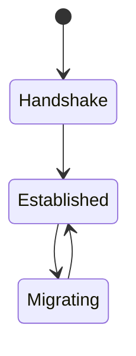
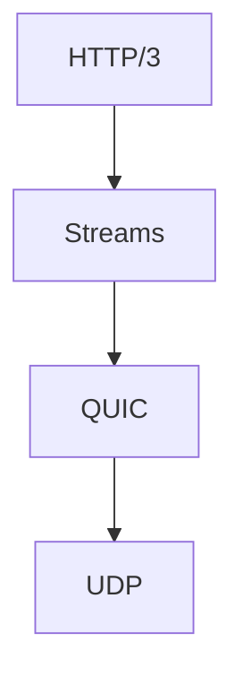

# QUIC

<TopicMeta />

<Prerequisites />

::: tip Published
This page meets the handbook **published** bar: deep explanation, ≥10 common mistakes, and official references. Further engine-level errata welcome via PR.
:::

## Introduction

**QUIC** is a UDP-based transport integrating TLS 1.3-equivalent cryptography, multiplexed streams, improved loss recovery, and connection migration via connection IDs. **HTTP/3** is the HTTP mapping onto QUIC.

## Why does it exist?

Fixes TCP+TLS historical layering costs and TCP HOL for multiplexed apps.

## Historical Background

Google’s gQUIC → IETF QUIC (RFC 9000 family).

## Mental Model

TLS-shaped security + TCP-shaped reliability, built fresh on UDP with streams as first-class citizens.

## Internal Workflow

1. ClientHello-equivalent in QUIC Initial packets.
2. Keys derived; 1-RTT (or 0-RTT) data.
3. Streams carry HTTP/3 frames.
4. Path change → connection ID keeps logical conn.

## Lifecycle



## Browser Perspective

Implemented inside browser/network stack; not a JS API.

## JavaScript Engine Perspective

Not applicable.

## React Perspective

Not applicable.

## Next.js Perspective

Not applicable.

## Server Perspective

Usually enable at edge; kernel UDP tuning may matter at origin scale.

## Network Perspective

Operators see UDP; ossification avoided by encrypting most of the header surface.

## Memory Perspective

Not applicable.

## Performance

Faster handshake; better under loss; CPU costs differ from TCP offload — measure.

## Production Example

Mobile users switching networks kept streams alive longer with H3/QUIC at CDN — fewer replay storms after resume.

## Code Examples

```bash
# Feature detection via curl / browser protocol column
curl -I --http3 https://cloudflare.com
```

## Diagrams



## Common Mistakes

1. Implementing DIY QUIC in app JS
2. Forgetting fallback
3. Equating QUIC with unreliable UDP semantics for apps (QUIC is reliable for streams)
4. Ignoring amplification/DoS concerns when self-hosting
5. Assuming 0-RTT is always safe
6. Confusing gQUIC with IETF QUIC
7. Overlooking an edge case #1 specific to 02-internet.quic in production traffic
8. Overlooking an edge case #2 specific to 02-internet.quic in production traffic
9. Overlooking an edge case #3 specific to 02-internet.quic in production traffic
10. Overlooking an edge case #4 specific to 02-internet.quic in production traffic


## Best Practices

- Prefer vendor implementations/CDNs
- Monitor UDP success
- Treat 0-RTT carefully

## Anti-patterns

- Requiring QUIC with no fallback

## Comparison

| Feature | TCP+TLS | QUIC |
| --- | --- | --- |
| Layering | Separate | Integrated |
| Streams | Via H2 on one TCP | Native |
| Migration | Poor | Designed-in |

## Interview Questions

### Easy

**Q:** What is QUIC?

**A:** A modern reliable encrypted transport protocol over UDP used by HTTP/3.

### Medium

**Q:** Name two QUIC advantages over TCP+TLS.

**A:** Faster combined handshake and no TCP HOL blocking across streams; connection migration.

### Hard

**Q:** Why encrypt so much of QUIC?

**A:** To prevent middlebox ossification that froze TCP extensions — intermediaries can’t meddle with what they can’t see.

## Summary

- QUIC = encrypted multiplexed UDP transport
- HTTP/3 rides on QUIC
- Migration + less HOL
- Fallback still mandatory

## References

- [RFC 9000 — QUIC](https://www.rfc-editor.org/rfc/rfc9000)
- [RFC 9001 — QUIC TLS](https://www.rfc-editor.org/rfc/rfc9001)

<RelatedTopics />


Prev: [`02-internet.http3`](/02-internet/http3/) · Next: [`02-internet.cookies`](/02-internet/cookies/)
