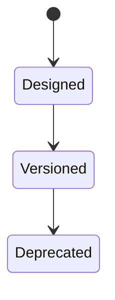

# REST

<TopicMeta />

<Prerequisites />

::: tip Published
This page meets the handbook **published** bar: deep explanation, ≥10 common mistakes, and official references. Further engine-level errata welcome via PR.
:::

## Introduction

**REST** (Representational State Transfer) is an architectural style for networked resources — in practice, most “REST APIs” are **HTTP JSON APIs** using resource URLs and methods. True REST constraints (hypermedia) are rarer; still, resource-oriented design beats ad-hoc RPC soup.

## Why does it exist?

Shared conventions help caching, auth, and client generation. Frontends consume these APIs daily.

## Historical Background

Roy Fielding’s dissertation → Rails-era REST popularity → GraphQL/gRPC alternatives.

## Mental Model

Nouns as URLs (`/orders/42`); verbs as HTTP methods; representations as JSON; status codes as outcomes.

## Internal Workflow

1. Identify resources.
2. Map methods (GET read, POST create, PATCH update…).
3. Return proper statuses & error shape.
4. Document pagination/filtering.

## Lifecycle



## Browser Perspective

CORS + credentials interact with REST APIs on other origins.

## JavaScript Engine Perspective

Not applicable.

## React Perspective

TanStack Query etc. map cleanly to GET/mutation methods.

## Next.js Perspective

Not applicable.

## Server Perspective

Idempotency keys for payments-like POSTs.

## Network Perspective

GET cacheability is a superpower when used correctly.

## Memory Perspective

Not applicable.

## Performance

Chatty fine-grained resources hurt mobile; design aggregates or BFF when needed.

## Production Example

Mobile app made 40 GETs per screen; introduced BFF aggregate endpoint — 40→3.

## Code Examples

```http
GET /api/orders/42 HTTP/1.1
Accept: application/json

HTTP/1.1 200 OK
ETag: "v3"
Content-Type: application/json

{"id":42,"status":"paid"}
```

## Diagrams


## Common Mistakes

1. POST-only RPC styled as REST
2. 200 OK for errors
3. Uncacheable GETs that should be cacheable
4. Breaking changes without versioning strategy
5. Leaking internal IDs/PII excessively
6. No pagination on lists
7. Overlooking an edge case #1 specific to 02-internet.rest in production traffic
8. Overlooking an edge case #2 specific to 02-internet.rest in production traffic
9. Overlooking an edge case #3 specific to 02-internet.rest in production traffic
10. Overlooking an edge case #4 specific to 02-internet.rest in production traffic


## Best Practices

- Consistent error envelope
- Pagination & filtering
- Correct methods/statuses
- ETags when useful

## Anti-patterns

- Infinite nested resources `/a/1/b/2/c/3/d`

## Comparison

| Style | Strength |
| --- | --- |
| REST/HTTP JSON | Caching, simplicity, ubiquity |
| GraphQL | Client-specified graphs |
| RPC/gRPC | Efficient typed contracts |

## Interview Questions

### Easy

**Q:** What does a REST API typically look like on the web?

**A:** Resource URLs over HTTP with JSON representations and standard methods/status codes.

### Medium

**Q:** Why is GET cacheable more often than POST?

**A:** GET is safe/idempotent in semantics; caches and CDNs can reuse responses when headers allow.

### Hard

**Q:** How do you evolve a public REST API safely?

**A:** Additive changes first, explicit versioning or compatible media types, deprecation windows, and contract tests.

## Summary

- Practical REST = resourceful HTTP JSON
- Methods and status codes matter
- Caching is a feature
- Avoid chatty mobile waterfalls

## References

- [Fielding dissertation — REST](https://ics.uci.edu/~fielding/pubs/dissertation/rest_arch_style.htm)
- [RFC 9110 — HTTP Semantics](https://www.rfc-editor.org/rfc/rfc9110)

<RelatedTopics />


Prev: [`02-internet.authorization`](/02-internet/authorization/) · Next: [`02-internet.graphql`](/02-internet/graphql/)
