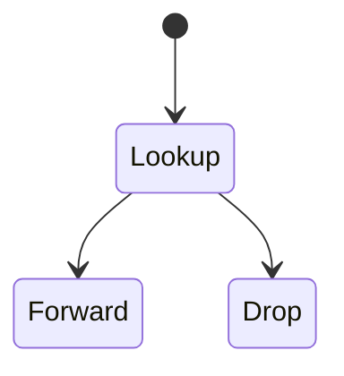

# Router

<TopicMeta />

<Prerequisites />

::: tip Published
This page meets the handbook **published** bar: deep explanation, ≥10 common mistakes, and official references. Further engine-level errata welcome via PR.
:::

## Introduction

A **router** forwards IP packets between networks based on destination IP and routing tables (often learned via BGP/OSPF). Home “Wi-Fi routers” combine routing, NAT, firewall, and AP functions.

## Why does it exist?

Understanding hops explains traceroute, MTU issues, and why “the server is up” can still be unreachable from some networks.

## Historical Background

Early IMPs → dedicated routers → software routers / cloud VPCs / virtual gateways.

## Mental Model

Packet arrives → decrement TTL → lookup longest-prefix match → send out next interface. If TTL hits 0, drop + optional ICMP.

## Internal Workflow

1. Receive frame/packet.
2. Parse IP destination.
3. Lookup route.
4. Forward or drop/NAT.

## Lifecycle



## Browser Perspective

Browser only sees failures as timeouts/errors — traceroute is for humans.

## JavaScript Engine Perspective

Not applicable.

## React Perspective

Not applicable.

## Next.js Perspective

Not applicable.

## Server Perspective

Not applicable.

## Network Perspective

Core topic. NAT rewrites addresses at edge routers/gateways.

## Memory Perspective

Not applicable.

## Performance

Each hop adds serialization/queue delay. Bufferbloat inflates latency under load.

## Production Example

Asymmetric routes broke stateful firewalls for webhooks; fixed routing symmetry.

## Code Examples

```bash
traceroute -n example.com
```

## Diagrams


## Common Mistakes

1. Confusing switch (L2) with router (L3)
2. Ignoring TTL expired in traces
3. Assuming ICMP always allowed
4. Forgetting NAT hairpin behaviors
5. Equating Wi-Fi AP with routing logic only
6. Thinking routers understand HTTP
7. Overlooking an edge case #1 specific to 02-internet.router in production traffic
8. Overlooking an edge case #2 specific to 02-internet.router in production traffic
9. Overlooking an edge case #3 specific to 02-internet.router in production traffic
10. Overlooking an edge case #4 specific to 02-internet.router in production traffic


## Best Practices

- Use traceroute/MTR for path issues
- Mind MTU/MSS for tunnels/VPN

## Anti-patterns

- Blocking all ICMP (breaks PMTU discovery)

## Comparison

| Device | Layer | Job |
| --- | --- | --- |
| Switch | L2 | Forward frames by MAC |
| Router | L3 | Forward packets by IP |
| LB | L4/L7 | Distribute connections/requests |

## Interview Questions

### Easy

**Q:** What does a router do?

**A:** Forwards IP packets between networks using routing tables.

### Medium

**Q:** What does traceroute show?

**A:** The IP hops that returned ICMP time-exceeded (when not blocked) toward a destination.

### Hard

**Q:** How does NAT on a home router affect servers you host?

**A:** Inbound connections need port forwarding or hole punching; many carrier CGNATs block unsolicited inbound entirely.

## Summary

- Routers forward by IP
- TTL limits loops
- Home gateways also NAT
- Path issues ≠ app bugs

## References

- [RFC 1812 — Router requirements](https://www.rfc-editor.org/rfc/rfc1812)
- [MDN — Router (glossary)](https://developer.mozilla.org/en-US/docs/Glossary/Router)

<RelatedTopics />


Prev: [`02-internet.isp`](/02-internet/isp/) · Next: [`02-internet.switch`](/02-internet/switch/)
