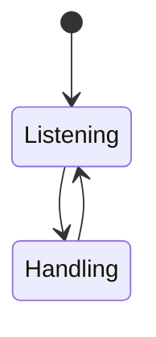
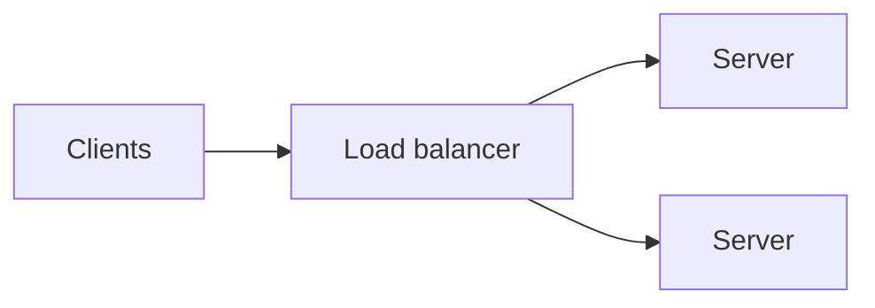

# Server

<TopicMeta />

<Prerequisites />

::: tip Published
This page meets the handbook **published** bar: deep explanation, ≥10 common mistakes, and official references. Further engine-level errata welcome via PR.
:::

## Introduction

A **server** accepts connections and provides resources or API responses. On the web, the **origin** (scheme + host + port) identifies a server-side authority the browser trusts for cookies and SOP.

## Why does it exist?

Frontends depend on server latency, TLS, caching headers, and correctness. SSR/edge blur “server” location but not responsibility.

## Historical Background

Dedicated machines → virtual hosts → containers → serverless/edge isolates.

## Mental Model

Listen on IP:port → accept → speak protocol (HTTP) → respond → release. Load balancers multiply servers behind one name.

## Internal Workflow

1. Bind/listen.
2. TLS handshake if HTTPS.
3. Parse request; authZ; business logic.
4. Respond with status/headers/body.

## Lifecycle



## Browser Perspective

Browser only sees the origin you exposed.

## JavaScript Engine Perspective

Not applicable.

## React Perspective

Not applicable.

## Next.js Perspective

Route Handlers / Server Components run in server runtimes.

## Server Perspective

Horizontal scale, health checks, graceful drain.

## Network Perspective

Anycast/DNS may steer to nearest POP.

## Memory Perspective

Not applicable.

## Performance

TTFB, fan-out, and cold starts dominate UX more than micro-optimizing React sometimes.

## Production Example

Origin overload during sale; CDN cache + read replicas + queue checkout writes.

## Code Examples

```http
HTTP/1.1 200 OK
Content-Type: application/json
Cache-Control: private, no-store
```

## Diagrams



## Common Mistakes

1. Single origin without redundancy
2. No timeouts on outbound server fetches
3. Mixing cacheable and private data headers
4. Assuming edge equals strong consistency
5. Exposing admin ports
6. Blocking event loop on server JS
7. Overlooking an edge case #1 specific to 02-internet.server in production traffic
8. Overlooking an edge case #2 specific to 02-internet.server in production traffic
9. Overlooking an edge case #3 specific to 02-internet.server in production traffic
10. Overlooking an edge case #4 specific to 02-internet.server in production traffic


## Best Practices

- Health checks + graceful shutdown
- Explicit cache headers
- Structured timeouts

## Anti-patterns

- Infinite server-side request chains without budgets

## Comparison

| Role | Example |
| --- | --- |
| Origin | Your API |
| Edge | CDN/worker |
| Reverse proxy | nginx/Envoy |

## Interview Questions

### Easy

**Q:** What is a server?

**A:** A program that accepts network requests and responds with data or actions.

### Medium

**Q:** What is an origin?

**A:** scheme + host + port tuple that browsers use for security boundaries.

### Hard

**Q:** How do you scale a web server tier?

**A:** Stateless app servers behind LB, externalize session/state, cache aggressively, autoscale on saturation metrics.

## Summary

- Servers accept and respond
- Origins define browser trust boundaries
- Scale with LB + statelessness
- Headers are part of the contract

## References

- [RFC 9110 — HTTP Semantics](https://www.rfc-editor.org/rfc/rfc9110)
- [MDN — Origin](https://developer.mozilla.org/en-US/docs/Glossary/Origin)

<RelatedTopics />


Prev: [`02-internet.client`](/02-internet/client/) · Next: [`02-internet.isp`](/02-internet/isp/)
