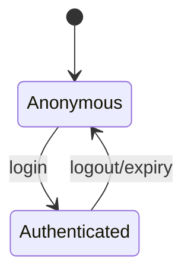
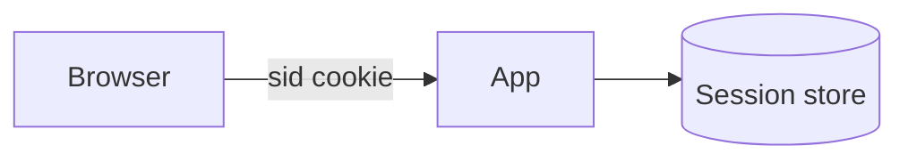

# Sessions

<TopicMeta />

<Prerequisites />

::: tip Published
This page meets the handbook **published** bar: deep explanation, ≥10 common mistakes, and official references. Further engine-level errata welcome via PR.
:::

## Introduction

A **session** associates a sequence of requests with server-side state (user id, cart, auth). Typically the browser holds a **session ID cookie**; the server stores session data in memory/Redis/DB. Alternatives: fully self-contained tokens (JWT) with different trade-offs.

## Why does it exist?

HTTP is stateless. Sessions recreate continuity for logged-in UX.

## Historical Background

Server memory sessions → sticky LBs → shared Redis sessions → token-centric APIs.

## Mental Model

Cookie carries opaque ID → server lookup → state. Invalidate ID ⇒ logout everywhere that ID is rejected.

## Internal Workflow

1. Login succeeds.
2. Create session record; set cookie.
3. Each request loads session by ID.
4. Logout/expiry deletes or invalidates.

## Lifecycle



## Browser Perspective

Cookie lifetime vs sliding expiration UX.

## JavaScript Engine Perspective

Not applicable.

## React Perspective

Not applicable.

## Next.js Perspective

Iron-session / Auth.js patterns common.

## Server Perspective

Store sessions off the app box for horizontal scale.

## Network Perspective

Always Secure cookies on HTTPS.

## Memory Perspective

Not applicable.

## Performance

Session store latency adds to TTFB; cache hot sessions; avoid giant session blobs.

## Production Example

Sessions in process memory + multiple instances ⇒ random logouts. Moved to Redis.

## Code Examples

```http
Set-Cookie: sid=…; HttpOnly; Secure; SameSite=Lax; Path=/
```

## Diagrams



## Common Mistakes

1. In-memory sessions with multiple servers
2. Predictable session IDs
3. No expiry/rotation
4. Storing secrets in the cookie client-side
5. Session fixation (not renewing ID at login)
6. Infinite idle lifetime
7. Overlooking an edge case #1 specific to 02-internet.sessions in production traffic
8. Overlooking an edge case #2 specific to 02-internet.sessions in production traffic
9. Overlooking an edge case #3 specific to 02-internet.sessions in production traffic
10. Overlooking an edge case #4 specific to 02-internet.sessions in production traffic


## Best Practices

- Regenerate ID on login
- Shared store + TTL
- Rotate & revoke
- Minimal session payload

## Anti-patterns

- Encoded JWT “sessions” that can’t be revoked without extra infra, used as if revocable

## Comparison

| Approach | Revocation | Size on wire |
| --- | --- | --- |
| Server session ID | Easy | Tiny cookie |
| Stateless JWT | Harder | Larger token |

## Interview Questions

### Easy

**Q:** How do HTTP sessions usually work?

**A:** Server stores state keyed by an ID; browser sends the ID (usually a cookie) each request.

### Medium

**Q:** Why is session fixation dangerous?

**A:** If the session ID before login continues after login, an attacker who planted the ID can hijack the authenticated session.

### Hard

**Q:** Sticky load balancing vs shared session store?

**A:** Sticky keeps a user on one instance (fragile); shared store allows any instance to serve any user and supports graceful deploys.

## Summary

- Sessions rehydrate state onto HTTP
- Opaque IDs + server store are classic
- Scale with shared storage
- Rotate on login; expire aggressively enough

## References

- [OWASP Session Management Cheat Sheet](https://cheatsheetseries.owasp.org/cheatsheets/Session_Management_Cheat_Sheet.html)
- [MDN — Sessions](https://developer.mozilla.org/en-US/docs/Web/HTTP/Guides/Session)

<RelatedTopics />


Prev: [`02-internet.cookies`](/02-internet/cookies/) · Next: [`02-internet.authentication`](/02-internet/authentication/)
