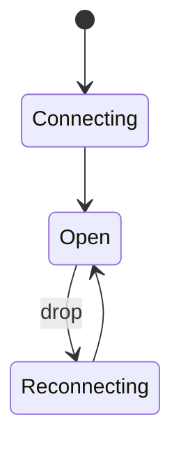
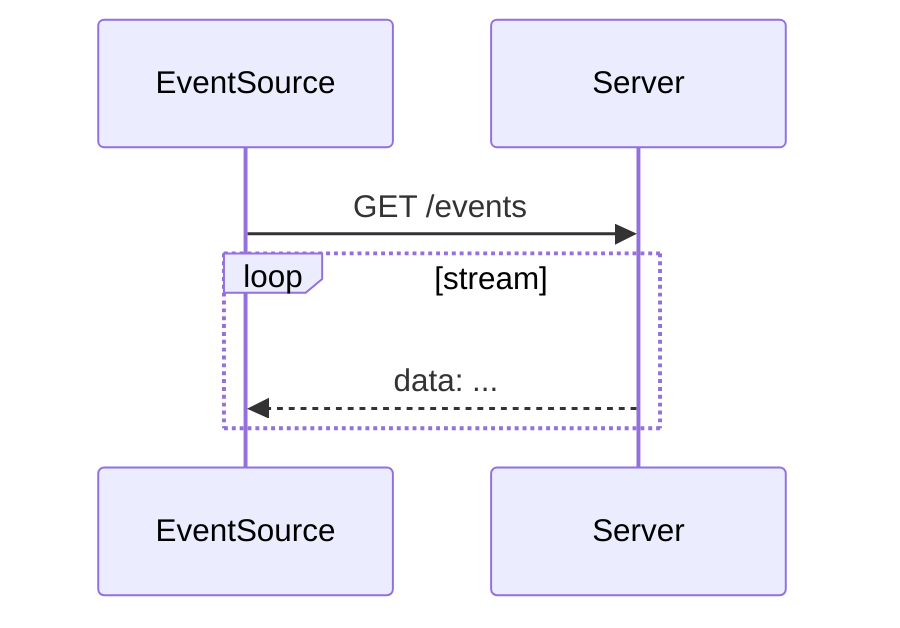

# Server-Sent Events

<TopicMeta />

<Prerequisites />

::: tip Published
This page meets the handbook **published** bar: deep explanation, ≥10 common mistakes, and official references. Further engine-level errata welcome via PR.
:::

## Introduction

**Server-Sent Events (SSE)** stream text events from server to browser over a long-lived HTTP response (`text/event-stream`). The browser `EventSource` API auto-reconnects. Ideal for one-way updates (feeds, progress, notifications).

## Why does it exist?

Simpler than WebSockets when the client mostly listens. Works through many HTTP infrastructures more easily.

## Historical Background

Part of HTML capability set; competed with Comet; still excellent for many push cases.

## Mental Model

Client opens GET; server keeps response open and writes `event:`/`data:` frames; client parses; on drop, reconnect with `Last-Event-ID`.

## Internal Workflow

1. `new EventSource(url)`.
2. Server responds 200 + `Content-Type: text/event-stream`.
3. Emit events.
4. Auto-reconnect on network blip.

## Lifecycle



## Browser Perspective

EventSource is GET + credentials rules; no custom headers in the classic API — auth often cookies.

## JavaScript Engine Perspective

Not applicable.

## React Perspective

Subscribe in useEffect; close on cleanup.

## Next.js Perspective

Not applicable.

## Server Perspective

One concurrent connection per tab; scale with care.

## Network Perspective

Proxies must not buffer forever; flush events; watch timeouts.

## Memory Perspective

Not applicable.

## Performance

Lighter than polling; still connection limits (HTTP/1.1 ~6/origin) — H2 helps.

## Production Example

Progress UI used SSE behind nginx without `X-Accel-Buffering: no` — events arrived in bursts. Disabled buffering.

## Code Examples

```js
const es = new EventSource('/events', { withCredentials: true })
es.onmessage = (e) => console.log(e.data)
// server frames:
// data: {"progress":40}
//
```

## Diagrams



## Common Mistakes

1. Needing binary/bidirectional but choosing SSE
2. Proxy buffering breaking realtime
3. Forgetting Last-Event-ID handling server-side
4. Custom Authorization headers with EventSource (not supported)
5. Not closing EventSource on route change
6. Using SSE on HTTP/1.1 with many parallel streams per origin
7. Overlooking an edge case #1 specific to 02-internet.sse in production traffic
8. Overlooking an edge case #2 specific to 02-internet.sse in production traffic
9. Overlooking an edge case #3 specific to 02-internet.sse in production traffic
10. Overlooking an edge case #4 specific to 02-internet.sse in production traffic


## Best Practices

- Disable proxy buffering
- Idempotent event IDs
- Cookie auth or fetch-stream alternatives when headers needed
- Cleanup in UI

## Anti-patterns

- SSE for high-frequency binary market data without profiling (WebSocket/WebTransport may fit better)

## Comparison

| | SSE | WebSocket |
| --- | --- | --- |
| Direction | Server→client | Bidirectional |
| Protocol | HTTP | Upgraded socket |
| Reconnect | Built-in | DIY |

## Interview Questions

### Easy

**Q:** What do Server-Sent Events provide?

**A:** A one-way server-to-client event stream over HTTP with browser auto-reconnect.

### Medium

**Q:** Limitation of EventSource?

**A:** Typically GET-only and cannot set arbitrary headers; auth often relies on cookies.

### Hard

**Q:** How do you resume after disconnect?

**A:** Server sends `id:` per event; browser resends `Last-Event-ID` on reconnect; server continues the stream.

## Summary

- SSE = one-way HTTP event stream
- EventSource auto-reconnects
- Watch proxies and auth constraints
- Prefer over WS when uni-directional is enough

## References

- [HTML Standard — Server-sent events](https://html.spec.whatwg.org/multipage/server-sent-events.html)
- [MDN — EventSource](https://developer.mozilla.org/en-US/docs/Web/API/EventSource)

<RelatedTopics />


Prev: [`02-internet.websocket`](/02-internet/websocket/) · Next: [`02-internet.http2`](/02-internet/http2/)
