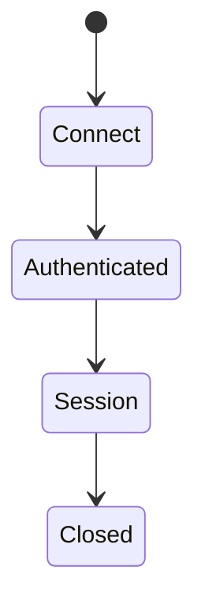
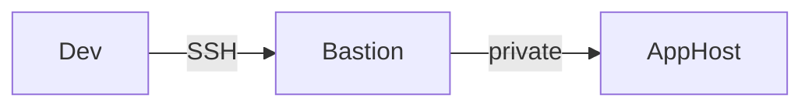

# SSH

<TopicMeta />

<Prerequisites />

::: tip Published
This page meets the handbook **published** bar: deep explanation, ≥10 common mistakes, and official references. Further engine-level errata welcome via PR.
:::

## Introduction

**SSH (Secure Shell)** provides encrypted remote login, command execution, and port forwarding. Frontend engineers use it to access jump hosts, tunnel databases, and deploy. It is not a browser protocol.

## Why does it exist?

Production debugging and secure tunnels remain everyday tasks even on “serverless” teams.

## Historical Background

Replaced telnet/rlogin; OpenSSH ubiquitous; keys over passwords.

## Mental Model

TCP to port 22 → key exchange → auth (public key) → interactive shell or forwarded ports.

## Internal Workflow

1. `ssh user@host`.
2. Host key verification.
3. Public-key auth.
4. Session commands / `-L` tunnels.

## Lifecycle



## Browser Perspective

Not applicable inside page JS.

## JavaScript Engine Perspective

Not applicable.

## React Perspective

Not applicable.

## Next.js Perspective

Not applicable.

## Server Perspective

Disable password auth; rotate keys; MFA where possible.

## Network Perspective

Bastion/SSM patterns reduce exposed SSH.

## Memory Perspective

Not applicable.

## Performance

Muxing (`ControlMaster`) speeds repeated deploys.

## Production Example

Devs used shared ec2 passwords; moved to short-lived SSM/OIDC certs.

## Code Examples

```bash
ssh -i ~/.ssh/id_ed25519 user@bastion
ssh -L 5432:db.internal:5432 user@bastion
```

## Diagrams



## Common Mistakes

1. Password auth on the public Internet
2. Disabling host key checks (`StrictHostKeyChecking=no`) habitually
3. Sharing private keys in Slack
4. Exposing port 22 worldwide without allowlists
5. Long-lived agent forwarding carelessly
6. Tunneling production DB and leaving it open
7. Overlooking an edge case #1 specific to 02-internet.ssh in production traffic
8. Overlooking an edge case #2 specific to 02-internet.ssh in production traffic
9. Overlooking an edge case #3 specific to 02-internet.ssh in production traffic
10. Overlooking an edge case #4 specific to 02-internet.ssh in production traffic


## Best Practices

- Ed25519 keys / certificates
- Bastion or SSM
- Least privilege
- Audit access

## Anti-patterns

- Root login with shared key

## Comparison

| | SSH | HTTPS admin UI |
| --- | --- | --- |
| Use | Shell/tunnel | Product access |
| Auth | Keys/certs | App auth |

## Interview Questions

### Easy

**Q:** What is SSH used for?

**A:** Secure remote command execution and tunneling to servers.

### Medium

**Q:** Why prefer key-based auth?

**A:** Stronger credentials, no shared passwords over the wire, easier automation and revocation with good ops.

### Hard

**Q:** How do you avoid inbound SSH exposure in cloud?

**A:** Use SSM/OS Login/IAP bastions with IAM, no public port 22, short-lived credentials, audited sessions.

## Summary

- SSH secures remote admin access
- Keys > passwords
- Tunnels are powerful and risky
- Not a browser protocol

## References

- [RFC 4253 — SSH transport](https://www.rfc-editor.org/rfc/rfc4253)
- [OpenSSH documentation](https://www.openssh.com/manual.html)

<RelatedTopics />


Prev: [`02-internet.tls`](/02-internet/tls/) · Next: [`02-internet.websocket`](/02-internet/websocket/)
