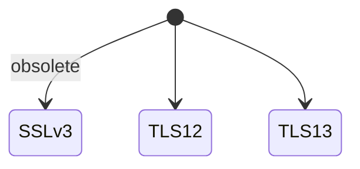
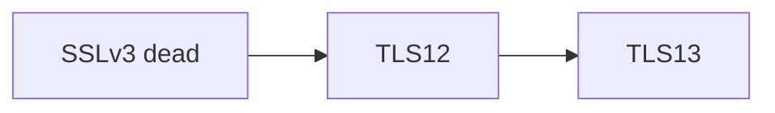

# SSL

<TopicMeta />

<Prerequisites />

::: tip Published
This page meets the handbook **published** bar: deep explanation, ≥10 common mistakes, and official references. Further engine-level errata welcome via PR.
:::

## Introduction

**SSL (Secure Sockets Layer)** is the obsolete predecessor of **TLS**. People still say “SSL certificate” colloquially, but modern stacks negotiate **TLS 1.2/1.3**. Treat “SSL” in docs as historical naming unless you are dealing with legacy config.

## Why does it exist?

Avoid enabling ancient protocols (SSLv3) that are broken (POODLE). Know that vendors misuse the label.

## Historical Background

Netscape SSL → standardized TLS 1.0+ → SSL fully retired.

## Mental Model

SSL ⊂ museum; TLS = what you configure; “SSL cert” = X.509 cert used for TLS.

## Internal Workflow

1. See “SSL” in UI → configure TLS.
2. Disable SSL3/TLS1.0/1.1.
3. Prefer TLS 1.3.

## Lifecycle



## Browser Perspective

Modern browsers removed old SSL/TLS versions.

## JavaScript Engine Perspective

Not applicable.

## React Perspective

Not applicable.

## Next.js Perspective

Not applicable.

## Server Perspective

Cipher suite and min-version config at LB.

## Network Perspective

Protocol version negotiation during handshake.

## Memory Perspective

Not applicable.

## Performance

TLS 1.3 is typically faster (fewer RTTs) than older handshakes.

## Production Example

PCI scan failed due to TLS1.0 still enabled on a forgotten VIP.

## Code Examples

```bash
nmap --script ssl-enum-ciphers -p 443 example.com
```

## Diagrams



## Common Mistakes

1. Enabling SSLv3 for “compatibility”
2. Thinking SSL and TLS are different products you need both of
3. Ignoring deprecation of TLS 1.0/1.1
4. Using outdated cipher suites
5. Confusing certificate file formats with protocol versions
6. Assuming “SSL mode” on CDNs means something other than TLS termination
7. Overlooking an edge case #1 specific to 02-internet.ssl in production traffic
8. Overlooking an edge case #2 specific to 02-internet.ssl in production traffic
9. Overlooking an edge case #3 specific to 02-internet.ssl in production traffic
10. Overlooking an edge case #4 specific to 02-internet.ssl in production traffic


## Best Practices

- Say TLS when precise
- Min version TLS 1.2+
- Prefer TLS 1.3

## Anti-patterns

- Wide open cipher lists “just in case”

## Comparison

| Name | Status |
| --- | --- |
| SSLv3 | Broken/obsolete |
| TLS 1.2 | OK if configured well |
| TLS 1.3 | Preferred |

## Interview Questions

### Easy

**Q:** Is SSL still used?

**A:** The SSL protocols are obsolete; modern HTTPS uses TLS. The name “SSL” often remains colloquially.

### Medium

**Q:** Why was SSLv3 disabled?

**A:** Critical weaknesses such as POODLE made it unsafe.

### Hard

**Q:** How do you audit a site’s TLS posture?

**A:** Check supported protocol versions/ciphers (SSL Labs/testssl/nmap), ensure cert chain validity, HSTS, and no mixed content.

## Summary

- SSL is historical; TLS is current
- Disable ancient protocols
- “SSL cert” means TLS cert in practice
- Prefer TLS 1.3

## References

- [RFC 7568 — Deprecating SSL](https://www.rfc-editor.org/rfc/rfc7568)
- [MDN — TLS](https://developer.mozilla.org/en-US/docs/Glossary/TLS)

<RelatedTopics />


Prev: [`02-internet.https`](/02-internet/https/) · Next: [`02-internet.tls`](/02-internet/tls/)
