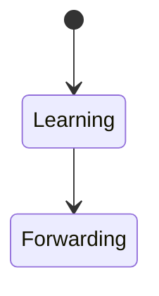
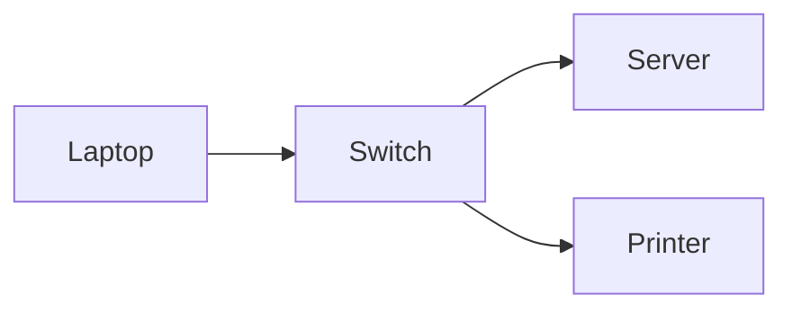

# Switch

<TopicMeta />

<Prerequisites />

::: tip Published
This page meets the handbook **published** bar: deep explanation, ≥10 common mistakes, and official references. Further engine-level errata welcome via PR.
:::

## Introduction

A **switch** interconnects devices on a local network and forwards **Ethernet frames** based on MAC addresses. It does not (usually) inspect IP/HTTP. Frontends rarely configure switches, but LAN vs WAN mental models matter for office/dev setups.

## Why does it exist?

Helps distinguish local delivery from Internet routing — and why localhost/LAN APIs behave differently than public origins.

## Historical Background

Hubs flooded all ports → switches learned MACs → VLANs / data-center fabrics.

## Mental Model

Learn source MAC → port mapping; forward destination MAC to port; flood if unknown; never IP-route.

## Internal Workflow

1. Frame in.
2. Update MAC table.
3. Forward/flood/filter.

## Lifecycle



## Browser Perspective

Same Wi-Fi still different device; CORS still applies to IPs/hosts.

## JavaScript Engine Perspective

Not applicable.

## React Perspective

Not applicable.

## Next.js Perspective

Not applicable.

## Server Perspective

Not applicable.

## Network Perspective

L2 domain size matters for broadcast traffic.

## Memory Perspective

Not applicable.

## Performance

LAN RTT is tiny; don’t use LAN timings as mobile UX estimates.

## Production Example

Devs tested only on LAN against staging; production EU users saw 120ms RTT — missed timeout bugs.

## Code Examples

```bash
# ARP/neighbors — L2 mapping (OS tools vary)
ip neigh
```

## Diagrams



## Common Mistakes

1. Calling every box a switch
2. Expecting switches to load-balance HTTP
3. Confusing VLAN segmentation with auth
4. Assuming MAC equals identity security
5. Using LAN perf as global truth
6. Mixing up hub vs switch
7. Overlooking an edge case #1 specific to 02-internet.switch in production traffic
8. Overlooking an edge case #2 specific to 02-internet.switch in production traffic
9. Overlooking an edge case #3 specific to 02-internet.switch in production traffic
10. Overlooking an edge case #4 specific to 02-internet.switch in production traffic


## Best Practices

- Know L2 vs L3 boundary in your VPC/office
- Test with realistic RTT

## Anti-patterns

- Hardcoding LAN IPs into production builds

## Comparison

| | Switch | Router |
| --- | --- | --- |
| Address | MAC | IP |
| Scope | LAN/VLAN | Between networks |

## Interview Questions

### Easy

**Q:** What address does a switch use to forward?

**A:** MAC addresses in Ethernet frames.

### Medium

**Q:** How is a switch different from a router?

**A:** Switch forwards within L2 networks by MAC; router forwards between L3 networks by IP.

### Hard

**Q:** Why don’t switches make CORS go away on a LAN?

**A:** CORS is a browser security policy based on origins, not on whether packets stayed in one Ethernet segment.

## Summary

- Switches forward frames by MAC
- LAN ≠ Internet performance
- Not an HTTP concept
- Useful for mental layering

## References

- [IEEE 802.1 bridging overview](https://1.ieee802.org/)
- [Cloudflare — What is a network switch](https://www.cloudflare.com/learning/network-layer/what-is-a-network-switch/)

<RelatedTopics />


Prev: [`02-internet.router`](/02-internet/router/) · Next: [`02-internet.dns`](/02-internet/dns/)
