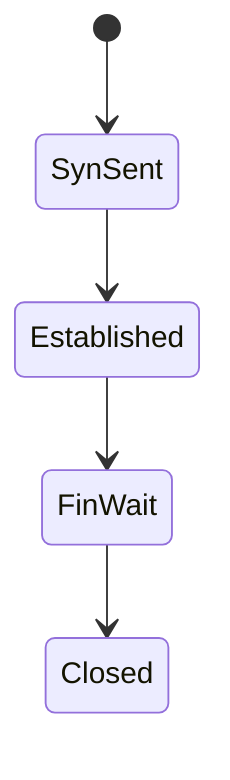
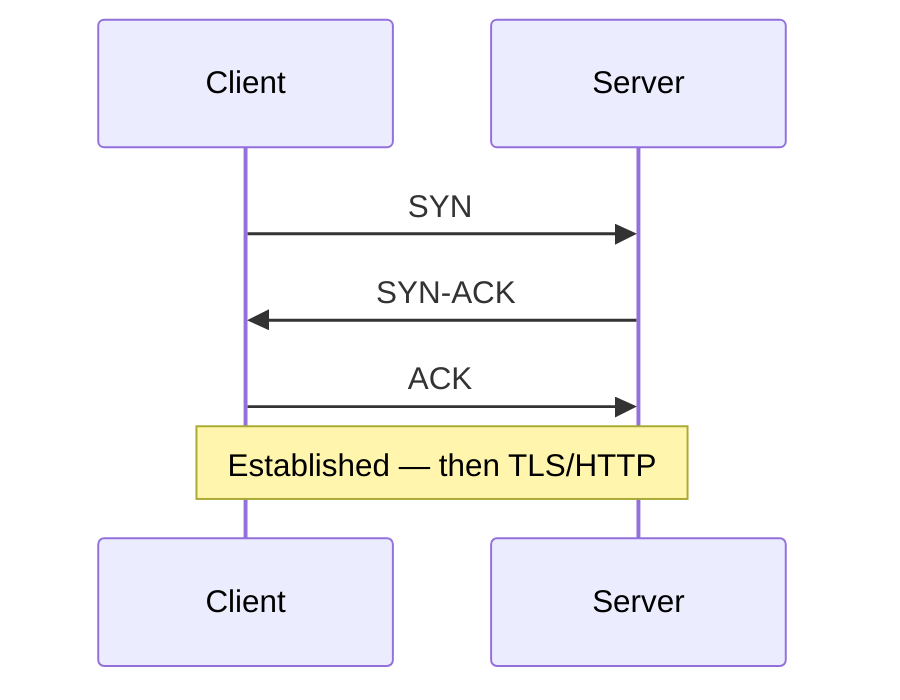

# TCP

<TopicMeta />

<Prerequisites />

::: tip Published
This page meets the handbook **published** bar: deep explanation, ≥10 common mistakes, and official references. Further engine-level errata welcome via PR.
:::

## Introduction

**TCP (Transmission Control Protocol)** provides a reliable, ordered, bidirectional **byte stream** between two endpoints. It performs handshake, acknowledgments, retransmission, flow control, and congestion control. Classic HTTPS runs **HTTP over TLS over TCP**.

## Why does it exist?

HTTP/1.1 and HTTP/2 assume TCP. Head-of-line blocking at TCP layer motivates HTTP/3/QUIC. Understanding RTT × handshake explains why connections are expensive.

## Historical Background

Vint Cerf/Bob Kahn lineage; decades of congestion control (Reno, CUBIC, BBR).

## Mental Model

Phone call setup (SYN/SYN-ACK/ACK) → talk with sequence numbers → hang up (FIN/RST). Lost packets get retransmitted; a single loss can stall the stream (HOL blocking).

## Internal Workflow

1. Three-way handshake.
2. TLS handshake (for HTTPS) on the stream.
3. Data segments with SEQ/ACK.
4. Congestion window grows; loss signals slowdown.
5. Connection teardown.

## Lifecycle



## Browser Perspective

Connection pools per origin; HTTP/2 multiplexes many streams on one TCP conn — but TCP HOL still exists.

## JavaScript Engine Perspective

Not applicable.

## React Perspective

Not applicable.

## Next.js Perspective

Not applicable.

## Server Perspective

Time-wait piles, keepalive, and load balancer idle timeouts matter.

## Network Perspective

Core transport for the web until QUIC.

## Memory Perspective

Not applicable.

## Performance

Minimize new connections (keep-alive, HTTP/2/3). TCP + TLS cold connect can be multiple RTTs before first byte.

## Production Example

LB idle timeout < app keepalive caused random 502s. Aligned timeouts + HTTP keepalives.

## Code Examples

```bash
curl -v --http1.1 https://example.com  # TCP+TLS under the hood
```

## Diagrams



## Common Mistakes

1. Assuming TCP means low latency
2. Ignoring HOL blocking under loss
3. Chatty connection-per-request on HTTP/1.1
4. Not tuning idle timeouts across proxies
5. Confusing TCP with HTTP
6. Believing TCP guarantees message boundaries (it’s a byte stream)
7. Overlooking an edge case #1 specific to 02-internet.tcp in production traffic
8. Overlooking an edge case #2 specific to 02-internet.tcp in production traffic
9. Overlooking an edge case #3 specific to 02-internet.tcp in production traffic
10. Overlooking an edge case #4 specific to 02-internet.tcp in production traffic


## Best Practices

- Reuse connections
- Prefer HTTP/2/3 when beneficial
- Align proxy timeouts
- Use TCP for reliability-needed data

## Anti-patterns

- Application-level retransmit storms on already-reliable TCP without backoff

## Comparison

| | TCP | UDP |
| --- | --- | --- |
| Reliability | Yes | No |
| Order | Yes | No |
| Use | HTTP/1–2, SSH | QUIC, games, DNS |

## Interview Questions

### Easy

**Q:** What does TCP give you?

**A:** Reliable, ordered byte streams with congestion control between two endpoints.

### Medium

**Q:** Describe the TCP handshake.

**A:** SYN, SYN-ACK, ACK to synchronize sequence numbers and establish the connection.

### Hard

**Q:** Why does TCP HOL blocking hurt HTTP/2?

**A:** Multiple HTTP streams share one TCP connection; a lost packet stalls the TCP stream, delaying all multiplexed HTTP streams.

## Summary

- TCP = reliable byte stream
- Handshake + congestion control cost RTTs
- HOL blocking motivates QUIC
- Keepalive/timeouts matter in prod

## References

- [RFC 9293 — TCP](https://www.rfc-editor.org/rfc/rfc9293)
- [MDN — TCP](https://developer.mozilla.org/en-US/docs/Glossary/TCP)

<RelatedTopics />


Prev: [`02-internet.ipv6`](/02-internet/ipv6/) · Next: [`02-internet.udp`](/02-internet/udp/)
