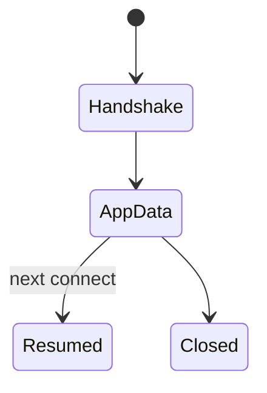
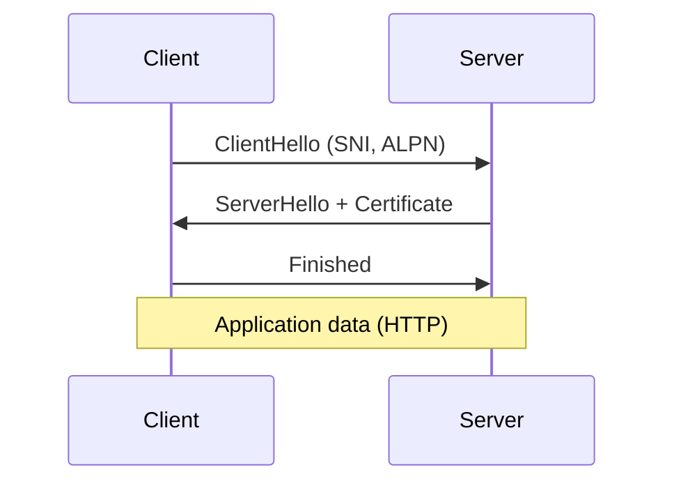

# TLS

<TopicMeta />

<Prerequisites />

::: tip Published
This page meets the handbook **published** bar: deep explanation, ≥10 common mistakes, and official references. Further engine-level errata welcome via PR.
:::

## Introduction

**TLS (Transport Layer Security)** negotiates cryptographic keys and authenticates endpoints so application data (HTTP, SMTP, etc.) can be encrypted. For the web, TLS underpins [HTTPS](/02-internet/https/). TLS 1.3 simplified the handshake to typically **1-RTT** (with 0-RTT options).

## Why does it exist?

Provides confidentiality, integrity, and server authentication — prerequisites for safe cookies and tokens on the public Internet.

## Historical Background

SSL → TLS 1.0–1.3; continuous cipher deprecation; certificate transparency ecosystem.

## Mental Model

Handshake agrees on keys using asymmetric crypto + AEAD symmetric crypto for the record layer. Server presents X.509 cert chain; client validates against trust store.

## Internal Workflow

1. ClientHello (versions, ciphers, SNI, ALPN).
2. ServerHello + certificate + key share.
3. Client verifies cert; derives keys.
4. Encrypted application data (HTTP).
5. Optional session resumption later.

## Lifecycle



## Browser Perspective

SNI selects cert/site; ALPN selects h2/http/1.1; cert errors block navigation.

## JavaScript Engine Perspective

BoringSSL/OpenSSL/NSS implementations differ — still same protocol.

## React Perspective

Not applicable.

## Next.js Perspective

Not applicable.

## Server Perspective

Terminate TLS; manage chains/intermediates; OCSP/stapling as applicable.

## Network Perspective

Middlebox TLS inspection breaks pinning and privacy.

## Memory Perspective

Not applicable.

## Performance

TLS1.3 + resumption + HTTP/2/3 connection reuse cuts handshake costs. 0-RTT has replay considerations.

## Production Example

Missing intermediate cert worked in desktop Chrome (AIA fetching) but failed in some mobile clients — fixed full chain deploy.

## Code Examples

```bash
openssl s_client -connect example.com:443 -servername example.com -alpn h2,http/1.1
```

## Diagrams



## Common Mistakes

1. Incomplete certificate chain
2. Wrong SNI/host cert
3. Clock skew failing validity
4. Using outdated ciphers
5. Assuming TLS authenticates the human user
6. Blindly enabling 0-RTT for non-idempotent POSTs
7. Certificate pinning without a solid rotation story
8. Leaving TLS 1.0/1.1 enabled “for old clients” without measuring need
9. Misconfigured intermediate certificates causing mobile-only failures
10. Assuming a green padlock means the API authorization model is sound


## Best Practices

- TLS 1.3, modern ciphers
- Full chain + monitoring
- HSTS
- Understand 0-RTT replay risks

## Anti-patterns

- Custom crypto instead of TLS

## Comparison

| Feature | TLS 1.2 | TLS 1.3 |
| --- | --- | --- |
| Handshake RTTs | Often 2 | 1 |
| 0-RTT | No | Optional |
| Legacy ciphers | Many | Removed |

## Interview Questions

### Easy

**Q:** What problem does TLS solve?

**A:** Encrypts and integrity-protects data on the wire and authenticates the server via certificates.

### Medium

**Q:** What is SNI?

**A:** Server Name Indication — client tells which hostname it wants during handshake so the server can present the right certificate on shared IPs.

### Hard

**Q:** Why is TLS 0-RTT special?

**A:** It can send app data on the first flight using resumed keys, improving latency but introducing replay risks — unsafe for non-idempotent requests without server controls.

## Summary

- TLS handshakes establish secure channels
- Cert validation is central
- TLS 1.3 is preferred
- HTTPS is HTTP over TLS

## References

- [RFC 8446 — TLS 1.3](https://www.rfc-editor.org/rfc/rfc8446)
- [MDN — TLS](https://developer.mozilla.org/en-US/docs/Glossary/TLS)

<RelatedTopics />


Prev: [`02-internet.ssl`](/02-internet/ssl/) · Next: [`02-internet.ssh`](/02-internet/ssh/)
