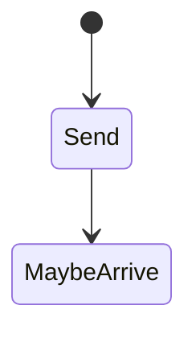

# UDP

<TopicMeta />

<Prerequisites />

::: tip Published
This page meets the handbook **published** bar: deep explanation, ≥10 common mistakes, and official references. Further engine-level errata welcome via PR.
:::

## Introduction

**UDP (User Datagram Protocol)** sends independent datagrams without connection handshake, retransmission, or ordering. Apps that need those features build them (or use QUIC). DNS historically uses UDP; **HTTP/3 uses QUIC over UDP**.

## Why does it exist?

When you need low latency and can tolerate loss (media) — or you implement reliability in user space (QUIC) — UDP is the substrate.

## Historical Background

Simple demux by port since early IP days; real-time WebRTC; QUIC rebirth of “UDP + smart userspace”.

## Mental Model

Throw postcards: may arrive, duplicate, reorder, or vanish. No connection state in the protocol (firewalls may still track flows).

## Internal Workflow

1. App writes datagram to IP:port.
2. Network delivers 0..n times.
3. App handles loss/order if needed.

## Lifecycle



## Browser Perspective

Browsers don’t expose raw UDP to pages; WebRTC/QUIC are gated APIs/stacks.

## JavaScript Engine Perspective

Not applicable.

## React Perspective

Not applicable.

## Next.js Perspective

Not applicable.

## Server Perspective

Not applicable.

## Network Perspective

Middleboxes sometimes throttle UDP; QUIC deployment fought this.

## Memory Perspective

Not applicable.

## Performance

No handshake RTT — great for QUIC’s 0/1-RTT goals. Loss handling is app-defined.

## Production Example

Corporate firewalls blocked UDP 443 → HTTP/3 fallback to TCP/HTTP2 needed monitoring.

## Code Examples

```bash
# DNS over UDP (typical)
dig example.com
```

## Diagrams


## Common Mistakes

1. Expecting UDP reliability
2. Assuming browsers allow arbitrary UDP sockets to pages
3. Forgetting path MTU for large datagrams
4. Equating UDP with insecurity (QUIC/TLS still encrypts)
5. Ignoring UDP blocking on enterprise nets
6. Reinventing TCP poorly
7. Overlooking an edge case #1 specific to 02-internet.udp in production traffic
8. Overlooking an edge case #2 specific to 02-internet.udp in production traffic
9. Overlooking an edge case #3 specific to 02-internet.udp in production traffic
10. Overlooking an edge case #4 specific to 02-internet.udp in production traffic


## Best Practices

- Use QUIC/WebRTC stacks rather than homemade reliability when possible
- Always plan HTTP/2 fallback

## Anti-patterns

- Giant unreplicated UDP protocols without congestion control (Internet-harmful)

## Comparison

| Feature | UDP | TCP |
| --- | --- | --- |
| Connect | No | Yes |
| Reliable | No | Yes |
| HTTP/3 | Yes (via QUIC) | No |

## Interview Questions

### Easy

**Q:** When would you use UDP?

**A:** When you want minimal transport — real-time media or protocols like QUIC that handle reliability themselves.

### Medium

**Q:** Why can HTTP/3 use UDP and still be secure/reliable?

**A:** QUIC implements encryption and reliability in userspace over UDP datagrams.

### Hard

**Q:** What operational issue affects UDP-based HTTP/3?

**A:** Some networks block or rate-limit UDP, requiring fallback to TCP-based HTTP.

## Summary

- UDP is unreliable datagrams
- Foundation for DNS/QUIC/media
- Browsers don’t give raw UDP to JS pages
- Always consider fallbacks

## References

- [RFC 768 — UDP](https://www.rfc-editor.org/rfc/rfc768)
- [MDN — UDP](https://developer.mozilla.org/en-US/docs/Glossary/UDP)

<RelatedTopics />


Prev: [`02-internet.tcp`](/02-internet/tcp/) · Next: [`02-internet.http`](/02-internet/http/)
