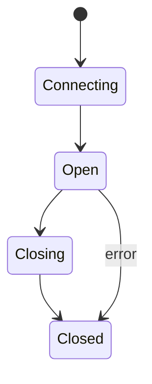
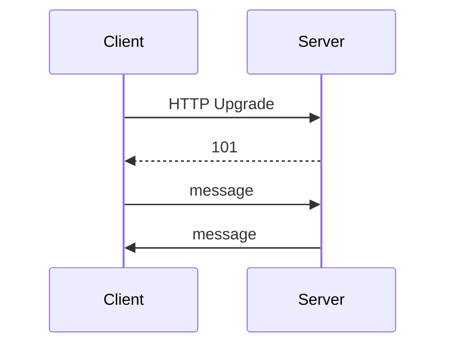

# WebSocket

<TopicMeta />

<Prerequisites />

::: tip Published
This page meets the handbook **published** bar: deep explanation, ≥10 common mistakes, and official references. Further engine-level errata welcome via PR.
:::

## Introduction

**WebSockets** provide a persistent, **full-duplex** message channel between client and server after an HTTP Upgrade handshake. Ideal for interactive real-time data when request/response HTTP is awkward.

## Why does it exist?

Polling wastes battery/RTT. WebSockets allow server push and low-latency bidirectional messages.

## Historical Background

Comet/long-poll hacks → RFC 6455 WebSocket → browser `WebSocket` API.

## Mental Model

HTTP handshake → switch protocols → framed messages both ways until close. Still sits on TCP (or sometimes other stacks); proxies must allow Upgrade.

## Internal Workflow

1. `GET` with `Upgrade: websocket` + `Connection: Upgrade`.
2. `101 Switching Protocols`.
3. Binary/text messages.
4. Close frames / reconnect logic in app.

## Lifecycle



## Browser Perspective

WebSocket API; must be careful with auth tokens; reconnect with backoff.

## JavaScript Engine Perspective

Not applicable.

## React Perspective

Put socket in context/effect once; cleanup on unmount.

## Next.js Perspective

Not applicable.

## Server Perspective

Horizontal scale via Redis/NATS pubsub — connections are stateful at edges.

## Network Perspective

LBs need sticky or shared pub/sub; idle timeouts.

## Memory Perspective

Not applicable.

## Performance

One conn beats chatty polling; still backoff reconnects; compress carefully.

## Production Example

Chat used one socket per tab without shared worker — thousands of conns per user with many tabs. Consolidated via BroadcastChannel/SharedWorker pattern.

## Code Examples

```js
const ws = new WebSocket('wss://example.com/socket')
ws.onmessage = (e) => console.log(e.data)
ws.send(JSON.stringify({ type: 'ping' }))
```

## Diagrams



## Common Mistakes

1. No reconnection/backoff
2. Auth only in first query string forever logged
3. Assuming messages are delivery-guaranteed across reconnects
4. Forgetting LB idle timeouts
5. Opening a new socket per React render
6. Using WebSockets for simple infrequent CRUD
7. Ignoring heartbeats
8. Overlooking an edge case #1 specific to 02-internet.websocket in production traffic
9. Overlooking an edge case #2 specific to 02-internet.websocket in production traffic
10. Overlooking an edge case #3 specific to 02-internet.websocket in production traffic


## Best Practices

- wss only
- Exponential backoff + jitter
- Heartbeats; idempotent event IDs
- Pub/sub for multi-instance servers

## Anti-patterns

- Unbounded message buffering on disconnect

## Comparison

| | WebSocket | SSE | HTTP poll |
| --- | --- | --- | --- |
| Direction | Bi | Server→client | Client pull |
| Complexity | Higher | Lower | Lowest |

## Interview Questions

### Easy

**Q:** What is a WebSocket?

**A:** A persistent full-duplex connection created via HTTP upgrade for bidirectional messaging.

### Medium

**Q:** When prefer SSE over WebSocket?

**A:** When you mainly need server→client text events over HTTP and want simpler infra/auto-reconnect.

### Hard

**Q:** How do you scale WebSockets across many servers?

**A:** Terminate connections at many nodes and fan-out via an external pub/sub; avoid requiring users stick forever to one VM without shared state bus.

## Summary

- Upgrade then full-duplex messages
- Great for real-time bi-directional needs
- Reconnect and scale intentionally
- Not a default for all APIs

## References

- [RFC 6455 — WebSocket](https://www.rfc-editor.org/rfc/rfc6455)
- [MDN — WebSocket](https://developer.mozilla.org/en-US/docs/Web/API/WebSocket)

<RelatedTopics />


Prev: [`02-internet.ssh`](/02-internet/ssh/) · Next: [`02-internet.sse`](/02-internet/sse/)
