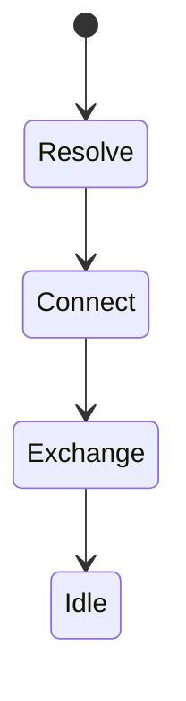
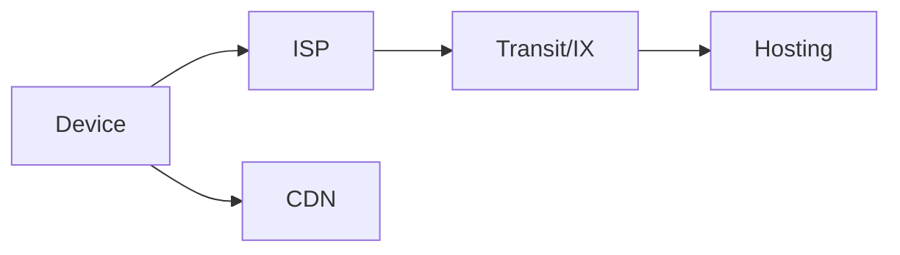

# What is the Internet

<TopicMeta />

<Prerequisites />

::: tip Published
This page meets the handbook **published** bar: deep explanation, ≥10 common mistakes, and official references. Further engine-level errata welcome via PR.
:::

## Introduction

The **Internet** is a global system of interconnected networks that communicate using the **Internet Protocol (IP)** suite (TCP/UDP/IP, plus application protocols like HTTP/DNS). It is not a single company or a single cable — it is agreements (protocols), addressing, and routing between autonomous systems.

## Why does it exist?

Frontend apps are clients on this network. Every `fetch` assumes DNS, routing, congestion, and failure exist. Without this map, HTTP feels like magic.

## Historical Background

ARPANET packet switching → TCP/IP standardization (1980s) → commercial Internet → WWW (HTTP) layered on top → mobile + CDN era.

## Mental Model

Many networks (home, ISP, cloud, CDN) peer and transit. Your packet hops router-to-router toward a destination IP. Reliability is optional at IP layer; TCP/QUIC add it.

## Internal Workflow

1. App asks OS to connect to a host.
2. DNS → IP.
3. Packets routed across ASes.
4. Server responds; middleboxes may NAT/firewall.

## Lifecycle



## Browser Perspective

Browser is an Internet client with security policies (SOP, mixed content).

## JavaScript Engine Perspective

Not applicable.

## React Perspective

Not applicable.

## Next.js Perspective

Not applicable.

## Server Perspective

Origin servers and edges terminate connections.

## Network Perspective

End-to-end principle: intelligence at edges, IP in the middle — with real-world NAT/CDN caveats.

## Memory Perspective

Not applicable.

## Performance

Latency ≈ distance + hops + congestion + protocol RTTs. Throughput ≠ latency.

## Production Example

Global SaaS measured regional TTFB; added anycast CDN + regional origins.

## Code Examples

```bash
traceroute example.com
curl -vI https://example.com
```

## Diagrams



## Common Mistakes

1. Calling the web and the Internet the same thing
2. Assuming the network is reliable
3. Ignoring mobile/captive portals
4. Thinking cloud regions remove distance
5. Confusing bandwidth with latency
6. Believing HTTPS removes all network failure modes
7. Overlooking an edge case #1 specific to 02-internet.what-is-the-internet in production traffic
8. Overlooking an edge case #2 specific to 02-internet.what-is-the-internet in production traffic
9. Overlooking an edge case #3 specific to 02-internet.what-is-the-internet in production traffic
10. Overlooking an edge case #4 specific to 02-internet.what-is-the-internet in production traffic


## Best Practices

- Design for retry/timeouts
- Measure real user regions
- Separate web vs Internet concepts in teaching

## Anti-patterns

- Infinite retries without backoff

## Comparison

| Term | Meaning |
| --- | --- |
| Internet | Network of networks (IP) |
| Web | HTTP(S) application space |
| Intranet | Private IP network |

## Interview Questions

### Easy

**Q:** What is the Internet?

**A:** A global network of networks communicating primarily via the IP suite.

### Medium

**Q:** How does a browser request relate to the Internet?

**A:** DNS resolves a name, TCP/QUIC connects to an IP, TLS may secure it, HTTP runs as the application protocol.

### Hard

**Q:** What does end-to-end principle imply for frontend reliability?

**A:** Middleboxes won’t save your app semantics — clients/servers must handle loss, reordering, and partial failure.

## Summary

- Internet = interconnected IP networks
- Web rides on Internet protocols
- Failure and latency are normal
- Frontends are network clients

## References

- [RFC 1122 — Requirements for Internet Hosts](https://www.rfc-editor.org/rfc/rfc1122)
- [MDN — How the web works](https://developer.mozilla.org/en-US/docs/Learn/Getting_started_with_the_web/How_the_Web_works)

<RelatedTopics />


Next: [`02-internet.client`](/02-internet/client/)
