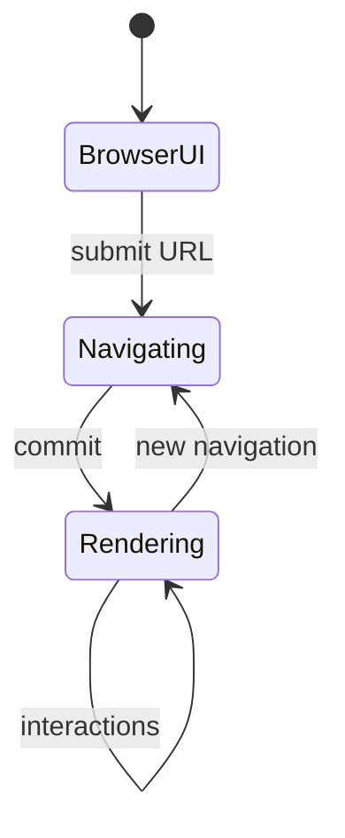
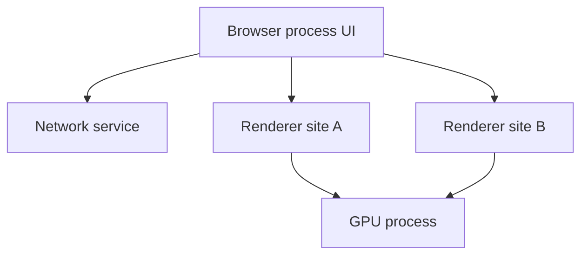

# Browser Architecture

<TopicMeta />

<Prerequisites />

::: tip Published
This page meets the handbook **published** bar: deep explanation, ≥10 common mistakes, and official references. Further engine-level errata welcome via PR.
:::

## Introduction

**Browser architecture** is the internal structure that turns URLs into pixels safely: a **browser/UI process**, **network service**, one or more **renderer** processes, a **GPU** process, and various utility processes. Understanding this map explains site isolation, why a tab crash rarely kills the window, and where your JS actually runs.

## Why does it exist?

A single-process browser (historical) meant one buggy page or compromised renderer could take everything down and read other sites’ memory. Architecture exists for **security** (sandboxing), **stability** (process isolation), and **performance** (parallelize network, decode, compose).

## Historical Background

Netscape/early IE were largely monolithic. Chrome popularized multi-process + sandboxing; Firefox and Safari evolved their own process models. Site Isolation tightened cross-origin separation after speculative-execution attacks.

## Mental Model

Think of an OS-like product:

- **Browser process** — chrome UI, trusted decisions, process spawning
- **Network service** — sockets, HTTP cache, cookies (privileged)
- **Renderer** — Blink/WebKit + V8/JSC for a document (sandboxed)
- **GPU process** — compositing / WebGL
- **Plugin/utility** — audio, storage, etc.

Your `document` and JS live in a **renderer**; DevTools often attaches there.

## Internal Workflow

1. User enters URL in browser process UI.
2. Network service resolves DNS, connects, fetches bytes.
3. Browser process commits navigation; picks/creates renderer.
4. Renderer parses HTML/CSS, runs JS, builds frames.
5. Compositor/GPU displays tiles; input routes browser → renderer.

## Lifecycle



## Browser Perspective

Chromium’s “Task Manager” shows process-per-tab/site memory. Frame hosts may share or split processes based on Site Isolation.

## JavaScript Engine Perspective

JS engines embed inside renderers (and workers). Architecture decides which engine instance sees which origins.

## React Perspective

React runs inside the renderer process. Crashing the tab loses in-memory React state — persist intentionally.

## Next.js Perspective

Not applicable.

## Server Perspective

Not applicable.

## Network Perspective

Network stack is not in your JS thread; only callbacks cross the boundary.

## Memory Perspective

Each process has its own address space. Duplicated copies of Chromium code trade RAM for isolation.

## Performance

More processes → more RAM. Fewer processes → weaker isolation. Mobile browsers balance aggressively. Heavy iframes of many origins multiply renderers.

## Production Example

An admin console embedded untrusted third-party iframes in-process historically. Moving to sandboxed iframes + Coop/Coep and understanding process isolation reduced XSS blast radius.

## Code Examples

```js
// You cannot directly inspect process IDs from page JS.
// Observe architecture effects instead:
console.log(navigator.userAgent)
// Cross-origin iframe = different agent cluster / often different process
```

## Diagrams



## Common Mistakes

1. Assuming one process for the whole browser always
2. Thinking `localStorage` is in a separate computer — it is origin storage mediated by browser services
3. Believing Web Workers are separate OS processes always (they are separate threads; SharedWorker/service worker models differ)
4. Ignoring that DevTools and extensions add their own complexity
5. Equating “browser architecture” with “React architecture”
6. Forgetting GPU process role when debugging compositor-only animations
7. Overlooking an edge case #1 specific to 03-browser.browser-architecture in production traffic
8. Overlooking an edge case #2 specific to 03-browser.browser-architecture in production traffic
9. Overlooking an edge case #3 specific to 03-browser.browser-architecture in production traffic
10. Overlooking an edge case #4 specific to 03-browser.browser-architecture in production traffic


## Best Practices

- Design for tab kill / refresh: persist critical state
- Treat cross-origin iframes as hostile
- Use Chromium Task Manager when chasing memory

## Anti-patterns

- Relying on shared memory via accidental globals across origins (impossible — don’t bypass with opener hacks)
- Unbounded iframe farms

## Comparison

| Piece | Trust | Runs your page JS? |
| --- | --- | --- |
| Browser process | High | No |
| Renderer | Sandboxed | Yes |
| GPU process | Medium | No (shaders/WebGL cmds) |
| Network service | High | No |

## Interview Questions

### Easy

**Q:** Name three major browser process types.

**A:** Browser/UI process, renderer process, GPU process (plus network/utility).

### Medium

**Q:** Why multi-process?

**A:** Security sandboxing, crash isolation, and parallelism across tabs/origins.

### Hard

**Q:** What is site isolation?

**A:** A policy of putting cross-site documents into different renderer processes so compromised renderers cannot easily read other sites’ memory.

## Summary

- Browsers are multi-process systems
- Page JS runs in sandboxed renderers
- Network and GPU are separate services
- Architecture trades memory for safety

## References

- [Chrome — Inside look at modern web browser](https://developer.chrome.com/blog/inside-browser-part1)
- [Chromium multi-process architecture](https://www.chromium.org/developers/design-documents/multi-process-architecture/)

<RelatedTopics />


Next: [`03-browser.multi-process-model`](/03-browser/multi-process-model/)
