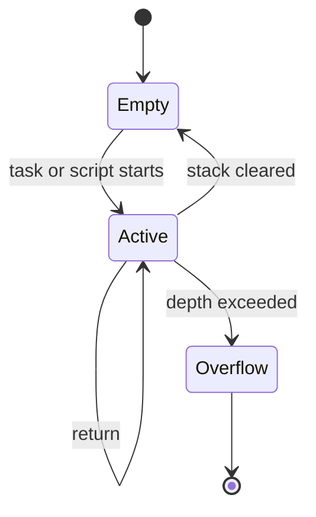
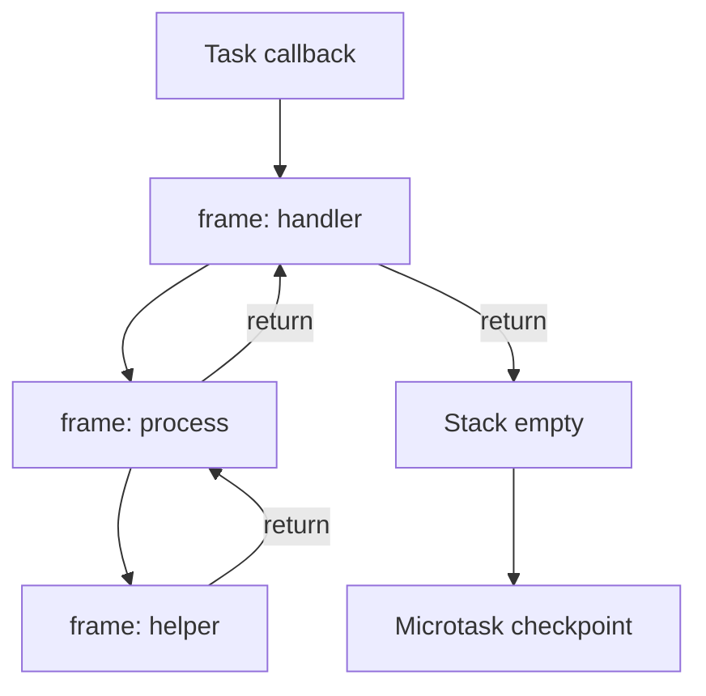

# Call Stack

<TopicMeta />

<Prerequisites />

::: tip Published
This page meets the handbook **published** bar: deep explanation, ≥10 common mistakes, and official references. Further engine-level errata welcome via PR.
:::

## Introduction

The **call stack** is the LIFO structure the JavaScript engine uses to track which function is currently running. Each function call pushes a **stack frame** (arguments, local variables, return address). When the function returns, the frame pops. On a browser tab’s main thread there is effectively **one** JS call stack for page script — so long synchronous work blocks timers, input handlers, and rendering callbacks that also need that thread.

If the stack never empties, the [event loop](/03-browser/event-loop/) cannot take the next task.

## Why does it exist?

CPUs run instructions sequentially inside a thread. Languages need a place to remember “who called whom” for returns, exceptions, and `this` binding. Without a stack model you cannot explain recursion depth, stack overflows, or why `foo()` finishing before `setTimeout` callbacks is normal.

For frontend engineers the stack is the reason **long tasks** hurt INP: while your sync code sits on the stack, the browser cannot run the next input task.

## Historical Background

Stack-based calling conventions predate the web by decades (Algol, C, hardware stack pointers). Browser JS engines (SpiderMonkey, then V8, JavaScriptCore) each implement an ECMAScript execution stack, including optimized frames and on-stack replacement when JIT code takes over. DevTools “Call Stack” panels surface this model to developers.

## Mental Model

Think of a single plate dispenser:

1. Sync script or a task starts → plates (frames) stack up as functions call functions.
2. Returns pop plates.
3. When the dispenser is empty, that **task** is done; microtasks may run next, then possibly render, then another task.
4. `throw` unwinds plates until a `catch` or the task fails.
5. Recursion without a base case → **RangeError: Maximum call stack size exceeded**.

Async does **not** pause the stack mid-function for other JS on the same thread — `await` exits the function, schedules continuation as a microtask/job, and leaves the stack empty for other work.

## Internal Workflow

1. Host (browser) selects a task and calls into the engine.
2. Engine creates an initial frame for the task’s callback/script.
3. Each `call` / method invoke pushes a frame; bytecode/JIT runs.
4. `return` pops; exceptions unwind.
5. When no frames remain, control returns to the embedder → microtask checkpoint → maybe rendering.

## Lifecycle



- **Empty** — ready for microtasks or the next task  
- **Active** — JS is running; UI may jank if this lasts  
- **Overflow** — engine aborts the call

## Browser Perspective

The main-thread call stack shares the thread with style, layout, and paint scheduling. Chromium’s Performance panel shows “Evaluate script” / function frames under a Task. Workers have separate stacks and cannot touch the DOM.

## JavaScript Engine Perspective

V8 represents frames for Ignition bytecode and TurboFan optimized code. Tail-call optimization is not generally available in JS; rely on loops or trampolines for deep recursion. Async functions desugar to state machines — each `await` boundary exits the stack.

## React Perspective

Render and commit are synchronous stretches on the stack (unless concurrent features yield). A heavy render keeps the stack busy and delays input. `useLayoutEffect` runs before paint still on the stack of the commit path.

## Next.js Perspective

Server Components execute on the server call stack (Node/Edge), not the browser’s. Client hydration uses the browser stack — keep hydration and client renders short.

## Server Perspective

Not applicable.

## Network Perspective

Network I/O does not occupy the JS stack while bytes arrive. Only the callback that processes the response pushes frames.

## Memory Perspective

Stack frames hold references that keep heap objects alive for the duration of the call. Closures escape to the heap; the stack itself is bounded and cheap compared with retained DOM/heaps.

## Performance

- Target **short tasks** so the stack returns to empty within a few milliseconds when possible.
- Avoid deep recursion on large trees; prefer iterative walks.
- Profile with Performance panel: tall “Function call” flames = stack busy.
- Move CPU-heavy work off the main stack via Workers.

## Production Example

A product page synchronously JSON-parses a 4MB payload in a click handler. The call stack stays occupied for 200ms; clicks feel dead. Fix: `response.json()` already async, then parse/chunk in a Worker or `scheduler.yield` between chunks so the stack clears between slices.

## Code Examples

```js
function a() { b() }
function b() { c() }
function c() { console.trace('stack') }
a()
// c ← b ← a ← (task)
```

```js
// await clears the stack between chunks
async function paintFriendly(items) {
  for (const item of items) {
    process(item)
    await scheduler.yield?.() // or await new Promise(r => setTimeout(r, 0))
  }
}
```

## Diagrams



## Common Mistakes

1. Believing async/await keeps the function “on the stack” while waiting — the stack is empty during the wait
2. Using deep recursion for large lists until Maximum call stack size exceeded
3. Doing multi-hundred-ms sync work in event handlers and blaming React
4. Confusing the call stack with the heap or with task queues
5. Reading DevTools async stacks as if every frame were still synchronously nested
6. Assuming Workers share the page call stack
7. Overlooking an edge case #1 specific to 03-browser.call-stack in production traffic
8. Overlooking an edge case #2 specific to 03-browser.call-stack in production traffic
9. Overlooking an edge case #3 specific to 03-browser.call-stack in production traffic
10. Overlooking an edge case #4 specific to 03-browser.call-stack in production traffic


## Best Practices

- Keep synchronous stretches short on the main thread
- Use iterative algorithms for deep structures
- Prefer `console.trace` / Performance panel over guessing order
- Yield between chunks of CPU work

## Anti-patterns

- Busy-wait loops that never pop the stack
- Synchronous XHR (deprecated) holding the stack for network
- Unbounded recursive Promise chains that look async but starve rendering via microtasks

## Comparison

| Concept | Role |
| --- | --- |
| Call stack | Currently running sync frames |
| Task queue | Future macrotasks waiting to run |
| Microtask queue | Jobs to drain before next render/task |
| Heap | Objects surviving beyond a single frame |

## Interview Questions

### Easy

**Q:** What is the JavaScript call stack?

**A:** A LIFO structure of function frames. The running function is the top frame; returns pop frames. One main-thread stack runs page JS.

### Medium

**Q:** Why can a long function freeze scrolling?

**A:** Scrolling and input are handled via tasks/rendering on the same main thread. While your function occupies the call stack, those tasks cannot run.

### Hard

**Q:** How does `await` interact with the call stack?

**A:** Awaiting pauses the async function’s logical progress but completes the current stack unwind. The continuation is queued (microtask) and later runs with a fresh stack.

## Summary

- One main-thread JS call stack per page (plus worker stacks)
- Frames push on call and pop on return
- An occupied stack blocks the event loop’s next turns
- Await yields the stack; it does not multithread JS

## References

- [ECMAScript — Executable Code and Execution Contexts](https://tc39.es/ecma262/#sec-executable-code-and-execution-contexts)
- [MDN — Call stack](https://developer.mozilla.org/en-US/docs/Glossary/Call_stack)
- [HTML Standard — Event loops](https://html.spec.whatwg.org/multipage/webappapis.html#event-loops)

<RelatedTopics />


Prev: [`03-browser.critical-rendering-path`](/03-browser/critical-rendering-path/) · Next: [`03-browser.task-queue`](/03-browser/task-queue/)
