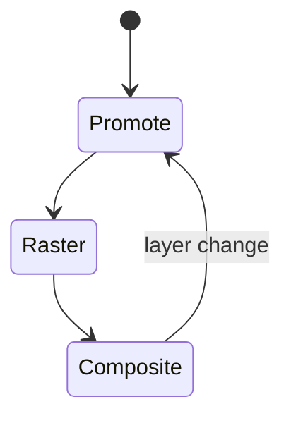
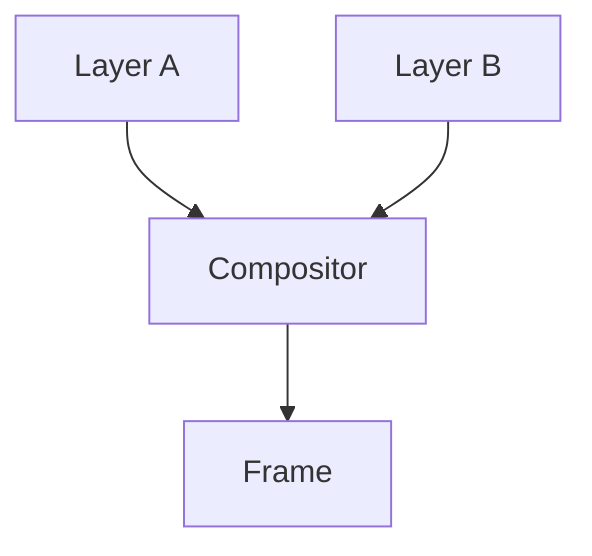

# Composite

<TopicMeta />

<Prerequisites />

::: tip Published
This page meets the handbook **published** bar: deep explanation, ≥10 common mistakes, and official references. Further engine-level errata welcome via PR.
:::

## Introduction

**Compositing** merges painted layers into the final frame, typically on the GPU. If you animate **compositor-friendly** properties (`transform`, `opacity`) on their own layer, the main thread can avoid layout/paint for those updates.

## Why does it exist?

Full paint every frame is expensive. Layerizing lets the compositor update frames while JS/main thread is busy (within limits).

## Historical Background

Hardware acceleration became default; browsers auto-promote layers with heuristics; `will-change` / 3D transforms influence promotion.

## Mental Model

Think Photoshop layers: paint each, then GPU blends. Too many layers = memory bandwidth cost.

## Internal Workflow

1. Decide layerization.
2. Raster layer tiles.
3. Compositor thread builds frame.
4. GPU presents.

## Lifecycle



## Browser Perspective

Compositor thread ≠ JS thread. Layers panel in DevTools shows promotions.

## JavaScript Engine Perspective

Not applicable.

## React Perspective

Motion libraries should prefer transform/opacity.

## Next.js Perspective

Not applicable.

## Server Perspective

Not applicable.

## Network Perspective

Not applicable.

## Memory Perspective

Not applicable.

## Performance

Animate transform/opacity; manage layer count; avoid accidental full-layer invalidations.

## Production Example

Slideshow used left animation; moved to translateX → smoother on mid Android.

## Code Examples

```css
.drawer { transform: translateX(0); transition: transform .2s; }
.drawer.open { transform: translateX(100%); }
```

## Diagrams



## Common Mistakes

1. will-change: everything
2. Assuming transform always skips paint (depends on layer)
3. Hundreds of promoted layers
4. Animating filter heavily
5. Ignoring memory cost of layers
6. Using top/left “because composite”
7. Overlooking an edge case #1 specific to 03-browser.composite in production traffic
8. Overlooking an edge case #2 specific to 03-browser.composite in production traffic
9. Overlooking an edge case #3 specific to 03-browser.composite in production traffic
10. Overlooking an edge case #4 specific to 03-browser.composite in production traffic


## Best Practices

- Promote intentionally
- Remove will-change after animation
- Verify with Layers/Performance

## Anti-patterns

- translateZ(0) shotgun hacks without measurement

## Comparison

| Property | Often compositor-only? |
| --- | --- |
| transform | Yes |
| opacity | Yes |
| top/left | No (layout) |
| box-shadow | Paint |

## Interview Questions

### Easy

**Q:** What is compositing?

**A:** Combining layers into the final frame, often on the GPU.

### Medium

**Q:** Which CSS properties are safest to animate?

**A:** transform and opacity, when they can be handled on compositor layers.

### Hard

**Q:** Why can too many layers hurt?

**A:** Each layer costs memory and bandwidth; over-promotion can be slower than painting a simpler tree.

## Summary

- Compositor merges layers
- transform/opacity are first-choice anim props
- Layer count is a trade-off
- Verify with DevTools

## References

- [web.dev — Stick to compositor-only properties](https://web.dev/articles/stick-to-compositor-only-properties-and-manage-layer-count)
- [Chrome Layers panel](https://developer.chrome.com/docs/devtools/layers)

<RelatedTopics />


Prev: [`03-browser.paint`](/03-browser/paint/) · Next: [`03-browser.gpu`](/03-browser/gpu/)
