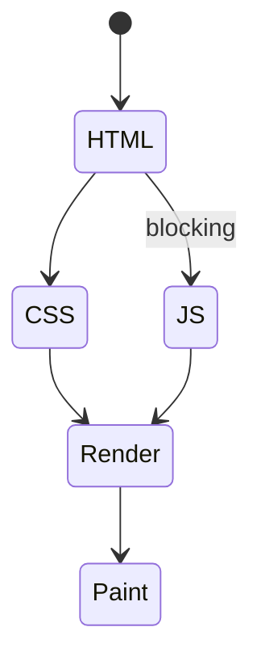
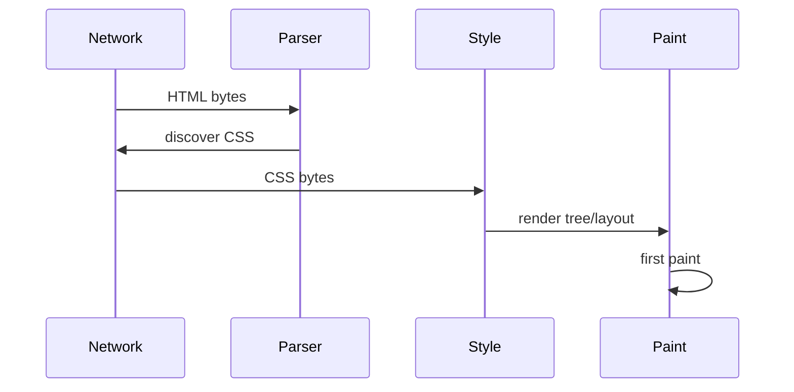

# Critical Rendering Path

<TopicMeta />

<Prerequisites />

::: tip Published
This page meets the handbook **published** bar: deep explanation, ≥10 common mistakes, and official references. Further engine-level errata welcome via PR.
:::

## Introduction

The **critical rendering path (CRP)** is the sequence of steps from receiving HTML/CSS/JS bytes to painting pixels the user cares about. Optimizing CRP means reducing **critical resources**, **bytes**, and **critical path length** (RTT chains).

## Why does it exist?

Users judge speed by first paint and interactivity. CRP analysis connects network waterfall to browser pipeline.

## Historical Background

Popularized by Google performance education (Udacity/CRP talks); still the right first-principles frame before framework myths.

## Mental Model

HTML → DOM; CSS → CSSOM; (JS may block); render tree → layout → paint. Critical CSS/JS lengthen the chain; async/defer/module and resource hints shorten it.

## Internal Workflow

1. DNS/TCP/TLS/HTTP fetch HTML.
2. Parse HTML; discover critical CSS/JS.
3. Fetch+parse CSS (render-blocking).
4. Execute blocking JS as encountered.
5. Build render tree; layout; paint.
6. Continue loading noncritical assets.

## Lifecycle



## Browser Perspective

Waterfall + Performance + Web Vitals (FCP/LCP) measure CRP outcomes.

## JavaScript Engine Perspective

Not applicable.

## React Perspective

CSR pushes JS onto CRP; SSR/streaming can paint HTML sooner; hydration affects interactivity.

## Next.js Perspective

App Router streaming, `loading.js`, and resource hints are CRP tools.

## Server Perspective

Not applicable.

## Network Perspective

Each RTT on the critical chain costs. HTTP/2/3, CDN, caching, early hints matter.

## Memory Perspective

Not applicable.

## Performance

Minimize critical CSS/JS; preload LCP image; avoid chains; use CDN; compress; HTTP caching.

## Production Example

SPA waited for 1MB JS before hero text. SSR + preload font/image cut LCP by 1.8s.

## Code Examples

```html
<link rel="preload" as="image" href="/hero.avif" fetchpriority="high" />
<link rel="stylesheet" href="/critical.css" />
<script type="module" src="/app.js"></script>
```

## Diagrams



## Common Mistakes

1. Blocking the CRP with noncritical JS
2. Fat CSS bundles for first paint
3. Lazy-loading the LCP image
4. Ignoring font critical path (FOIT/CLS)
5. Optimizing total bytes but not critical path length
6. Assuming HTTP/2 removes need for bundling strategy entirely
7. Client-only rendering for content-heavy landings
8. Inlining huge CSS “to help CRP” and delaying first byte
9. Using `@import` in CSS and creating request waterfalls
10. Measuring only Lighthouse lab and ignoring field LCP


## Best Practices

- Inventory critical resources
- Preload LCP; preconnect origins
- Defer noncritical JS
- Measure field LCP/INP

## Anti-patterns

- Sync third-party scripts in head
- CSS @import chains

## Comparison

| Metric | Relates to CRP |
| --- | --- |
| FCP | Early paint |
| LCP | Largest contentful paint |
| TTFB | Server/network prelude |
| INP | Post-load main thread |

## Interview Questions

### Easy

**Q:** What is the critical rendering path?

**A:** The steps and critical resources required to paint the first meaningful frame.

### Medium

**Q:** How do blocking scripts affect CRP?

**A:** They pause HTML parsing and can delay discovery/execution needed before paint.

### Hard

**Q:** How would you shorten CRP for a news article page?

**A:** SSR HTML text, inline/critical CSS, preload hero image/font, defer noncritical JS, CDN+cache, reduce redirects/RTT chains.

## Summary

- CRP = critical resources + bytes + chain length
- DOM+CSSOM before useful paint
- JS/CSS placement decides delay
- Measure FCP/LCP in lab and field

## References

- [web.dev — Critical rendering path](https://web.dev/articles/critical-rendering-path)
- [Chrome — CRP](https://developer.chrome.com/docs/performance/critical-rendering-path)

<RelatedTopics />


Prev: [`03-browser.repaint`](/03-browser/repaint/) · Next: [`03-browser.call-stack`](/03-browser/call-stack/)
