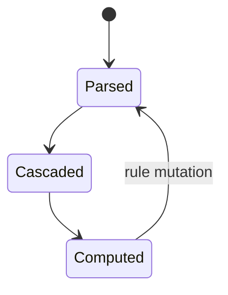
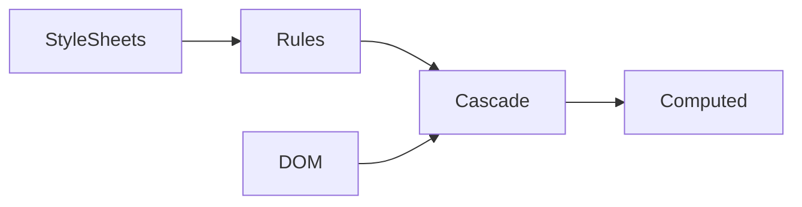

# CSSOM

<TopicMeta />

<Prerequisites />

::: tip Published
This page meets the handbook **published** bar: deep explanation, ≥10 common mistakes, and official references. Further engine-level errata welcome via PR.
:::

## Introduction

The **CSSOM** is the object representation of stylesheets and the APIs (`document.styleSheets`, `CSSStyleRule`, `getComputedStyle`) that interact with them. Together with the DOM it feeds style calculation for rendering.

## Why does it exist?

Engines need structured rules for cascade/specificity. JS needs a way to inspect and sometimes mutate CSS at runtime.

## Historical Background

CSSOM specs matured alongside CSS3; `getComputedStyle` became a staple for measuring.

## Mental Model

Stylesheet list → rules → declarations. Computed style is the **result after cascade+inheritance**, not raw CSSOM text.

## Internal Workflow

1. Parse CSS into stylesheet objects.
2. Cascade against DOM.
3. Produce computed values used by layout.
4. JS may insertRule/deleteRule → invalidation.

## Lifecycle



## Browser Perspective

DevTools Styles pane reflects CSSOM + authored. Computed tab shows resolved values.

## JavaScript Engine Perspective

Cross-origin stylesheets may restrict CSSOM rule access (CORS).

## React Perspective

Prefer CSS modules/variables over runtime rule surgery when possible.

## Next.js Perspective

Not applicable.

## Server Perspective

Not applicable.

## Network Perspective

Not applicable.

## Memory Perspective

Not applicable.

## Performance

getComputedStyle can force style/layout. insertRule on huge sheets can be costly.

## Production Example

Theme toggles via CSS variables on `:root` beat regenerating whole stylesheets.

## Code Examples

```js
const bg = getComputedStyle(el).backgroundColor
document.styleSheets[0].insertRule('.x{color:red}', 0)
```

## Diagrams



## Common Mistakes

1. Confusing authored CSS with computed style
2. Reading computed style in tight loops
3. Expecting access into opaque cross-origin sheets
4. Mutating CSSOM instead of classes/variables
5. Forgetting media query lists
6. Assuming CSSOM includes UA styles as editable rules
7. Overlooking an edge case #1 specific to 03-browser.cssom in production traffic
8. Overlooking an edge case #2 specific to 03-browser.cssom in production traffic
9. Overlooking an edge case #3 specific to 03-browser.cssom in production traffic
10. Overlooking an edge case #4 specific to 03-browser.cssom in production traffic


## Best Practices

- Toggle classes / CSS variables
- Cache layout reads
- CORS-enable sheets you must inspect

## Anti-patterns

- Animating by constantly rewriting CSSOM text

## Comparison

| API | Returns |
| --- | --- |
| element.style | Inline declarations only |
| getComputedStyle | Final used/computed values |
| styleSheets[i].cssRules | Parsed stylesheet rules |

## Interview Questions

### Easy

**Q:** What is CSSOM?

**A:** The object model for CSS stylesheets and related APIs.

### Medium

**Q:** Why might getComputedStyle be expensive?

**A:** It may force the browser to flush pending style/layout to return accurate values.

### Hard

**Q:** Why are some cssRules inaccessible?

**A:** Cross-origin stylesheets without proper CORS are opaque for security.

## Summary

- CSSOM is structured CSS for engines and JS
- Computed style ≠ inline style
- Mutations invalidate rendering
- Prefer variables/classes over rule rewriting

## References

- [CSSOM specification](https://www.w3.org/TR/cssom-1/)
- [MDN — CSSOM](https://developer.mozilla.org/en-US/docs/Web/API/CSS_Object_Model)

<RelatedTopics />


Prev: [`03-browser.dom`](/03-browser/dom/) · Next: [`03-browser.render-tree`](/03-browser/render-tree/)
