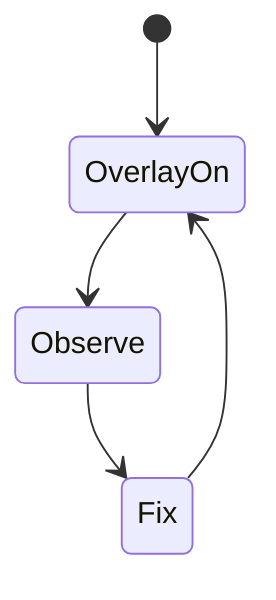
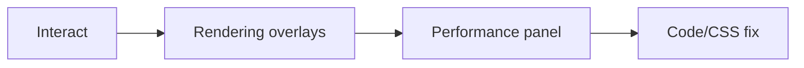

# DevTools Rendering Panel

<TopicMeta />

<Prerequisites />

::: tip Published
This page meets the handbook **published** bar: deep explanation, ≥10 common mistakes, and official references. Further engine-level errata welcome via PR.
:::

## Introduction

The **Rendering** drawer in Chromium DevTools visualizes painting, layer borders, scrolling issues, and frame rendering stats. It is the practical companion to Performance traces when debugging jank and paint areas.

## Why does it exist?

You cannot optimize what you cannot see. Paint flashing and layer borders make pipeline costs intuitive.

## Historical Background

DevTools gained rendering debug overlays as compositing became default; Continuously updated with Core Web Vitals overlays.

## Mental Model

Overlays answer: What painted? Which layers? Are we hitting frame budget? Is scroll slow because of main-thread work?

## Internal Workflow

1. Open DevTools → More tools → Rendering.
2. Enable Paint flashing / Layer borders / Frame Rendering Stats.
3. Interact with the UI.
4. Correlate with Performance panel recordings.

## Lifecycle



## Browser Perspective

These tools are Chromium-centric; Firefox/Safari have related but different tooling.

## JavaScript Engine Perspective

Not applicable.

## React Perspective

Use overlays while toggling components to see unexpected full-screen paints.

## Next.js Perspective

Not applicable.

## Server Perspective

Not applicable.

## Network Perspective

Not applicable.

## Memory Perspective

Not applicable.

## Performance

Use stats to see GPU/CPU frame time; don’t leave paint flashing on for users.

## Production Example

QA enabled paint flashing to catch a toast library repainting the whole app shell; fixed stacking/containment.

## Code Examples

```text
DevTools → Rendering → ✔ Paint flashing
                       ✔ Layer borders
                       ✔ Frame Rendering Stats
```

## Diagrams



## Common Mistakes

1. Using only Lighthouse and never overlays
2. Misreading paint flash as “bug” rather than cost signal
3. Leaving FPS meter as proof without field data
4. Ignoring scrolling performance issues checklist
5. Assuming Safari has the same panel
6. Optimizing based on one desktop GPU
7. Overlooking an edge case #1 specific to 03-browser.devtools-rendering-panel in production traffic
8. Overlooking an edge case #2 specific to 03-browser.devtools-rendering-panel in production traffic
9. Overlooking an edge case #3 specific to 03-browser.devtools-rendering-panel in production traffic
10. Overlooking an edge case #4 specific to 03-browser.devtools-rendering-panel in production traffic


## Best Practices

- Combine Rendering overlays + Performance + field metrics
- Test mid-tier mobile

## Anti-patterns

- Tuning animations only on high-refresh gaming monitors

## Comparison

| Tool | Best for |
| --- | --- |
| Rendering overlays | Live paint/layer insight |
| Performance panel | Timed pipeline breakdown |
| Lighthouse | Lab audits |

## Interview Questions

### Easy

**Q:** What does paint flashing show?

**A:** Regions of the page that were repainted.

### Medium

**Q:** Why enable layer borders?

**A:** To see which elements were promoted to compositor layers and catch over-promotion.

### Hard

**Q:** How do you debug scroll jank with these tools?

**A:** Enable frame stats and scrolling perf issues, record Performance while scrolling, look for main-thread layout/paint vs compositor scroll, fix handlers/CSS accordingly.

## Summary

- Rendering panel visualizes paint/layers/frames
- Use with Performance traces
- Chromium-first tooling
- Verify on real devices

## References

- [Chrome DevTools — Rendering](https://developer.chrome.com/docs/devtools/rendering/)
- [Chrome — Performance features](https://developer.chrome.com/docs/devtools/performance/)

<RelatedTopics />


Prev: [`03-browser.garbage-collection-browser`](/03-browser/garbage-collection-browser/)
