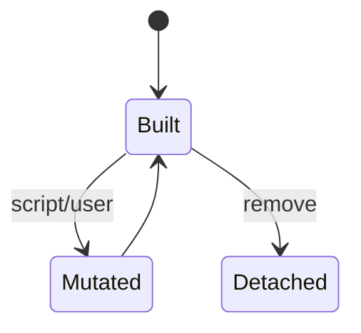
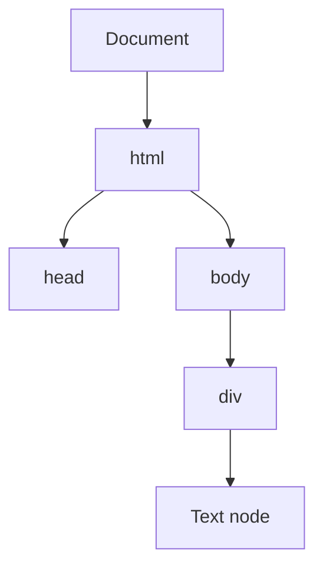

# DOM

<TopicMeta />

<Prerequisites />

::: tip Published
This page meets the handbook **published** bar: deep explanation, ≥10 common mistakes, and official references. Further engine-level errata welcome via PR.
:::

## Introduction

The **DOM** is the live tree of nodes (`Document`, elements, text, etc.) representing the page. Scripts read/update it via DOM APIs; the rendering engine turns those mutations into style/layout/paint work. It is not HTML source text — it is the **current** tree after parsing and mutations.

## Why does it exist?

Programming interfaces need objects, not a flat string. DOM provides traversal, events, and accessibility hooks.

## Historical Background

1990s browser wars → DOM Level specs → modern DOM Standard living standard (WHATWG) unifying behavior.

## Mental Model

Tree of nodes with parent/child/sibling pointers. Mutations are live. `innerHTML` parses HTML into nodes. React’s virtual DOM is a separate library tree that *commits* into this DOM.

## Internal Workflow

1. Parser creates nodes.
2. JS queries (`querySelector`) and mutates.
3. Engine dirties style/layout.
4. Event target dispatch uses the tree.

## Lifecycle



## Browser Perspective

Elements panel shows the DOM, not necessarily original HTML. Shadow DOM adds trees.

## JavaScript Engine Perspective

DOM bindings cross into C++; touching DOM from JS is slower than pure JS objects.

## React Perspective

React owns a virtual tree; DOM is the host. Prefer React updates over mixed manual DOM.

## Next.js Perspective

Not applicable.

## Server Perspective

Not applicable.

## Network Perspective

Not applicable.

## Memory Perspective

Detached nodes retained by JS closures leak. Clear listeners/refs.

## Performance

Batch mutations; avoid layout thrashing; use `DocumentFragment`; virtualize large lists.

## Production Example

A table with 50k DOM nodes froze scroll. Virtualization cut nodes to ~100.

## Code Examples

```js
const el = document.querySelector('#app')
el.replaceChildren() // clearer than innerHTML = '' for clearing
```

## Diagrams



## Common Mistakes

1. Thinking DOM === HTML file on disk
2. Holding references to detached nodes
3. Frequent forced reflow via size reads
4. Mixing jQuery/React DOM ownership carelessly
5. Using innerHTML with unsanitized user data (XSS)
6. Assuming querySelector is free in hot loops
7. Overlooking an edge case #1 specific to 03-browser.dom in production traffic
8. Overlooking an edge case #2 specific to 03-browser.dom in production traffic
9. Overlooking an edge case #3 specific to 03-browser.dom in production traffic
10. Overlooking an edge case #4 specific to 03-browser.dom in production traffic


## Best Practices

- Sanitize untrusted HTML
- Batch DOM writes
- Know Shadow DOM boundaries

## Anti-patterns

- Per-item layout reads/writes
- Building huge strings of HTML in a loop without batching

## Comparison

| Tree | Role |
| --- | --- |
| DOM | Host document nodes |
| CSSOM | Style rules |
| Render/layout tree | Visual boxes |
| React VDOM | Library UI description |

## Interview Questions

### Easy

**Q:** What is the DOM?

**A:** The live tree of document nodes browsers expose to scripts and rendering.

### Medium

**Q:** Why is touching the DOM relatively expensive?

**A:** It crosses into engine C++ structures and can invalidate style/layout, not just JS heap objects.

### Hard

**Q:** How does Shadow DOM change querying?

**A:** Shadow roots encapsulate; `querySelector` on light DOM won’t pierce closed shadows; slots project content.

## Summary

- DOM is a live node tree
- Mutations trigger rendering work
- Memory leaks via detached subtrees are common
- Not the same as React’s virtual tree

## References

- [DOM Standard](https://dom.spec.whatwg.org/)
- [MDN — DOM](https://developer.mozilla.org/en-US/docs/Web/API/Document_Object_Model)

<RelatedTopics />


Prev: [`03-browser.parsing-css`](/03-browser/parsing-css/) · Next: [`03-browser.cssom`](/03-browser/cssom/)
