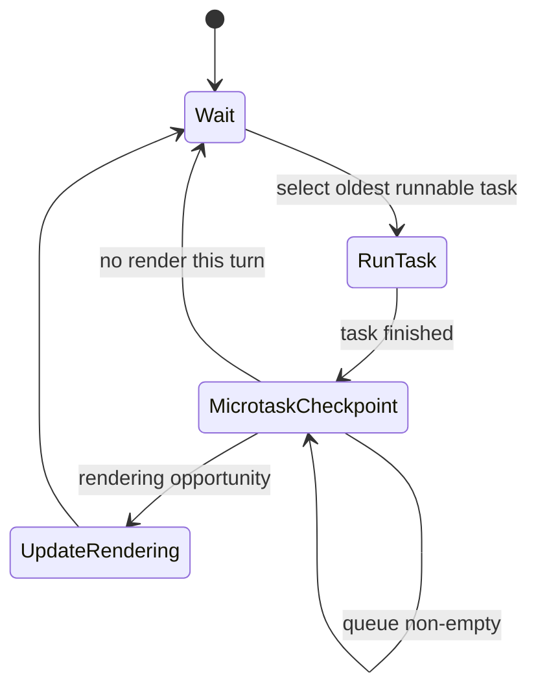
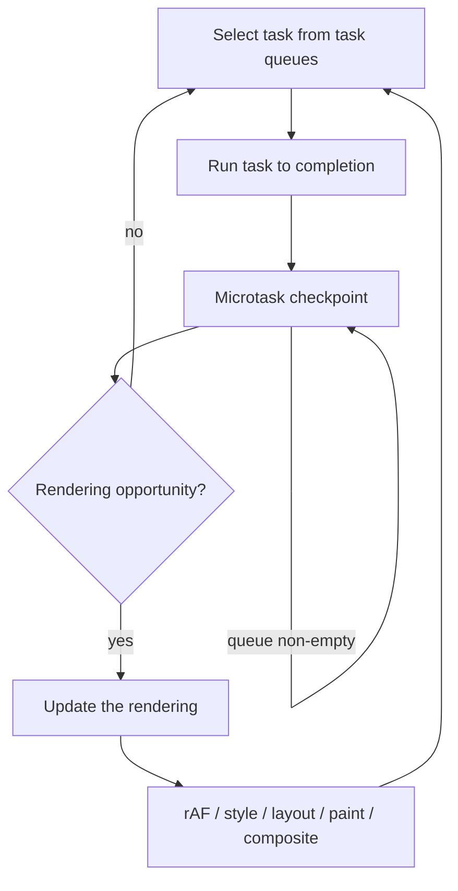
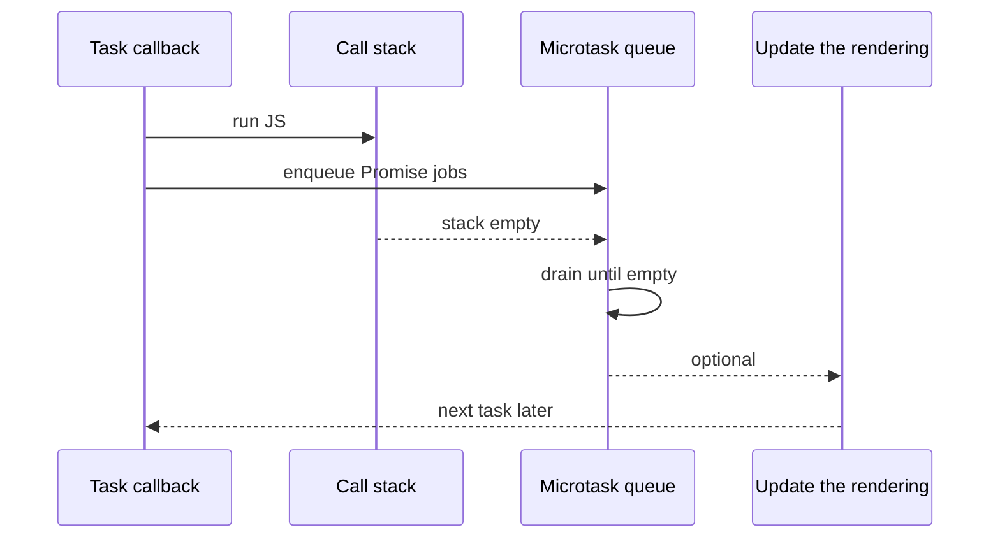

# Event Loop

<TopicMeta />

<Prerequisites />

::: tip Published
This page meets the handbook **published** bar: deep explanation, ≥10 common mistakes, and official references. Further engine-level errata welcome via PR.
:::

## Introduction

The **event loop** is the HTML Standard’s algorithm that coordinates JavaScript execution, host callbacks, and (for window event loops) **updating the rendering**. Page JS is event-driven and mostly single-threaded: work arrives as **tasks** and **microtasks**, runs on one [call stack](/03-browser/call-stack/), and must yield so input and paint can happen.

One-sentence model: **run a task → drain microtasks → optionally update rendering → repeat.**

Related handbook pages: [Event Loop (CS)](/01-computer-science/event-loop-cs/), [Event Loop (JS)](/06-javascript/event-loop-js/), [Microtasks](/03-browser/microtasks/), [Macrotasks](/03-browser/macrotasks/).

## Why does it exist?

Browsers interleave:

- your JavaScript
- parsing and the [critical rendering path](/03-browser/critical-rendering-path/)
- hit-testing and dispatching input
- network completion callbacks

If callbacks preempted arbitrary JS frames, reasoning about state would collapse. If JS never yielded, the tab would freeze. The event loop is **cooperative turn-based scheduling** with a normative microtask checkpoint and a defined rendering update pipeline.

## Historical Background

Early browsers ran scripts to completion with ad-hoc timer queues. `setTimeout`, XHR, MutationObserver, and Promises forced a shared model. The WHATWG **HTML Living Standard** now defines event loops, task sources, spinning the event loop, and the rendering update steps. Node.js uses libuv phases — related vocabulary, different rules. Always say which loop you mean in interviews.

## Mental Model

Restaurant with one chef ([call stack](/03-browser/call-stack/)):

1. **Task** (macrotask): an order ticket — timer, click, networking callback.
2. Chef cooks that ticket completely (run to completion).
3. **Microtask tray** must be emptied (Promises, `queueMicrotask`, some observer deliveries) before a new ticket — including microtasks queued *during* the drain.
4. For a **window** event loop, the browser may **update the rendering** (rAF, style, layout, paint, compose).
5. Idle until the next task.

Workers and worklets have event loops too, but without the browsing-context rendering steps.

## Internal Workflow

### HTML Standard steps (window event loop, simplified)

Normative detail lives in [HTML — Event loops](https://html.spec.whatwg.org/multipage/webappapis.html#event-loops). A practical faithful summary of one iteration:

1. **Choose the oldest task** from a task queue that has a runnable task (respecting task sources; browsers avoid starvation). Let it be *task*.
2. **Set** the event loop’s currently running task to *task*.
3. **Run** *task* (script or callback). This may queue more tasks and microtasks.
4. **Clear** the currently running task.
5. **Perform a microtask checkpoint**:
   - While the microtask queue is not empty:
     - Dequeue the oldest microtask and run it.
     - (Microtasks scheduled during the checkpoint also run before the checkpoint ends.)
   - Also perform the checkpoint when the stack is emptied after cleanups in other algorithm points (e.g. after running a callback that the host treats specially) — hosts call “perform a microtask checkpoint” in more places than “after each task,” but **after every task** is the core teaching model.
6. **Update the rendering** when the user agent decides it is time (not necessarily every task). For documents in the event loop, the UA performs the [**update the rendering**](https://html.spec.whatwg.org/multipage/webappapis.html#update-the-rendering) steps, which include (order matters conceptually):
   - flush autofocus / skip non-rendered docs as specified
   - run **resize** / **scroll** / media query / CSS animations & transitions steps as applicable
   - run **requestAnimationFrame** callbacks
   - run **IntersectionObserver** deliveries
   - perform style / layout / paint / composite work as needed
   - run `requestIdleCallback` when idle deadlines allow (separate scheduling)
7. If there is nothing to do, **wait** for the next task; otherwise go to step 1.

### Task sources (intuition)

Timers, DOM manipulation, user interaction, networking, history traversal, and others are different **task sources**. Ordering is guaranteed **within** a source more strongly than across sources.

### Spinning the event loop

Some algorithms “spin the event loop” to wait (e.g. synchronous dialogs, certain legacy sync APIs). That nested spinning is why sync XHR was so hostile — it re-enters the loop while your outer JS conceptually waits.

## Lifecycle



Per unit of work: **scheduled → selected → running → finished → (microtasks) → (optional render)**.

## Browser Perspective

Chromium: each renderer main thread runs a window event loop for documents in that process. Compositor frames can still move some layers if main-thread JS is busy, but style/layout work needed for the next frame waits on the loop. Performance panel labels Long Tasks when a turn exceeds ~50ms.

## JavaScript Engine Perspective

V8 executes whatever the embedder runs as a task/microtask. Promise reaction jobs are host-enqueued microtasks in browsers. JIT optimizations must not reorder beyond what ECMAScript + HTML allow you to observe.

## React Perspective

Concurrent React yields between units of work so the browser can process tasks and render. `useEffect` runs after paint; `useLayoutEffect` runs inside the commit path before paint. Promise chains inside either still use microtasks.

## Next.js Perspective

Node/Edge route handlers use Node’s loop, not the HTML rendering loop. Client components after hydration use the browser loop. Do not assume identical timer/Promise interleaving in every edge case across runtimes.

## Server Perspective

Not applicable for the browsing-context rendering event loop itself.

## Network Perspective

Sockets and HTTP stacks run off-thread; completion posts a task (or resolves a Promise, then microtasks) onto the page loop. HTTP/2 streams do not create parallel JS stacks.

## Memory Perspective

Queued tasks/microtasks retain closures. Microtask storms delay rendering and extend the lifetime of temporary graphs. Cancel timers and AbortControllers on navigation/unmount.

## Performance

- **Long tasks** block input and the next rendering update → poor INP.
- **Microtask monopolies** (`queueMicrotask` recursion / tight Promise chains) delay *Update the rendering* because the checkpoint must finish first.
- Prefer `scheduler.yield()` / chunking / Workers for CPU work; rAF for visual work; idle callbacks for deferrable work.

## Production Example

A trading dashboard applies hundreds of Promise-resolved state updates per second from a WebSocket fan-in. Each message’s microtask chain delays rAF and paint; FPS collapses. Fix: batch into one task (`queueMicrotask` once, or rAF coalesce), move decode to a Worker, and keep the main loop free for pointer tasks.

## Code Examples

```js
console.log('script start')
setTimeout(() => console.log('timeout (task)'), 0)
Promise.resolve()
  .then(() => console.log('promise1 (microtask)'))
  .then(() => console.log('promise2 (microtask)'))
requestAnimationFrame(() => console.log('rAF (rendering)'))
console.log('script end')
// Typical: script start → script end → promise1 → promise2 → (rAF before paint) → timeout
// Exact rAF vs timeout can vary with load; microtasks before next task is the stable rule.
```

```js
// Spec-shaped mental demo: microtasks drain fully
queueMicrotask(() => {
  console.log('m1')
  queueMicrotask(() => console.log('m2'))
})
setTimeout(() => console.log('t'), 0)
// m1, m2, then t
```

## Diagrams





## Common Mistakes

1. Treating Node’s event loop phases as identical to the HTML algorithm
2. Believing `setTimeout(fn, 0)` runs before Promise `then` handlers
3. Assuming the browser paints after every task
4. Creating microtask infinite loops that freeze UI without throwing
5. Blocking the main thread with sync CPU work and blaming “the event loop”
6. Expecting input events to interrupt a running task mid-function
7. Confusing rAF (rendering) with microtasks
8. Forgetting Workers have separate event loops
9. Relying on exact interleaving between unrelated task sources
10. Using busy-wait loops instead of awaiting events


## Best Practices

- Keep tasks short; measure Long Tasks
- Know whether a callback is task, microtask, or rAF
- Use AbortController so late tasks become no-ops
- Cite HTML vs Node explicitly in design docs and interviews
- Batch UI updates; avoid per-packet microtask storms

## Anti-patterns

- Busy-waiting for a flag instead of events/Promises
- Sync XHR or other “spin the event loop” legacy patterns
- Depending on cross-task-source ordering that the spec does not guarantee

## Comparison

| Mechanism | Queue | Relative to rendering |
| --- | --- | --- |
| `setTimeout` / UI / networking tasks | Task | After prior microtask checkpoint; paint may happen between tasks |
| Promise / `queueMicrotask` | Microtask | Before next task and before the next rendering update once checkpoint ends |
| `requestAnimationFrame` | Rendering steps | Inside **update the rendering** |
| `requestIdleCallback` | Idle period | When the UA has spare time |

See [Microtasks](/03-browser/microtasks/) and [Macrotasks](/03-browser/macrotasks/).

## Interview Questions

### Easy

**Q:** What is the browser event loop?

**A:** The HTML-defined loop that runs tasks on a single JS stack, drains microtasks after each task, and may update rendering for window event loops.

### Medium

**Q:** Outline the HTML event loop steps after a task runs.

**A:** Clear the running task, perform a microtask checkpoint until the microtask queue is empty, then optionally run update-the-rendering (rAF, style/layout/paint, etc.), then take another task or wait.

### Hard

**Q:** How can microtasks delay painting even if each handler is short?

**A:** Update the rendering happens after the microtask checkpoint. Continuously enqueueing new microtasks keeps the checkpoint open, so rendering steps never start — death by a thousand tiny jobs.

## Summary

- HTML event loop: task → microtask checkpoint → maybe update the rendering
- Task sources imply multiple queues, not one naive FIFO for everything
- Promises are microtasks; timers/input/networking are tasks
- Browser and Node loops differ — name which you mean
- Long tasks and microtask storms both destroy responsiveness

## References

- [HTML Standard — Event loops](https://html.spec.whatwg.org/multipage/webappapis.html#event-loops)
- [HTML Standard — Update the rendering](https://html.spec.whatwg.org/multipage/webappapis.html#update-the-rendering)
- [HTML Standard — Perform a microtask checkpoint](https://html.spec.whatwg.org/multipage/webappapis.html#perform-a-microtask-checkpoint)
- [MDN — Event loop](https://developer.mozilla.org/en-US/docs/Web/JavaScript/Event_loop)
- [Jake Archibald — Tasks, microtasks, queues and schedules](https://jakearchibald.com/2015/tasks-microtasks-queues-and-schedules/)

<RelatedTopics />


Prev: [`03-browser.task-queue`](/03-browser/task-queue/) · Next: [`03-browser.microtasks`](/03-browser/microtasks/)
