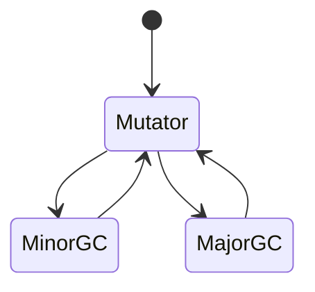
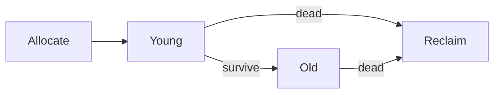

# Garbage Collection in the Browser

<TopicMeta />

<Prerequisites />

::: tip Published
This page meets the handbook **published** bar: deep explanation, ≥10 common mistakes, and official references. Further engine-level errata welcome via PR.
:::

## Introduction

**Garbage collection (GC)** reclaims JS objects that are unreachable. Browser engines use generational and incremental/concurrent GC (e.g. V8 Orinoco) to limit pauses. You cannot free objects manually; you **drop references** and reduce allocation pressure.

## Why does it exist?

Automatic memory enables safe app code, but GC pauses and heap growth still affect frame timing.

## Historical Background

Stop-the-world collectors → incremental marking → concurrent GC / parallel scavenging in modern V8/JSC/SM.

## Mental Model

Young objects die young (scavenge). Survivors promote to old space (mark/compact). Short-lived allocs are cheap until allocation rate explodes.

## Internal Workflow

1. Allocate on nursery/young gen.
2. Minor GC reclaims dead young objects.
3. Major GC marks from roots; sweeps/compacts old space.
4. Mutator (your JS) resumes.

## Lifecycle



## Browser Perspective

GC appears in Performance panel as garbage collection slices.

## JavaScript Engine Perspective

Engine-specific; V8 exposes gc events in traces. Forced GC in DevTools is for debugging only.

## React Perspective

Render churn = allocation churn. Memoization is sometimes about GC, not just CPU.

## Next.js Perspective

Not applicable.

## Server Perspective

Not applicable.

## Network Perspective

Not applicable.

## Memory Perspective

Not applicable.

## Performance

Reduce allocations in animation loops; reuse typed arrays carefully; avoid creating functions/objects per frame.

## Production Example

Game loop allocated new vectors every frame → GC every few frames. Object pools / mutate in place stabilized FPS.

## Code Examples

```js
// per-frame allocation — harsh
function tick() {
  const state = { t: performance.now() }
  requestAnimationFrame(tick)
}
```

## Diagrams



## Common Mistakes

1. Calling `gc()` in production mental models as a fix
2. Nulling everything obsessively without profiles
3. Ignoring allocation rate
4. Assuming WeakMap is a general cache without understanding ephemerality
5. Blaming GC for leaks (leaks are reachability)
6. Equating Java finalizers with JS
7. Overlooking an edge case #1 specific to 03-browser.garbage-collection-browser in production traffic
8. Overlooking an edge case #2 specific to 03-browser.garbage-collection-browser in production traffic
9. Overlooking an edge case #3 specific to 03-browser.garbage-collection-browser in production traffic
10. Overlooking an edge case #4 specific to 03-browser.garbage-collection-browser in production traffic


## Best Practices

- Profile allocations
- Prefer fewer short-lived objects in hot paths
- Use WeakMap/WeakRef for appropriate caches

## Anti-patterns

- Premature object pooling everywhere

## Comparison

| Concept | Developer action |
| --- | --- |
| GC of unreachable | Drop refs |
| Leak | Still reachable |
| WeakMap keys | GC with key objects |

## Interview Questions

### Easy

**Q:** What does GC collect?

**A:** Unreachable objects on the JS heap (engine-managed).

### Medium

**Q:** Why generational GC?

**A:** Most objects die young; scavenging young space is cheaper than always scanning the whole heap.

### Hard

**Q:** How can GC cause jank even without a leak?

**A:** High allocation rates force frequent collections; major GCs can pause the main thread enough to miss frames.

## Summary

- GC frees unreachable JS
- You control references and allocation rate
- Leaks ≠ GC bugs
- Trace GC in Performance panel

## References

- [V8 — Garbage collection](https://v8.dev/blog/trash-talk)
- [MDN — Memory management](https://developer.mozilla.org/en-US/docs/Web/JavaScript/Memory_management)

<RelatedTopics />


Prev: [`03-browser.memory-management`](/03-browser/memory-management/) · Next: [`03-browser.devtools-rendering-panel`](/03-browser/devtools-rendering-panel/)
