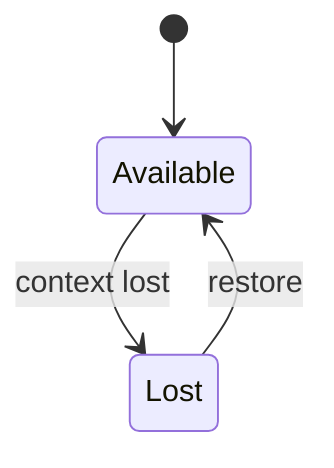

# GPU

<TopicMeta />

<Prerequisites />

::: tip Published
This page meets the handbook **published** bar: deep explanation, ≥10 common mistakes, and official references. Further engine-level errata welcome via PR.
:::

## Introduction

The **GPU** (via the browser’s GPU process/service) accelerates compositing, raster, Canvas/WebGL/WebGPU, and video. Frontend code rarely talks to the GPU directly except through those APIs, but CSS layerization depends on it.

## Why does it exist?

CPUs cannot push 60–120fps of pixels for modern UIs alone. GPUs excel at parallel pixel work.

## Historical Background

Optional acceleration → default GPU compositing; WebGL; WebGPU emerging.

## Mental Model

Main thread records; GPU process uploads textures/tiles; GPU draws. Device limits (memory, drivers) cause fallbacks.

## Internal Workflow

1. Compositor submits quads/tiles.
2. GPU process talks to drivers.
3. Frame displayed.
4. WebGL commands similarly IPC to GPU.

## Lifecycle



## Browser Perspective

chrome://gpu shows feature status. Crashes isolate to GPU process when possible.

## JavaScript Engine Perspective

WebGL bindings from JS enqueue GPU work; JS still runs on CPU.

## React Perspective

Not applicable.

## Next.js Perspective

Not applicable.

## Server Perspective

Not applicable.

## Network Perspective

Not applicable.

## Memory Perspective

Large textures and layers consume GPU memory → jank or context loss.

## Performance

Watch GPU memory; decode images appropriately; beware huge canvases on mobile.

## Production Example

Map WebGL leaked textures on route change → GPU memory climb → context lost. Explicit dispose on unmount.

## Code Examples

```js
canvas.addEventListener('webglcontextlost', (e) => {
  e.preventDefault()
  // schedule restore
})
```

## Diagrams


## Common Mistakes

1. Ignoring context loss
2. Unbounded texture uploads
3. Assuming GPU always helps CSS filters
4. Running WebGL on background tabs carelessly
5. Equating CSS composite with WebGL expertise
6. Not testing integrated vs discrete GPUs
7. Overlooking an edge case #1 specific to 03-browser.gpu in production traffic
8. Overlooking an edge case #2 specific to 03-browser.gpu in production traffic
9. Overlooking an edge case #3 specific to 03-browser.gpu in production traffic
10. Overlooking an edge case #4 specific to 03-browser.gpu in production traffic


## Best Practices

- Handle webglcontextlost
- Dispose GPU resources
- Cap canvas resolution (DPR strategy)

## Anti-patterns

- Fullscreen canvas at native DPR on low-end phones without need

## Comparison

| API | GPU use |
| --- | --- |
| CSS composite | Common |
| Canvas 2D | Often GPU-backed |
| WebGL/WebGPU | Explicit GPU |

## Interview Questions

### Easy

**Q:** Why do browsers use a GPU process?

**A:** To accelerate compositing/raster and isolate driver crashes from the browser UI.

### Medium

**Q:** What is WebGL context loss?

**A:** The GPU resource is reset; the app must recreate buffers/textures.

### Hard

**Q:** How can CSS cause GPU memory pressure?

**A:** Many large promoted layers and effects create big textures that exceed GPU budgets.

## Summary

- GPU process accelerates frames and graphics APIs
- Resources must be disposed
- Context loss is real on mobile
- CSS layers also use GPU memory

## References

- [Chrome — GPU process](https://www.chromium.org/developers/design-documents/gpu-architecture/)
- [MDN — WebGL best practices](https://developer.mozilla.org/en-US/docs/Web/API/WebGL_API/WebGL_best_practices)

<RelatedTopics />


Prev: [`03-browser.composite`](/03-browser/composite/) · Next: [`03-browser.reflow`](/03-browser/reflow/)
