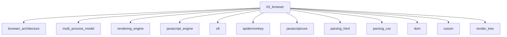

# Browser

## Scope

Browser architecture, rendering pipeline, event loop, and memory

## Prerequisites

See the learning paths and each topic's prerequisites in the registry.

## Topics in order

- [Browser Architecture](/03-browser/browser-architecture/) — junior, ~40 min
- [Multi-Process Model](/03-browser/multi-process-model/) — mid, ~35 min
- [Rendering Engine](/03-browser/rendering-engine/) — mid, ~40 min
- [JavaScript Engine](/03-browser/javascript-engine/) — mid, ~40 min
- [V8](/03-browser/v8/) — senior, ~50 min
- [SpiderMonkey](/03-browser/spidermonkey/) — senior, ~30 min
- [JavaScriptCore](/03-browser/javascriptcore/) — senior, ~30 min
- [Parsing HTML](/03-browser/parsing-html/) — mid, ~35 min
- [Parsing CSS](/03-browser/parsing-css/) — mid, ~30 min
- [DOM](/03-browser/dom/) — junior, ~35 min
- [CSSOM](/03-browser/cssom/) — mid, ~30 min
- [Render Tree](/03-browser/render-tree/) — mid, ~30 min
- [Layout](/03-browser/layout/) — mid, ~35 min
- [Paint](/03-browser/paint/) — mid, ~30 min
- [Composite](/03-browser/composite/) — mid, ~35 min
- [GPU](/03-browser/gpu/) — senior, ~30 min
- [Reflow](/03-browser/reflow/) — mid, ~30 min
- [Repaint](/03-browser/repaint/) — mid, ~25 min
- [Critical Rendering Path](/03-browser/critical-rendering-path/) — mid, ~45 min
- [Call Stack](/03-browser/call-stack/) — junior, ~25 min
- [Task Queue](/03-browser/task-queue/) — mid, ~30 min
- [Event Loop](/03-browser/event-loop/) — mid, ~45 min
- [Microtasks](/03-browser/microtasks/) — mid, ~35 min
- [Macrotasks](/03-browser/macrotasks/) — mid, ~30 min
- [Memory Management](/03-browser/memory-management/) — mid, ~40 min
- [Garbage Collection in the Browser](/03-browser/garbage-collection-browser/) — senior, ~40 min
- [DevTools Rendering Panel](/03-browser/devtools-rendering-panel/) — mid, ~25 min

## Module knowledge graph

## Suggested learning paths

Browse [Learning Paths](/learning-paths/).
