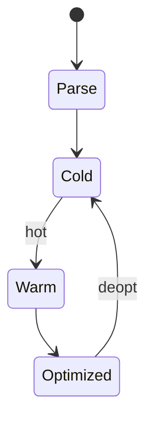

# JavaScript Engine

<TopicMeta />

<Prerequisites />

::: tip Published
This page meets the handbook **published** bar: deep explanation, ≥10 common mistakes, and official references. Further engine-level errata welcome via PR.
:::

## Introduction

A **JavaScript engine** executes ECMAScript: parsing source, compiling to bytecode and/or machine code, optimizing hot functions, deoptimizing when assumptions break, and collecting garbage. In browsers the major engines are [V8](/03-browser/v8/) (Chromium), [SpiderMonkey](/03-browser/spidermonkey/) (Firefox), and [JavaScriptCore](/03-browser/javascriptcore/) (Safari).

## Why does it exist?

JS is dynamic and delivered as source on every page load. Engines must start fast (interpreters) yet peak high (JITs) while staying correct per ECMAScript.

## Historical Background

SpiderMonkey (Netscape), then V8’s JIT race (2008) forced everyone to invest in optimizing compilers. Modern engines share Ignition-like interpreters + tiered compilers.

## Mental Model

**Parse → compile tiers → execute → profile → optimize → possibly deoptimize → GC**. Hidden classes/shapes and inline caches make property access fast when shapes are stable.

## Internal Workflow

1. Fetch script; parse to AST / bytecode.
2. Interpret or quickly compile.
3. Collect type feedback on hot code.
4. Optimize speculative native code.
5. Deoptimize on mismatch; GC reclaim heap.

## Lifecycle



## Browser Perspective

Engine embeds in renderer/worker. Long JS = long tasks on that thread.

## JavaScript Engine Perspective

This page *is* the engine view — see V8/JSC/SM child topics for specifics.

## React Perspective

Polymorphic props and megamorphic call sites can inhibit optimization; prefer stable shapes.

## Next.js Perspective

Server bundles run on Node’s V8 or Edge isolates — different CPU budgets.

## Server Perspective

Not applicable.

## Network Perspective

Not applicable.

## Memory Perspective

Not applicable.

## Performance

Avoid megamorphic object shapes in hot paths; don’t micro-optimize without profiles; watch GC pauses in allocations-heavy UI.

## Production Example

A chart lib allocated new object shapes per point (`{x,y,metaN}`). Stabilizing shapes cut CPU 30% in V8.

## Code Examples

```js
// Monomorphic: same shape
function sum(p) { return p.x + p.y }
// Keep objects like {x, y} in hot loops
```

## Diagrams


## Common Mistakes

1. Assuming the same microbenchmark ranks identically in all engines
2. Equating TypeScript with engine optimization
3. Ignoring deopts from shape changes
4. Thinking `eval` is free
5. Confusing engine with rendering engine
6. Premature `new Function` tricks
7. Overlooking an edge case #1 specific to 03-browser.javascript-engine in production traffic
8. Overlooking an edge case #2 specific to 03-browser.javascript-engine in production traffic
9. Overlooking an edge case #3 specific to 03-browser.javascript-engine in production traffic
10. Overlooking an edge case #4 specific to 03-browser.javascript-engine in production traffic


## Best Practices

- Measure in the engines your users run
- Keep hot object shapes stable
- Ship less JS — parse/compile cost is real

## Anti-patterns

- Giant undifferentiated bundles
- Delete + add properties in hot loops casually

## Comparison

| Engine | Host |
| --- | --- |
| V8 | Chrome, Edge, Node |
| SpiderMonkey | Firefox |
| JavaScriptCore | Safari, Bun (embeds) |

## Interview Questions

### Easy

**Q:** What is a JS engine?

**A:** The runtime that parses, compiles, and executes JavaScript and manages memory.

### Medium

**Q:** Why tiered compilation?

**A:** Start fast with bytecode/interpreter; invest JIT time only in hot functions.

### Hard

**Q:** What causes deoptimization?

**A:** Violated speculative assumptions — e.g. object shape or call target changes — forcing a fall back to less optimized code.

## Summary

- Engines parse, tier-compile, optimize, GC
- V8 / SM / JSC differ but share ideas
- Stable shapes help JITs
- JS engine ≠ rendering engine

## References

- [ECMAScript specification](https://tc39.es/ecma262/)
- [V8 docs](https://v8.dev/docs)

<RelatedTopics />


Prev: [`03-browser.rendering-engine`](/03-browser/rendering-engine/) · Next: [`03-browser.v8`](/03-browser/v8/)
