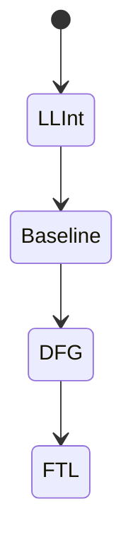

# JavaScriptCore

<TopicMeta />

<Prerequisites />

::: tip Published
This page meets the handbook **published** bar: deep explanation, ≥10 common mistakes, and official references. Further engine-level errata welcome via PR.
:::

## Introduction

**JavaScriptCore (JSC)** is WebKit’s JS engine (Safari, and other WebKit embeds). It uses a famous multi-tier pipeline (LLInt → Baseline → DFG → FTL historically) and different GC choices. iOS/macOS users mean JSC is mandatory for real-world QA.

## Why does it exist?

Mobile Safari is often the strictest UX constraint. JSC performance and WebKit rendering quirks decide whether your SPA feels native on iPhone.

## Historical Background

JSC evolved inside WebKit; tiers like DFG/FTL were influential. Bun also embeds JSC outside Safari — another reason to know the name.

## Mental Model

Same language semantics, Safari-shaped cliffs: cold start on devices, JIT restrictions on some iOS configurations historically, WebKit-specific DOM costs.

## Internal Workflow

1. Parse / LLInt.
2. Promote hot code through tiers.
3. Optimize with type feedback.
4. GC; coordinate with WebKit object lifetimes.

## Lifecycle



## Browser Perspective

WebKit + JSC on Apple platforms; energy efficiency matters as much as peak throughput.

## JavaScript Engine Perspective

Test on real iOS devices; simulators are imperfect for perf.

## React Perspective

Hydration cost on mid-tier iPhones is a common JSC+WebKit bottleneck.

## Next.js Perspective

Not applicable.

## Server Perspective

Not applicable.

## Network Perspective

Not applicable.

## Memory Perspective

Not applicable.

## Performance

Budget JS for low-end iPhones; prefer less hydration; watch third-party scripts.

## Production Example

Marketing site passed Lighthouse on desktop Chrome yet janked on iPhone 11 due to hydration + images. Fix: less client JS, streaming SSR.

## Code Examples

```js
// Feature-detect standards; don’t sniff JSC
if ('ResizeObserver' in window) { /* ... */ }
```

## Diagrams


## Common Mistakes

1. Never testing Safari/iOS
2. Assuming Chrome DevTools equals WebKit behavior
3. Ignoring ITP/privacy-related timing differences
4. Heavy polyfills shipped to modern Safari unnecessarily
5. Treating Bun’s JSC as identical to Safari’s host embedding
6. Animating layout properties without checking iOS GPU behavior
7. Overlooking an edge case #1 specific to 03-browser.javascriptcore in production traffic
8. Overlooking an edge case #2 specific to 03-browser.javascriptcore in production traffic
9. Overlooking an edge case #3 specific to 03-browser.javascriptcore in production traffic
10. Overlooking an edge case #4 specific to 03-browser.javascriptcore in production traffic


## Best Practices

- Real-device Safari checks for JS-heavy flows
- Use WebKit remote inspection
- Keep bundles lean for cellular + JSC parse cost

## Anti-patterns

- Desktop-only CI screenshots

## Comparison

| Engine | Primary browser |
| --- | --- |
| JavaScriptCore | Safari |
| V8 | Chrome/Edge |
| SpiderMonkey | Firefox |

## Interview Questions

### Easy

**Q:** What engine does Safari use?

**A:** JavaScriptCore (with WebKit rendering).

### Medium

**Q:** Why can iOS Safari be the perf gate?

**A:** Large mobile share, thermal/CPU limits, and WebKit/JSC characteristics differ from desktop Chromium.

### Hard

**Q:** How do you investigate a Safari-only jank?

**A:** Reproduce on device, use WebKit inspector/timelines, compare CRP and JS time, minimize repro, check known WebKit bugs.

## Summary

- JSC is Safari’s JS engine
- Multi-tier compilation
- iOS testing is non-negotiable
- Less JS often beats micro-tuning

## References

- [JavaScriptCore docs/blog via WebKit](https://webkit.org/blog/)
- [WebKit — JavaScript](https://docs.webkit.org/)

<RelatedTopics />


Prev: [`03-browser.spidermonkey`](/03-browser/spidermonkey/) · Next: [`03-browser.parsing-html`](/03-browser/parsing-html/)
