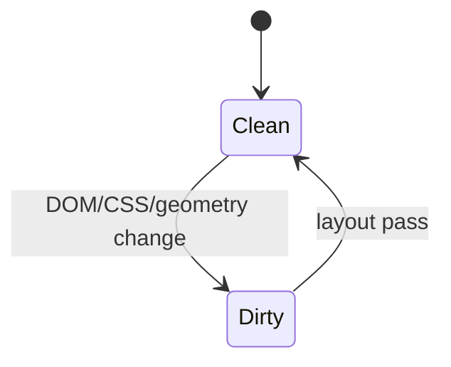
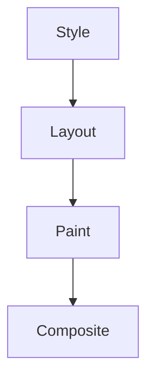

# Layout

<TopicMeta />

<Prerequisites />

::: tip Published
This page meets the handbook **published** bar: deep explanation, ≥10 common mistakes, and official references. Further engine-level errata welcome via PR.
:::

## Introduction

**Layout** (also called **reflow**) computes geometric information — sizes, positions — for boxes in the layout tree given the viewport and CSS. It is often the expensive middle of the rendering pipeline after style and before paint.

## Why does it exist?

CSS is constraint-based (flex, grid, flow). Geometry must be solved before painting pixels in the right places.

## Historical Background

Block&inline layout → flex/grid → container queries. Engines incrementally reflow dirty subtrees when possible.

## Mental Model

Dirty bit on a subtree → measure children → assign positions → cache results until invalidated. Reading `offsetWidth` forces flush if dirty.

## Internal Workflow

1. Style computed.
2. Layout dirty roots scheduled.
3. Walk/measure boxes.
4. Update scrollable overflow.
5. Proceed to paint if needed.

## Lifecycle



## Browser Perspective

Performance panel shows Layout events. Layout thrashing = many forced layouts.

## JavaScript Engine Perspective

Not V8 — layout is rendering engine work on the main thread (mostly).

## React Perspective

Commit that changes DOM structure can trigger large layouts. CSS containment helps.

## Next.js Perspective

Not applicable.

## Server Perspective

Not applicable.

## Network Perspective

Not applicable.

## Memory Perspective

Not applicable.

## Performance

Batch reads then writes; prefer transform animations; contain: layout; virtualize lists; avoid animating width/top.

## Production Example

Autosuggest measured each item via offsetHeight in a loop — 40 layouts/frame. Batched measurement fixed jank.

## Code Examples

```js
// thrash
items.forEach(el => { el.style.width = el.offsetWidth + 1 + 'px' })
// better: read all, then write all
const widths = items.map(el => el.offsetWidth)
items.forEach((el, i) => { el.style.width = widths[i] + 1 + 'px' })
```

## Diagrams



## Common Mistakes

1. Interleaving read/write layout properties
2. Animating top/left/width
3. Assuming flex is always cheap
4. Ignoring table layout costs
5. Forcing layout inside requestAnimationFrame unnecessarily many times
6. Equating layout with paint
7. Overlooking an edge case #1 specific to 03-browser.layout in production traffic
8. Overlooking an edge case #2 specific to 03-browser.layout in production traffic
9. Overlooking an edge case #3 specific to 03-browser.layout in production traffic
10. Overlooking an edge case #4 specific to 03-browser.layout in production traffic


## Best Practices

- Read/write batching
- Containment and content-visibility
- Compositor-friendly animations

## Anti-patterns

- Layout thrashing loops
- Measuring everything on every mousemove

## Comparison

| Stage | Computes |
| --- | --- |
| Style | Computed values |
| Layout | Geometry |
| Paint | Display lists/pixels |
| Composite | Layer blend |

## Interview Questions

### Easy

**Q:** What is layout/reflow?

**A:** Calculating box geometry (size/position) for the page.

### Medium

**Q:** What is layout thrashing?

**A:** Alternating DOM writes and geometry reads so the browser must relayout repeatedly in one turn.

### Hard

**Q:** How does contain:layout help?

**A:** It promises subtree layout independence so invalidation/layout can be scoped, reducing work outside the containment box.

## Summary

- Layout solves geometry
- Forced sync layout is a common jank source
- Batch reads/writes
- Prefer transform/opacity for motion

## References

- [web.dev — Avoid large complex layouts](https://web.dev/articles/avoid-large-complex-layouts-and-layout-thrashing)
- [MDN — Reflow](https://developer.mozilla.org/en-US/docs/Glossary/Reflow)

<RelatedTopics />


Prev: [`03-browser.render-tree`](/03-browser/render-tree/) · Next: [`03-browser.paint`](/03-browser/paint/)
