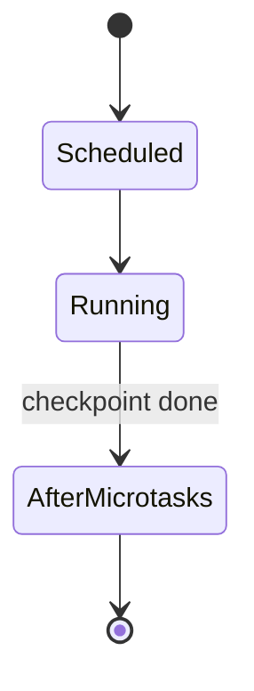
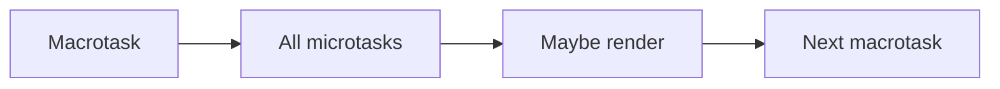

# Macrotasks

<TopicMeta />

<Prerequisites />

::: tip Published
This page meets the handbook **published** bar: deep explanation, ≥10 common mistakes, and official references. Further engine-level errata welcome via PR.
:::

## Introduction

**Macrotask** is developer slang for an HTML **task** — one turn of work selected from a [task queue](/03-browser/task-queue/). Examples: `setTimeout`/`setInterval` callbacks, discrete UI events, `postMessage`, many networking completions. After each macrotask, [microtasks](/03-browser/microtasks/) drain before the next macrotask or paint.

## Why does it exist?

The platform needs a unit of work larger than a single Promise handler for host I/O and input. Macrotasks define those units and create the gaps where browsers can render and handle other sources.

## Historical Background

The term “macrotask” spread from community explanations contrasting them with microtasks; the HTML Standard simply says **task**. Prefer “task” in precise writing; “macrotask” is fine in interviews if you define it.

## Mental Model

Each macrotask is one full “turn”: run callback → drain microtasks → maybe render → next turn.

## Internal Workflow

1. Host enqueues a task on a task source.
2. Event loop selects it.
3. Callback runs on the call stack.
4. Microtask checkpoint.
5. Optional rendering update.

## Lifecycle



## Browser Perspective

Input tasks are prioritized for responsiveness; background timers may be throttled in inactive tabs (minimum delay clamping, budget limits).

## JavaScript Engine Perspective

Engine enters/exits once per task callback from the embedder’s perspective.

## React Perspective

Most DOM event handlers you write are macrotasks. React’s event delegation still runs inside that task.

## Next.js Perspective

Not applicable.

## Server Perspective

Not applicable.

## Network Perspective

XHR onload / fetch’s internal completion scheduling ultimately results in tasks + Promise microtasks for user code.

## Memory Perspective

Not applicable.

## Performance

Inactive-tab timer throttling breaks naive polling. Prefer WebSocket/SSE push; use Page Visibility API.

## Production Example

A SPA used setInterval(fetch, 1000) for presence. Background tabs delayed intervals → false offline. Switched to server push + visibility-aware heartbeat.

## Code Examples

```js
setTimeout(() => console.log('macro'), 0)
Promise.resolve().then(() => console.log('micro'))
// micro then macro
```

## Diagrams



## Common Mistakes

1. Using “macrotask” without knowing the HTML word is task
2. Assuming timers fire at exact delays under load or in background tabs
3. Polling with setInterval instead of events
4. Expecting macrotasks to interrupt each other
5. Putting animation solely on setTimeout
6. Forgetting clearInterval on unmount
7. Overlooking an edge case #1 specific to 03-browser.macrotasks in production traffic
8. Overlooking an edge case #2 specific to 03-browser.macrotasks in production traffic
9. Overlooking an edge case #3 specific to 03-browser.macrotasks in production traffic
10. Overlooking an edge case #4 specific to 03-browser.macrotasks in production traffic


## Best Practices

- Say task vs microtask explicitly in code reviews
- Respect background timer throttling
- Prefer rAF for animation

## Anti-patterns

- setInterval without drift control for clocks
- Nested timeouts as a state machine without cancellation

## Comparison

| Term | Spec name | Typical APIs |
| --- | --- | --- |
| Macrotask | Task | setTimeout, click, message |
| Microtask | Microtask | Promise, queueMicrotask |

## Interview Questions

### Easy

**Q:** What is a macrotask?

**A:** A colloquial name for an HTML task: one event-loop turn such as a timer or click handler.

### Medium

**Q:** What runs between two macrotasks?

**A:** A full microtask checkpoint, and possibly a rendering update, before the next task is selected.

### Hard

**Q:** Why might setTimeout(fn, 100) run much later?

**A:** Main-thread congestion, nesting clamp (historically 4ms), background tab throttling, and tasks ahead in queue all delay firing.

## Summary

- Macrotask ≈ HTML task
- One runs at a time on the main thread
- Microtasks and maybe paint happen between them
- Timers are unreliable clocks under load

## References

- [HTML Standard — Event loops](https://html.spec.whatwg.org/multipage/webappapis.html#event-loops)
- [MDN — setTimeout](https://developer.mozilla.org/en-US/docs/Web/API/Window/setTimeout)

<RelatedTopics />


Prev: [`03-browser.microtasks`](/03-browser/microtasks/) · Next: [`03-browser.memory-management`](/03-browser/memory-management/)
