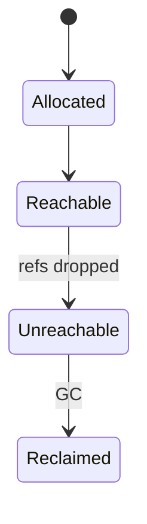
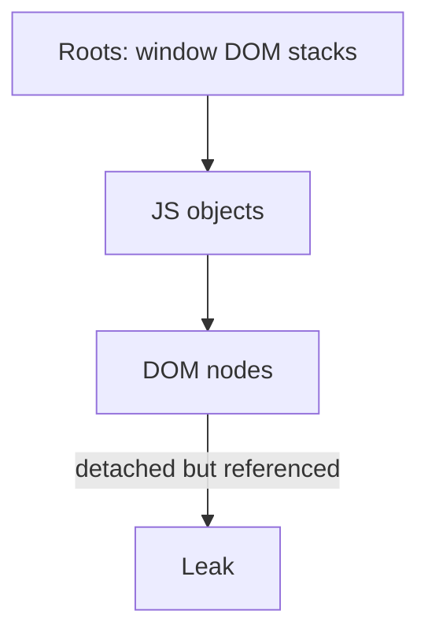

# Memory Management

<TopicMeta />

<Prerequisites />

::: tip Published
This page meets the handbook **published** bar: deep explanation, ≥10 common mistakes, and official references. Further engine-level errata welcome via PR.
:::

## Introduction

**Memory management** in the browser spans the JS heap ([V8](/03-browser/v8/) GC), DOM object graphs, image/decoded buffers, and caches. Leaks usually mean **reachable** memory you intended to drop — listeners, detached DOM, closures, global registries.

## Why does it exist?

Tabs are long-lived. Unbounded growth kills mobile tabs and makes GC jank.

## Historical Background

Manual malloc eras → GC languages; browsers added heap snapshots and allocation timelines.

## Mental Model

If something is reachable from roots (window, DOM, stacks, pending callbacks), it stays alive. Detached DOM with a JS ref is still alive.

## Internal Workflow

1. Allocate JS/DOM/resources.
2. Drop references when done.
3. GC reclaims unreachable JS.
4. Engine frees native wrappers when possible.

## Lifecycle



## Browser Perspective

Memory panel: snapshots, allocation sampling. Task Manager for process totals.

## JavaScript Engine Perspective

V8 GC strategies (scavenge/mark-sweep/compact) show as pauses if heavy.

## React Perspective

Clear effects; watch Suspense/query caches; avoid accidental retained props.

## Next.js Perspective

Not applicable.

## Server Perspective

Not applicable.

## Network Perspective

Not applicable.

## Memory Perspective

This topic is the memory perspective hub for the module.

## Performance

High allocation rate → GC pauses. Leaks → eventual OOM. Prefer object reuse carefully; measure first.

## Production Example

Chat widget retained every message DOM node in an array forever. Windowed buffer fixed memory.

## Code Examples

```js
const ac = new AbortController()
window.addEventListener('resize', onResize, { signal: ac.signal })
// later
ac.abort()
```

## Diagrams



## Common Mistakes

1. Forgotten event listeners
2. Closures capturing large arrays in long-lived timers
3. Caches without bounds/TTL
4. Detached DOM retainers
5. Growing arrays of debug logs in production
6. Assuming navigation always frees everything instantly in SPAs
7. Overlooking an edge case #1 specific to 03-browser.memory-management in production traffic
8. Overlooking an edge case #2 specific to 03-browser.memory-management in production traffic
9. Overlooking an edge case #3 specific to 03-browser.memory-management in production traffic
10. Overlooking an edge case #4 specific to 03-browser.memory-management in production traffic


## Best Practices

- AbortController for listeners/fetch
- Bounded caches
- Heap snapshot diffs

## Anti-patterns

- Global mutable stores that never evict

## Comparison

| Tool | Use |
| --- | --- |
| Heap snapshot | Retainer paths |
| Allocation timeline | Churn |
| Performance | GC pauses |

## Interview Questions

### Easy

**Q:** What causes a DOM leak?

**A:** JavaScript still referencing nodes removed from the document.

### Medium

**Q:** How do you find a leak?

**A:** Take heap snapshots before/after actions, look for growing detached HTMLElement retainers, fix references/listeners.

### Hard

**Q:** Why might SPA memory rise even with GC?

**A:** Caches, listeners, and module-level singletons remain reachable roots across “page” transitions that aren’t full reloads.

## Summary

- Reachability defines lifetime
- Detached DOM + refs = leaks
- Bound caches and abort listeners
- Snapshot to verify

## References

- [Chrome — Memory problems](https://developer.chrome.com/docs/devtools/memory-problems/)
- [MDN — Memory management](https://developer.mozilla.org/en-US/docs/Web/JavaScript/Memory_management)

<RelatedTopics />


Prev: [`03-browser.macrotasks`](/03-browser/macrotasks/) · Next: [`03-browser.garbage-collection-browser`](/03-browser/garbage-collection-browser/)
