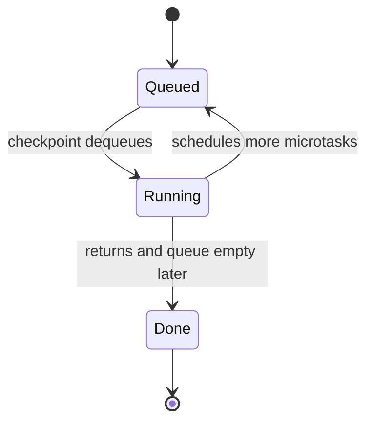
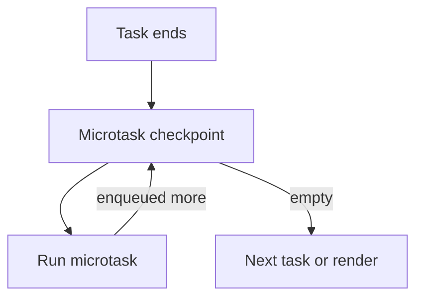

# Microtasks

<TopicMeta />

<Prerequisites />

::: tip Published
This page meets the handbook **published** bar: deep explanation, ≥10 common mistakes, and official references. Further engine-level errata welcome via PR.
:::

## Introduction

**Microtasks** are jobs that run at a **microtask checkpoint**: after a task finishes (and at other algorithm-defined points), the browser drains the microtask queue **until it is empty**. Primary sources: Promise reaction handlers, `queueMicrotask`, and some host deliveries (historically MutationObserver).

They always run **before** the next macrotask and **before** the next **update the rendering** once the checkpoint completes.

## Why does it exist?

Promises need a way to run handlers soon after the current JS stack clears, but still with consistent ordering — without waiting for timers. Microtasks give “soon, but after sync code” semantics that make `await` chains predictable.

## Historical Background

MutationObserver introduced a microtask-like checkpoint. ES2015 Promises aligned with host job queues; HTML wired Promise jobs to the microtask queue. `queueMicrotask` exposed the same queue to authors.

## Mental Model

After finishing a plate of food (task), the chef must wash **all** the small cups (microtasks) — including cups added while washing — before taking a new order or plating (render).

## Internal Workflow

1. Sync code or a task schedules `promise.then(fn)` / `queueMicrotask(fn)`.
2. When the stack is empty, the host **performs a microtask checkpoint**.
3. While queue non-empty: run oldest microtask.
4. Only then: next task or rendering update.

## Lifecycle



## Browser Perspective

DevTools can show microtasks under the parent task. Endless microtasks = frozen UI with little “Timer” activity.

## JavaScript Engine Perspective

V8’s Promise jobs are enqueued through the embedder’s microtask mechanism in Chrome.

## React Perspective

State updates scheduled from Promise handlers flush according to React’s rules, but the handler itself still ran as a microtask.

## Next.js Perspective

Not applicable.

## Server Perspective

Not applicable.

## Network Perspective

fetch resolution queues microtasks for your `then`/`await` continuations after the networking task completes.

## Memory Perspective

A pending Promise retains resolve handlers and closed-over data until settled and handlers run.

## Performance

Microtask storms delay paint. Prefer batching; never recursively `queueMicrotask` without a terminating condition that yields to a task.

## Production Example

A client retries an API in a tight `await` loop without delay, generating continuous microtask/task churn. Add exponential backoff as real timer tasks.

## Code Examples

```js
queueMicrotask(() => console.log(1))
Promise.resolve().then(() => console.log(2))
console.log(0)
// 0, 1, 2 (relative order of 1 vs 2 is enqueue order)
```

## Diagrams



## Common Mistakes

1. Thinking microtasks run in parallel
2. Using microtasks for work that should wait until after paint
3. Recursive queueMicrotask causing a soft freeze
4. Assuming MutationObserver always beats Promises (ordering depends on enqueue time)
5. Confusing microtasks with Node’s `process.nextTick` (similar niche, different runtime)
6. Expecting setTimeout(0) inside a microtask to run before other already-queued microtasks
7. Scheduling unbounded Promise chains that delay paint
8. Assuming MutationObserver callbacks always run as microtasks in every browser version without checking
9. Equating `process.nextTick` with browser microtasks
10. Overlooking an edge case #1 specific to 03-browser.microtasks in production traffic


## Best Practices

- Use microtasks for “after sync, before render/task” consistency
- Break huge chains with timer/rAF/scheduler.yield
- Document intentional reliance on microtask ordering

## Anti-patterns

- Scheduling unbounded microtasks in a hot path
- Implementing a custom “next tick” that starves rendering

## Comparison

| | Microtask | Macrotask |
| --- | --- | --- |
| Examples | Promise, queueMicrotask | setTimeout, click, fetch completion task |
| Drain | Entire queue | One task |
| Before paint? | Checkpoint must finish first | Paint may occur between tasks |

## Interview Questions

### Easy

**Q:** Name two APIs that schedule microtasks.

**A:** Promise then/catch/finally handlers and queueMicrotask (also await continuations).

### Medium

**Q:** Why do microtasks run before setTimeout(0)?

**A:** After the current task, the microtask checkpoint drains fully before the event loop selects the next task (the timer).

### Hard

**Q:** Can microtasks starve macrotasks?

**A:** Yes. Continuously enqueueing microtasks prevents the checkpoint from ending, so the next task never starts and rendering updates stall.

## Summary

- Microtasks drain completely at a checkpoint
- Promises and queueMicrotask share this queue in browsers
- Rendering waits until the checkpoint finishes
- Unbounded microtasks freeze the page

## References

- [HTML — Perform a microtask checkpoint](https://html.spec.whatwg.org/multipage/webappapis.html#perform-a-microtask-checkpoint)
- [MDN — queueMicrotask](https://developer.mozilla.org/en-US/docs/Web/API/Window/queueMicrotask)
- [MDN — Microtask guide](https://developer.mozilla.org/en-US/docs/Web/API/HTML_DOM_API/Microtask_guide)

<RelatedTopics />


Prev: [`03-browser.event-loop`](/03-browser/event-loop/) · Next: [`03-browser.macrotasks`](/03-browser/macrotasks/)
