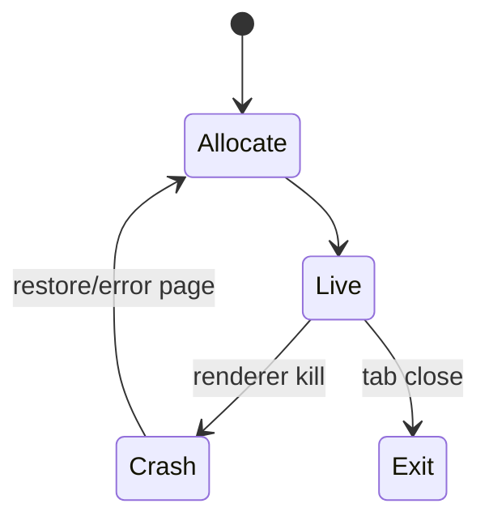
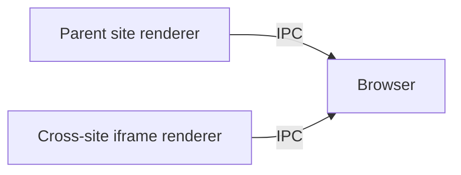

# Multi-Process Model

<TopicMeta />

<Prerequisites />

::: tip Published
This page meets the handbook **published** bar: deep explanation, ≥10 common mistakes, and official references. Further engine-level errata welcome via PR.
:::

## Introduction

The **multi-process model** is how Chromium-class browsers assign **renderer processes** to documents and frames. Related origins may share a process; cross-site content is preferably isolated. This is the concrete policy layer on top of [browser architecture](/03-browser/browser-architecture/).

## Why does it exist?

Without isolation, XSS or a renderer exploit in one site could inspect another site’s DOM/cookies in the same address space. Multi-process + sandbox reduces that to IPC attacks against a hardened browser process.

## Historical Background

Chrome 2008: process-per-tab beginnings. Over time: process-per-site-instance, out-of-process iframes (OOPIFs), full Site Isolation defaults on desktop.

## Mental Model

Each **site** (scheme + eTLD+1, with caveats) prefers its own sandboxed renderer. Cross-site iframes become out-of-process frames talking via browser mediation.

## Internal Workflow

1. Navigation committed for an origin.
2. Process allocator finds an eligible renderer or spawns one.
3. Blink/V8 instance loads the document.
4. Cross-site subframe may trigger another process + compositor surface.

## Lifecycle



## Browser Perspective

chrome://process-internals and Task Manager help see assignments. Memory pressure can remerge processes on some platforms.

## JavaScript Engine Perspective

Each renderer embeds engines; isolates are per agent cluster within.

## React Perspective

No direct API — but cross-origin iframe React apps do not share JS heaps.

## Next.js Perspective

Not applicable.

## Server Perspective

Not applicable.

## Network Perspective

Cookies still keyed by origin; process model does not replace cookie policies.

## Memory Perspective

N isolates ≈ N heaps of framework code unless shared via memory mapping of binaries.

## Performance

OOPIFs cost more memory and IPC. Pages with many cross-site embeds pay a tax.

## Production Example

A marketplace embeds many partner iframes; RAM spikes on low-end laptops. Mitigation: lazy-load iframes, prefer redirects over always-on embeds.

## Code Examples

```html
<iframe sandbox="allow-scripts" src="https://other.example/widget"></iframe>
<!-- Prefer sandbox + strict CSP; expect separate process on desktop Chromium -->
```

## Diagrams



## Common Mistakes

1. Assuming iframe always shares the parent heap
2. Equating thread and process
3. Thinking sandbox attribute alone equals process isolation
4. Ignoring mobile process limits
5. Expecting SharedArrayBuffer without cross-origin isolation headers
6. Confusing site vs origin
7. Overlooking an edge case #1 specific to 03-browser.multi-process-model in production traffic
8. Overlooking an edge case #2 specific to 03-browser.multi-process-model in production traffic
9. Overlooking an edge case #3 specific to 03-browser.multi-process-model in production traffic
10. Overlooking an edge case #4 specific to 03-browser.multi-process-model in production traffic


## Best Practices

- Minimize cross-site iframe count
- Use sandbox + CSP on embeds
- For SAB/high-res timers, ship COOP/COEP correctly

## Anti-patterns

- Document.domain hacks (deprecated/removed paths)
- Relying on parent↔child globals across sites

## Comparison

| Model | Isolation | Memory |
| --- | --- | --- |
| Single-process | Weak | Low |
| Process-per-tab | Medium | Medium |
| Site Isolation / OOPIF | Strong | Higher |

## Interview Questions

### Easy

**Q:** Why not run all tabs in one process?

**A:** Crashes and exploits would be shared; multi-process isolates failure and attack surface.

### Medium

**Q:** What is an out-of-process iframe?

**A:** A cross-site iframe rendered in a different renderer process from its parent.

### Hard

**Q:** How does process model interact with `postMessage`?

**A:** Messages are serialized via the browser; you never get a live object reference across agent clusters — structured clone / transferable rules apply.

## Summary

- Multi-process assigns sandboxed renderers to sites
- OOPIFs isolate cross-site frames
- Security wins cost RAM/IPC
- Page JS cannot assume shared heaps across sites

## References

- [Chromium Site Isolation](https://www.chromium.org/Home/chromium-security/site-isolation/)
- [Chrome — Browser architecture](https://developer.chrome.com/blog/inside-browser-part1)

<RelatedTopics />


Prev: [`03-browser.browser-architecture`](/03-browser/browser-architecture/) · Next: [`03-browser.rendering-engine`](/03-browser/rendering-engine/)
