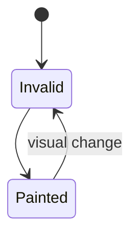

# Paint

<TopicMeta />

<Prerequisites />

::: tip Published
This page meets the handbook **published** bar: deep explanation, ≥10 common mistakes, and official references. Further engine-level errata welcome via PR.
:::

## Introduction

**Paint** records drawing commands (text, colors, borders, shadows, images) for laid-out boxes into paint records / display lists, often per layer. It follows [layout](/03-browser/layout/) and precedes [composite](/03-browser/composite/).

## Why does it exist?

Geometry alone is not pixels. Paint decides how each box visually appears.

## Historical Background

Software raster → threaded paint → GPU rasterization. Engines split paint invalidation finely.

## Mental Model

Layout boxes → paint ops → rasterize tiles → compositor stitches. Changing `background-color` can repaint without relayout; changing `width` needs layout then paint.

## Internal Workflow

1. Layout complete.
2. Invalidate paint regions.
3. Build/update display lists.
4. Raster tiles (CPU/GPU).
5. Composite.

## Lifecycle



## Browser Perspective

Paint flashing in DevTools Rendering panel shows regions.

## JavaScript Engine Perspective

Not applicable.

## React Perspective

Visual-only prop changes may paint without full layout if geometry stable.

## Next.js Perspective

Not applicable.

## Server Perspective

Not applicable.

## Network Perspective

Not applicable.

## Memory Perspective

Not applicable.

## Performance

Large layers with blur/shadows are expensive. Reduce paint areas; promote intentional layers carefully.

## Production Example

A full-screen box-shadow on a frequently updating div repainted huge regions; simplified shadow fixed GPU time.

## Code Examples

```css
.card:hover { background: #fafafa; } /* paint */
.card.open { height: 200px; }       /* layout + paint */
.card.lift { transform: translateY(-4px); } /* often composite */
```

## Diagrams


## Common Mistakes

1. Using paint when composite would do
2. Enormous animated blurs
3. Assuming any CSS change only paints
4. Ignoring paint on text heavy areas
5. Overusing will-change
6. Confusing paint with CRP first pixel
7. Overlooking an edge case #1 specific to 03-browser.paint in production traffic
8. Overlooking an edge case #2 specific to 03-browser.paint in production traffic
9. Overlooking an edge case #3 specific to 03-browser.paint in production traffic
10. Overlooking an edge case #4 specific to 03-browser.paint in production traffic


## Best Practices

- Inspect paint flashing
- Limit invalidation area
- Prefer compositor props for animation

## Anti-patterns

- Animating box-shadow heavily
- will-change on everything

## Comparison

| Change | Typical pipeline |
| --- | --- |
| color | Paint (+ composite) |
| width | Layout + paint + composite |
| transform | Composite (if layered) |

## Interview Questions

### Easy

**Q:** What is paint?

**A:** Filling pixels/display lists for visuals of boxes after layout.

### Medium

**Q:** Can you paint without layout?

**A:** Yes — e.g. changing background color with geometry unchanged.

### Hard

**Q:** Why might paint be large despite small DOM changes?

**A:** Invalidation can expand to large layers; stacking contexts and effects enlarge paint regions.

## Summary

- Paint follows layout
- Not all visual changes relayout
- Paint area matters
- DevTools paint flashing helps

## References

- [Chrome — Paint performance](https://developer.chrome.com/docs/performance/)
- [HTML/CSS rendering concepts on web.dev](https://web.dev/articles/rendering-performance)

<RelatedTopics />


Prev: [`03-browser.layout`](/03-browser/layout/) · Next: [`03-browser.composite`](/03-browser/composite/)
