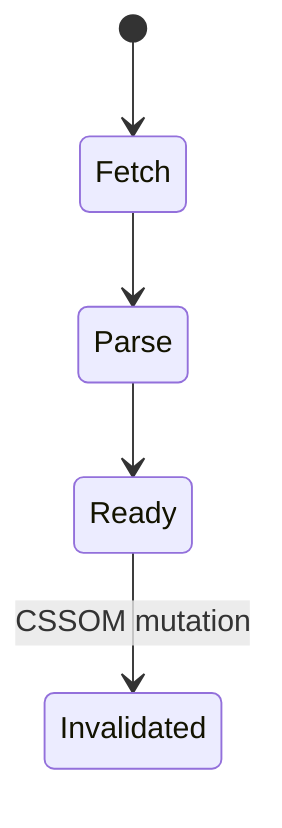
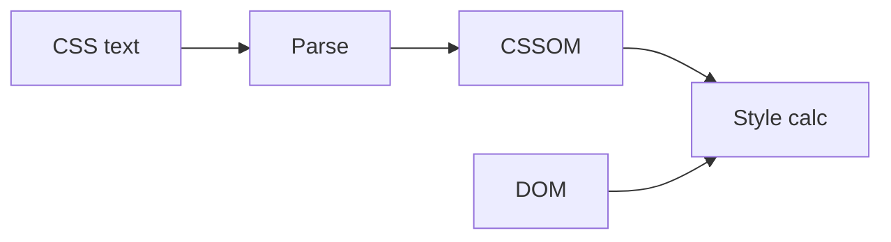

# Parsing CSS

<TopicMeta />

<Prerequisites />

::: tip Published
This page meets the handbook **published** bar: deep explanation, ≥10 common mistakes, and official references. Further engine-level errata welcome via PR.
:::

## Introduction

**CSS parsing** turns stylesheet text into a [CSSOM](/03-browser/cssom/) of rules and declarations. Render-blocking CSS in the critical path delays first paint because the engine prefers not to paint unstyled content (FOUC avoidance).

## Why does it exist?

Style must be known before useful layout/paint. Parsing CSS is CPU work that competes with JS on the main thread.

## Historical Background

From `<font>` tags to cascading stylesheets; CSSOM and render-blocking behavior evolved with performance best practices (media attributes, critical CSS).

## Mental Model

CSS bytes → tokenize/parse → rule trees → cascade later with DOM → computed styles. `@import` chains delay completion.

## Internal Workflow

1. Discover stylesheet (link/style).
2. Fetch if external.
3. Parse into rules.
4. Mark style dirty; compute when needed.
5. Media-mismatched links may be non-blocking.

## Lifecycle



## Browser Perspective

Link rel=stylesheet is render-blocking for matching media. DevTools Network shows priority.

## JavaScript Engine Perspective

CSS parsing is in the rendering engine, not V8 — unless CSS-in-JS feeds style via JS.

## React Perspective

Runtime CSS-in-JS injects rules via JS — pay parse + invalidation costs carefully.

## Next.js Perspective

Not applicable.

## Server Perspective

Not applicable.

## Network Perspective

Critical CSS should be small and early; HTTP/2 helps but bytes still parse.

## Memory Perspective

Not applicable.

## Performance

Inline critical CSS; defer non-critical with media tricks or onload; avoid huge unused sheets.

## Production Example

Design system shipped 800KB CSS; unused >70%. Purge/split by route cut FCP.

## Code Examples

```html
<link rel="stylesheet" href="/critical.css" />
<link rel="stylesheet" href="/print.css" media="print" />
```

## Diagrams



## Common Mistakes

1. Blocking render with unused huge CSS
2. Chained @import
3. Assuming CSS never blocks
4. Injecting styles late without reserving space (CLS)
5. Duplicating frameworks CSS per microfrontend carelessly
6. Using JS to load all CSS after paint without critical path plan
7. Overlooking an edge case #1 specific to 03-browser.parsing-css in production traffic
8. Overlooking an edge case #2 specific to 03-browser.parsing-css in production traffic
9. Overlooking an edge case #3 specific to 03-browser.parsing-css in production traffic
10. Overlooking an edge case #4 specific to 03-browser.parsing-css in production traffic


## Best Practices

- Critical CSS strategy
- media attributes for non-critical
- Cover fonts/layout to reduce CLS

## Anti-patterns

- @import url in CSS for critical path
- One mega-bundle CSS for entire enterprise

## Comparison

| Resource | Typically render-blocking? |
| --- | --- |
| Matching stylesheet | Yes |
| media=print | No (until print) |
| async script | No for parser in same way |
| font | Can block text rendering (FOIT/FOUT policies) |

## Interview Questions

### Easy

**Q:** What is produced by parsing CSS?

**A:** CSSOM — a structured representation of style rules.

### Medium

**Q:** Why does CSS block first paint?

**A:** Browsers avoid FOUC; they wait for critical CSS before painting meaningful styled frames.

### Hard

**Q:** How can you load a stylesheet without blocking render?

**A:** Use non-matching media then switch, `preload` as style then onload enable, or split critical vs deferred CSS carefully.

## Summary

- CSS parses into CSSOM
- Critical CSS blocks rendering
- @import and huge sheets hurt CRP
- Split and defer thoughtfully

## References

- [CSS Syntax Module](https://www.w3.org/TR/css-syntax-3/)
- [web.dev — Extract critical CSS](https://web.dev/articles/extract-critical-css)

<RelatedTopics />


Prev: [`03-browser.parsing-html`](/03-browser/parsing-html/) · Next: [`03-browser.dom`](/03-browser/dom/)
