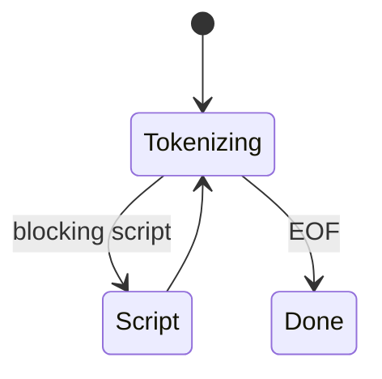
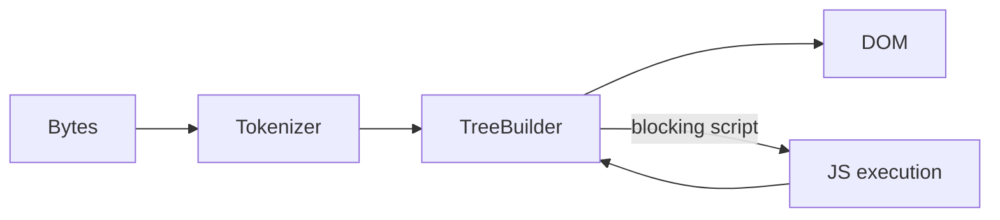

# Parsing HTML

<TopicMeta />

<Prerequisites />

::: tip Published
This page meets the handbook **published** bar: deep explanation, ≥10 common mistakes, and official references. Further engine-level errata welcome via PR.
:::

## Introduction

**HTML parsing** converts a byte stream into a [DOM](/03-browser/dom/) tree using the HTML tokenizer + tree construction algorithms (WHATWG). Unlike XML, HTML is resilient: the parser recovers from broken markup. Scripts can block or defer parsing depending on `async`/`defer`/type=module.

## Why does it exist?

Authors ship text; browsers need a structured document for styling, accessibility trees, and scripting. Speculative parsing keeps the network busy while scripts run.

## Historical Background

SGML-ish browsers → messy compatibility → HTML5/WHATWG standardized the exact error-handling parser everyone had to clone.

## Mental Model

Bytes → **tokenizer** (tags, text, comments) → **tree builder** inserts nodes → if classic blocking `<script>`, parser pauses for fetch+execute → continues. Preload scanner may look ahead for URLs.

## Internal Workflow

1. Decode bytes to input stream.
2. Tokenize.
3. Tree construction / foster parenting / adoption agency as specified.
4. Encounter script → run script processing model.
5. EOF → document ready states advance.

## Lifecycle



## Browser Perspective

Incremental parsing enables progressive rendering. Preload scanner discovers CSS/JS early.

## JavaScript Engine Perspective

Classic scripts execute on the parser thread turn; modules are deferred by default.

## React Perspective

SSR HTML is parsed like any HTML; hydration expects matching DOM structure.

## Next.js Perspective

Not applicable.

## Server Perspective

Not applicable.

## Network Perspective

Streaming responses let parsing start before Content-Length completes.

## Memory Perspective

Not applicable.

## Performance

Avoid blocking scripts in `<head>` without defer/async; prefer modules; keep HTML lean on CRP.

## Production Example

A tag manager injected sync in head delayed FCP. Moved to `async` + consent gating.

## Code Examples

```html
<script src="/app.js" defer></script>
<script type="module" src="/entry.js"></script>
```

## Diagrams



## Common Mistakes

1. Assuming browsers reject invalid HTML
2. Putting sync scripts before content without need
3. Expecting document.write to be fine in modern apps
4. Forgetting parser-blocking vs defer semantics
5. Mis-nested tags and blaming CSS
6. Ignoring preload scanner by obfuscating URLs in JS-only injection
7. Overlooking an edge case #1 specific to 03-browser.parsing-html in production traffic
8. Overlooking an edge case #2 specific to 03-browser.parsing-html in production traffic
9. Overlooking an edge case #3 specific to 03-browser.parsing-html in production traffic
10. Overlooking an edge case #4 specific to 03-browser.parsing-html in production traffic


## Best Practices

- Valid, semantic markup
- defer/async/module appropriately
- Discover critical CSS/JS in HTML

## Anti-patterns

- document.write after load
- Huge HTML without streaming/pagination

## Comparison

| Script | Parser behavior |
| --- | --- |
| Classic sync | Blocks parser while download+exec |
| defer | Downloads parallel; runs after document parsed |
| async | Runs when ready; order not preserved |
| type=module | Deferred by default; ordered modules |

## Interview Questions

### Easy

**Q:** What does the HTML parser output?

**A:** A DOM tree (plus side effects like running scripts).

### Medium

**Q:** Why can scripts block rendering?

**A:** Classic sync scripts pause parsing; without DOM/CSS progress, first paint waits.

### Hard

**Q:** What is the preload scanner?

**A:** A speculative tokenizer pass that finds resource URLs early even if the main parser is blocked on a script.

## Summary

- HTML parsing is standardized and forgiving
- Scripts interact with the parser via specific rules
- Streaming + preload scanner aid CRP
- Prefer defer/module for apps

## References

- [HTML Standard — Parsing](https://html.spec.whatwg.org/multipage/parsing.html)
- [MDN — HTML parser](https://developer.mozilla.org/en-US/docs/Web/HTML)

<RelatedTopics />


Prev: [`03-browser.javascriptcore`](/03-browser/javascriptcore/) · Next: [`03-browser.parsing-css`](/03-browser/parsing-css/)
