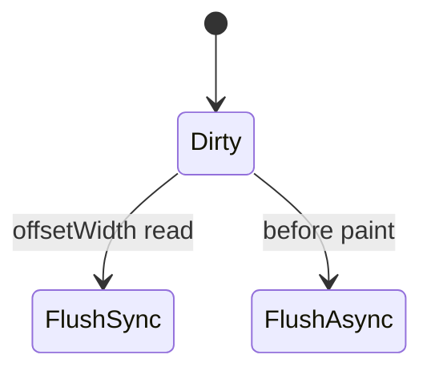
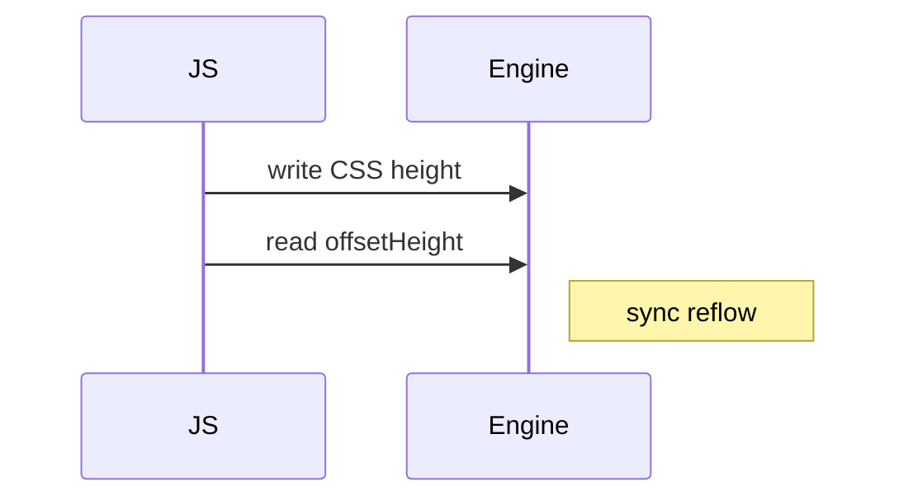

# Reflow

<TopicMeta />

<Prerequisites />

::: tip Published
This page meets the handbook **published** bar: deep explanation, ≥10 common mistakes, and official references. Further engine-level errata welcome via PR.
:::

## Introduction

**Reflow** is another name for [layout](/03-browser/layout/) — recalculating geometry. Engineers say “avoid reflow” meaning avoid unnecessary or forced synchronous layout. This page focuses on **causes and thrashing patterns**.

## Why does it exist?

Geometry recalculation is CPU-heavy and blocks the main thread. Understanding reflow is mandatory for INP/FPS work.

## Historical Background

The term reflow is older teaching language; Chromium traces label it Layout.

## Mental Model

Any change that might affect size/position dirties layout. Reading geometry flushes pending reflow now.

## Internal Workflow

1. Mutation dirties.
2. Either scheduled layout before paint, or sync flush on read.
3. Geometry updated.

## Lifecycle



## Browser Perspective

Performance panel: look for Layout + Recalculate Style pairs in loops.

## JavaScript Engine Perspective

Not applicable.

## React Perspective

Render thrash often reflow thrash after commit.

## Next.js Perspective

Not applicable.

## Server Perspective

Not applicable.

## Network Perspective

Not applicable.

## Memory Perspective

Not applicable.

## Performance

Batch DOM; avoid sync flush; use ResizeObserver instead of polling offsets.

## Production Example

Infinite scroll measured each card height individually while inserting — reflow storm. Switched to estimated sizes + ResizeObserver.

## Code Examples

```js
// forces reflow
void el.offsetHeight
```

## Diagrams



## Common Mistakes

1. Polling geometry on scroll with layout reads
2. Calling getBoundingClientRect in tight loops
3. Changing classes one-by-one causing N reflows
4. Thinking reflow == repaint
5. Ignoring fonts causing late reflow (CLS)
6. Using tables for complex dashboard layout without need
7. Overlooking an edge case #1 specific to 03-browser.reflow in production traffic
8. Overlooking an edge case #2 specific to 03-browser.reflow in production traffic
9. Overlooking an edge case #3 specific to 03-browser.reflow in production traffic
10. Overlooking an edge case #4 specific to 03-browser.reflow in production traffic


## Best Practices

- Batch classList changes
- Prefer transform
- Reserve space for async content

## Anti-patterns

- Measure-mutate-measure per node

## Comparison

| Term | Meaning |
| --- | --- |
| Reflow | Layout geometry recalc |
| Repaint | Paint without necessarily layout |
| Composite | Layer merge |

## Interview Questions

### Easy

**Q:** What triggers reflow?

**A:** Changes affecting geometry (DOM structure, layout CSS, font loads) and some measurement APIs.

### Medium

**Q:** Name APIs that force sync layout.

**A:** offsetWidth/Height, getBoundingClientRect, scrollTop writes/reads patterns, getComputedStyle for some properties, etc.

### Hard

**Q:** How do you prove a reflow issue?

**A:** Record Performance, find repeated Layout events tied to script, correlate with geometry reads/writes, fix batching, remeasure.

## Summary

- Reflow = layout
- Forced sync layout is the footgun
- Batch and measure less
- Trace to verify

## References

- [MDN — Reflow](https://developer.mozilla.org/en-US/docs/Glossary/Reflow)
- [web.dev — Layout thrashing](https://web.dev/articles/avoid-large-complex-layouts-and-layout-thrashing)

<RelatedTopics />


Prev: [`03-browser.gpu`](/03-browser/gpu/) · Next: [`03-browser.repaint`](/03-browser/repaint/)
