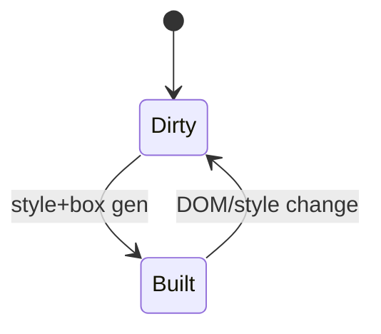
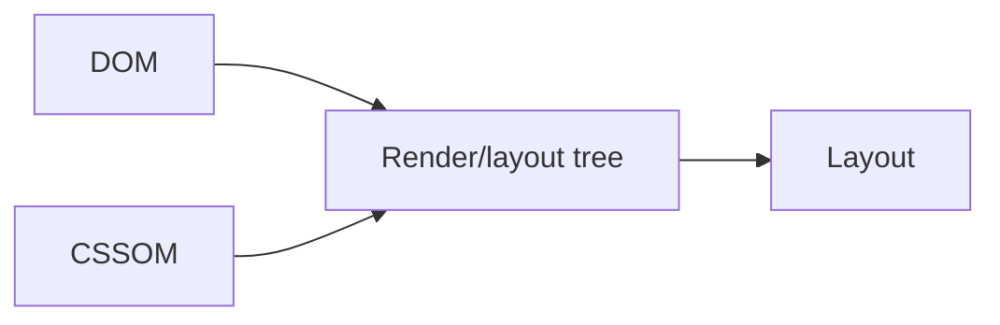

# Render Tree

<TopicMeta />

<Prerequisites />

::: tip Published
This page meets the handbook **published** bar: deep explanation, ≥10 common mistakes, and official references. Further engine-level errata welcome via PR.
:::

## Introduction

The **render tree** (modern engines: layout/fragment trees) is the visual tree built from DOM + computed styles — typically excluding `display: none` nodes and including anonymous boxes. It is the input to [layout](/03-browser/layout/).

## Why does it exist?

Not every DOM node produces a box. Engines need a structure that matches the visual formatting model.

## Historical Background

Classic “render tree” teaching came from early WebKit/Chrome docs; engines now use richer fragment/layout tree terminology, but the mental model remains taught.

## Mental Model

DOM node + computed style → box (or none). `visibility: hidden` still boxes (take space); `display: none` does not. Pseudo-elements can create boxes without DOM elements.

## Internal Workflow

1. Compute style.
2. Generate boxes/fragments.
3. Layout sizes/positions.
4. Paint.

## Lifecycle



## Browser Perspective

Layers may promote some render objects for compositing.

## JavaScript Engine Perspective

Not applicable.

## React Perspective

Returning `null` removes host nodes → boxes go away.

## Next.js Perspective

Not applicable.

## Server Perspective

Not applicable.

## Network Perspective

Not applicable.

## Memory Perspective

Not applicable.

## Performance

Huge visual trees cost layout. Virtualize; `content-visibility` can skip work.

## Production Example

Offscreen dashboards kept thousands of `display:none` nodes still in DOM — memory high. Conditional mount fixed RAM.

## Code Examples

```css
.hidden { display: none; }      /* no box */
.invisible { visibility: hidden; } /* box remains */
```

## Diagrams



## Common Mistakes

1. Thinking display:none nodes are in the render tree
2. Equating render tree with DOM 1:1
3. Forgetting pseudo-element boxes
4. Confusing visibility with display
5. Ignoring anonymous boxes in inline formatting
6. Assuming Shadow DOM is invisible to rendering
7. Overlooking an edge case #1 specific to 03-browser.render-tree in production traffic
8. Overlooking an edge case #2 specific to 03-browser.render-tree in production traffic
9. Overlooking an edge case #3 specific to 03-browser.render-tree in production traffic
10. Overlooking an edge case #4 specific to 03-browser.render-tree in production traffic


## Best Practices

- Remove large unused subtrees when possible
- Use content-visibility for long pages

## Anti-patterns

- Keeping entire app routes mounted+hidden forever

## Comparison

| Node state | In layout tree? |
| --- | --- |
| display:none | No |
| visibility:hidden | Yes |
| opacity:0 | Yes |

## Interview Questions

### Easy

**Q:** What feeds the render tree?

**A:** DOM and CSSOM / computed styles.

### Medium

**Q:** Does visibility:hidden remove a node from the render tree?

**A:** No — it still generates a box and occupies space.

### Hard

**Q:** Why is “render tree” an incomplete term in modern engines?

**A:** Engines use layout/fragment/paint trees and layers; “render tree” is a teaching simplification.

## Summary

- Visual tree ≠ DOM tree
- display:none drops boxes
- Layout consumes the box tree
- Modern engines use richer names

## References

- [Chrome — Critical rendering path](https://developer.chrome.com/docs/performance/critical-rendering-path)
- [CSS Display Module](https://www.w3.org/TR/css-display-3/)

<RelatedTopics />


Prev: [`03-browser.cssom`](/03-browser/cssom/) · Next: [`03-browser.layout`](/03-browser/layout/)
