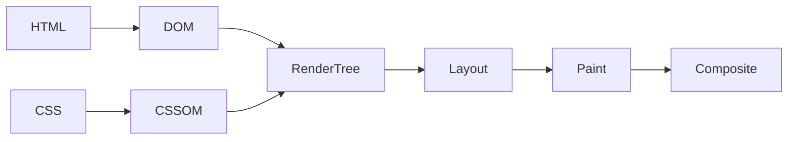

# Rendering Engine

<TopicMeta />

<Prerequisites />

::: tip Published
This page meets the handbook **published** bar: deep explanation, ≥10 common mistakes, and official references. Further engine-level errata welcome via PR.
:::

## Introduction

A **rendering engine** (Blink in Chromium, WebKit in Safari, Gecko in Firefox) builds the [DOM](/03-browser/dom/)/[CSSOM](/03-browser/cssom/), performs style resolution, [layout](/03-browser/layout/), [paint](/03-browser/paint/), and hands layers to the compositor/[GPU](/03-browser/gpu/). It is distinct from the [JavaScript engine](/03-browser/javascript-engine/), though they interact constantly.

## Why does it exist?

HTML/CSS are declarative documents. Something must implement the visual formatting model, handle dynamic mutations, and produce pixels efficiently across devices.

## Historical Background

KHTML → WebKit → Blink fork (2013). Gecko evolved independently. Engines converged on similar pipelines but differ in optimizations and feature timelines.

## Mental Model

Pipeline: **bytes → tokens → DOM/CSSOM → render tree → layout → paint records → tiles/layers → composite**. JS can mutate DOM/CSS between any stages and invalidate later stages.

## Internal Workflow

1. Receive HTML/CSS/image bytes.
2. Parse HTML → DOM; parse CSS → CSSOM.
3. Compute style; build annotated render/layout tree.
4. Layout boxes; paint into display lists/layers.
5. Composite with GPU; present frame.
6. On mutation: dirty flags → partial pipeline rerun.

## Lifecycle

```mermaid
stateDiagram-v2
  [*] --> Parse
  Parse --> Style
  Style --> Layout
  Layout --> Paint
  Paint --> Composite
  Composite --> Style: invalidation
```

## Browser Perspective

Renderer process hosts the engine. Compositor frame production can continue for already-committed layers while main thread is busy — until main-thread style/layout is required.

## JavaScript Engine Perspective

JS engine calls into DOM bindings that dirty rendering structures.

## React Perspective

React commit → DOM mutations → engine invalidation. Concurrent rendering aims to reduce wasted commits.

## Next.js Perspective

Not applicable.

## Server Perspective

Not applicable.

## Network Perspective

CRP starts when bytes arrive; streaming HTML enables incremental parsing.

## Memory Perspective

Not applicable.

## Performance

Avoid layout thrashing; prefer compositor-friendly anims (transform/opacity); reduce style recalc scope with containment.

## Production Example

A CSS-in-JS pattern recalculated styles for the whole tree each hover. Switching to atomic CSS + contain fixed style time.

## Code Examples

```js
// Force layout (use sparingly)
el.classList.add('open')
const h = el.offsetHeight // read triggers layout if dirty
el.style.height = h + 'px'
```

## Diagrams



## Common Mistakes

1. Calling V8 the rendering engine
2. Assuming all browsers use Blink
3. Ignoring incremental HTML parsing
4. Animating top/left instead of transform
5. Reading layout in loops
6. Equating paint with composite
7. Overlooking an edge case #1 specific to 03-browser.rendering-engine in production traffic
8. Overlooking an edge case #2 specific to 03-browser.rendering-engine in production traffic
9. Overlooking an edge case #3 specific to 03-browser.rendering-engine in production traffic
10. Overlooking an edge case #4 specific to 03-browser.rendering-engine in production traffic


## Best Practices

- Know which pipeline stage your change dirties
- Test Safari/Firefox for engine differences
- Use Performance panel “Experience”/frames

## Anti-patterns

- Synchronously forcing layout per list item
- Huge unbounded DOM without virtualization

## Comparison

| Engine | Browser |
| --- | --- |
| Blink | Chrome, Edge, many Chromium |
| WebKit | Safari |
| Gecko | Firefox |

## Interview Questions

### Easy

**Q:** What does a rendering engine do?

**A:** Parses HTML/CSS and produces painted/composited frames for the page.

### Medium

**Q:** Name the main pipeline stages.

**A:** Parse → style → layout → paint → composite (with DOM/CSSOM construction).

### Hard

**Q:** Why can transform animations stay smooth during JS jank?

**A:** If only compositor properties change on existing layers, the GPU/compositor can update without main-thread layout/paint.

## Summary

- Rendering engines implement HTML/CSS visual pipeline
- Distinct from JS engines
- Mutations invalidate later stages
- Blink / WebKit / Gecko differ in details

## References

- [Chrome — Rendering performance](https://developer.chrome.com/docs/performance/)
- [WebKit blog](https://webkit.org/blog/)

<RelatedTopics />


Prev: [`03-browser.multi-process-model`](/03-browser/multi-process-model/) · Next: [`03-browser.javascript-engine`](/03-browser/javascript-engine/)
