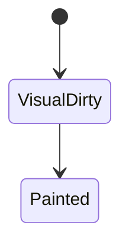

# Repaint

<TopicMeta />

<Prerequisites />

::: tip Published
This page meets the handbook **published** bar: deep explanation, ≥10 common mistakes, and official references. Further engine-level errata welcome via PR.
:::

## Introduction

**Repaint** updates painted output when appearance changes. It may happen **without reflow** (e.g. background color) or **after reflow** when geometry changed. Prefer saying which pipeline stages run rather than using “repaint” vaguely.

## Why does it exist?

Visual updates must reach the screen. Distinguishing repaint from reflow guides optimization.

## Historical Background

Older articles used repaint loosely; modern tooling names Paint / Composite events.

## Mental Model

Appearance-only → paint (+ composite). Geometry → layout + paint + composite.

## Internal Workflow

1. Style invalidation.
2. If geometry affected → layout.
3. Paint dirty regions.
4. Composite.

## Lifecycle



## Browser Perspective

Paint flashing visualizes repaint regions.

## JavaScript Engine Perspective

Not applicable.

## React Perspective

Frequent style toggles can repaint large areas — use CSS states carefully.

## Next.js Perspective

Not applicable.

## Server Perspective

Not applicable.

## Network Perspective

Not applicable.

## Memory Perspective

Not applicable.

## Performance

Reduce paint regions; avoid expensive effects on large layers.

## Production Example

Highlight-on-hover applied box-shadow on a full-row table cell causing wide paints; reduced effect to a small accent.

## Code Examples

```css
.row:hover { background: #f5f5f5; } /* repaint-focused */
```

## Diagrams

```mermaid
flowchart TD
  change[Visual change] --> style[Style]
  style --> layout{Geometry?}
  layout -->|yes| lay[Layout]
  layout -->|no| paint[Paint]
  lay --> paint --> comp[Composite]
```

## Common Mistakes

1. Using repaint as a synonym for any jank
2. Ignoring that “just color” can still be costly on huge layers
3. Not verifying with paint flashing
4. Assuming opacity changes always only composite
5. Confusing browser repaint with React repaint
6. Optimizing paint before measuring
7. Overlooking an edge case #1 specific to 03-browser.repaint in production traffic
8. Overlooking an edge case #2 specific to 03-browser.repaint in production traffic
9. Overlooking an edge case #3 specific to 03-browser.repaint in production traffic
10. Overlooking an edge case #4 specific to 03-browser.repaint in production traffic


## Best Practices

- Measure stages in Performance panel
- Keep animated regions small

## Anti-patterns

- Full-page opacity toggles for modals without isolation

## Comparison

| Event | Includes layout? |
| --- | --- |
| Repaint-only | No |
| Reflow+repaint | Yes |

## Interview Questions

### Easy

**Q:** What is repaint?

**A:** Updating painted pixels/display lists when visuals change.

### Medium

**Q:** Give a change that repaints without reflow.

**A:** Changing `color` or `background-color` with stable geometry.

### Hard

**Q:** When might opacity animation still paint?

**A:** If the element isn’t layerized as expected or descendants force main-thread effects — verify with tooling.

## Summary

- Repaint updates visuals
- May or may not follow reflow
- Use precise stage names when optimizing
- Paint flashing helps

## References

- [web.dev — Rendering performance](https://web.dev/articles/rendering-performance)
- [Chrome DevTools — Rendering](https://developer.chrome.com/docs/devtools/rendering/)

<RelatedTopics />


Prev: [`03-browser.reflow`](/03-browser/reflow/) · Next: [`03-browser.critical-rendering-path`](/03-browser/critical-rendering-path/)
