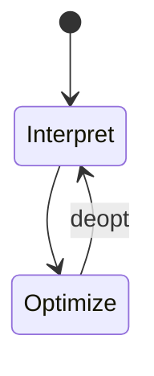

# SpiderMonkey

<TopicMeta />

<Prerequisites />

::: tip Published
This page meets the handbook **published** bar: deep explanation, ≥10 common mistakes, and official references. Further engine-level errata welcome via PR.
:::

## Introduction

**SpiderMonkey** is Mozilla’s JavaScript engine in Firefox. Like V8 it uses tiered compilation and generational GC, but with different IR, optimizers, and performance cliffs. Cross-browser performance work must include Gecko/SpiderMonkey, not only Chromium.

## Why does it exist?

Firefox still holds meaningful share in some locales and among power users. Engine diversity keeps the web from becoming a single-vendor runtime.

## Historical Background

Born in Netscape; oldest continuously developed JS engine. Has shipped TraceMonkey, JägerMonkey, IonMonkey, Warp, etc., reflecting the ongoing JIT arms race.

## Mental Model

Same ECMAScript semantics, different implementation: parse → bytecode/baseline → optimizing tier → GC. Never assume V8-only tricks.

## Internal Workflow

1. Parse/emit bytecode.
2. Execute with profiling.
3. Optimize hot paths (Warp/Ion lineage depending on version).
4. GC as needed.

## Lifecycle



## Browser Perspective

Gecko + SpiderMonkey integration differs from Blink + V8 bindings details — DOM perf cliffs can vary.

## JavaScript Engine Perspective

Test JS-heavy features in Firefox Nightly when optimizing.

## React Perspective

Same React code; different allocation/JIT behavior — verify animations and large lists in Firefox.

## Next.js Perspective

Not applicable.

## Server Perspective

Not applicable.

## Network Perspective

Not applicable.

## Memory Perspective

Not applicable.

## Performance

Validate with Firefox Profiler, not only Chrome Performance.

## Production Example

A wasm+JS hybrid ran well in Chrome but regressively allocated in Firefox; fixed by reducing boundary crossings.

## Code Examples

```js
// Prefer standards-compliant JS; avoid engine-specific intrinsics in app code
```

## Diagrams


## Common Mistakes

1. Chromium-only performance sign-off
2. Assuming Identical JIT heuristics
3. Ignoring Firefox Profiler
4. Using nonstandard extensions
5. Forgetting ESR vs rapid-release differences
6. Equating SpiderMonkey with Rhino/Nashorn
7. Overlooking an edge case #1 specific to 03-browser.spidermonkey in production traffic
8. Overlooking an edge case #2 specific to 03-browser.spidermonkey in production traffic
9. Overlooking an edge case #3 specific to 03-browser.spidermonkey in production traffic
10. Overlooking an edge case #4 specific to 03-browser.spidermonkey in production traffic


## Best Practices

- Include Firefox in perf budgets for JS-heavy apps
- File reduced test cases when engines disagree

## Anti-patterns

- User-agent targeting for “perf hacks” without measuring

## Comparison

| Engine | Browser |
| --- | --- |
| SpiderMonkey | Firefox |
| V8 | Chromium |
| JSC | Safari |

## Interview Questions

### Easy

**Q:** Which browser uses SpiderMonkey?

**A:** Firefox (Gecko).

### Medium

**Q:** Why care if you develop mainly on Chrome?

**A:** Users and semantics/performance differ; the web is multi-engine.

### Hard

**Q:** What should you do when a optimization helps V8 but hurts SM?

**A:** Prefer clearer algorithms, measure both, avoid ultra-narrow JIT tuning unless the hotspot is proven and stable.

## Summary

- SpiderMonkey powers Firefox JS
- Tiered JIT + GC like peers
- Always verify multi-engine
- Use Firefox Profiler

## References

- [SpiderMonkey docs](https://spidermonkey.dev/)
- [Firefox Profiler](https://profiler.firefox.com/)

<RelatedTopics />


Prev: [`03-browser.v8`](/03-browser/v8/) · Next: [`03-browser.javascriptcore`](/03-browser/javascriptcore/)
