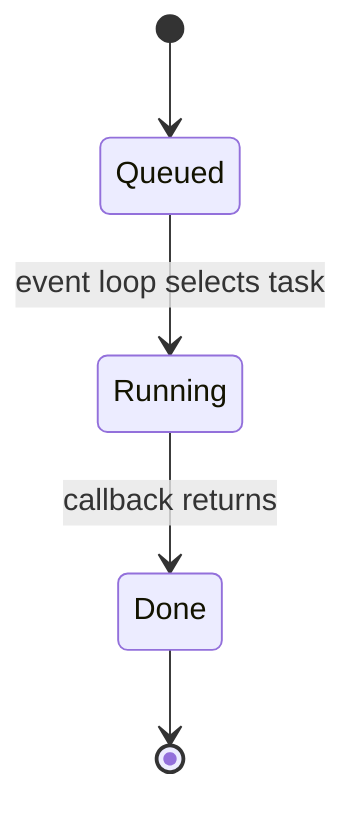
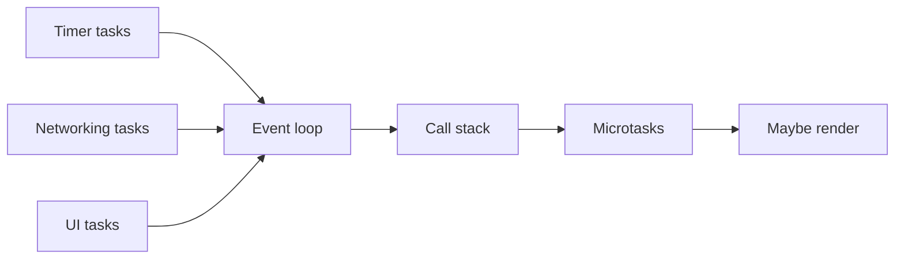

# Task Queue

<TopicMeta />

<Prerequisites />

::: tip Published
This page meets the handbook **published** bar: deep explanation, ≥10 common mistakes, and official references. Further engine-level errata welcome via PR.
:::

## Introduction

A **task queue** (HTML: queues of tasks from **task sources**) holds callbacks that are not microtasks: timer completions, DOM events, networking `load` callbacks, `message` events, history traversal, and more. The [event loop](/03-browser/event-loop/) picks an oldest runnable task, runs it to completion on the [call stack](/03-browser/call-stack/), then performs a microtask checkpoint.

Colloquially people say “macrotask queue”; the HTML Standard models **multiple queues** and fair selection across **task sources**.

## Why does it exist?

JavaScript cannot interrupt itself mid-function on the same thread. Asynchronous host events must be **recorded** and run later. Task queues provide that buffer with ordering guarantees inside a source and integration with rendering.

## Historical Background

`setTimeout` (early browsers), then XMLHttpRequest callbacks, then the HTML Standard’s formal task/microtask model. Node.js has a different phase-based loop (timers, poll, check, …) — similar idea, different rules.

## Mental Model

Multiple inbox trays in an office:

- **Timer tray**, **I/O tray**, **user-interaction tray**, etc.
- Each tray is FIFO for its source.
- The event loop picks a tray that has work (browsers avoid starving sources).
- One letter (task) is processed fully before microtasks and before the next letter.

`setTimeout(fn, 0)` means “queue `fn` as a timer task after the delay,” not “run before Promises.”

## Internal Workflow

1. Host event occurs (timer fires, packet completes, click).
2. Browser creates a **task** with a callback and queues it on the appropriate task source’s queue.
3. When the event loop is ready, it selects a task and runs it.
4. After the task, **microtask checkpoint** runs to completion.
5. Rendering may occur (rendering event loops).
6. Repeat.

## Lifecycle



A task is **queued → running → completed**. Cancellation (`clearTimeout`, `AbortSignal`) removes or ignores work before or during handling.

## Browser Perspective

Chromium schedules tasks on the renderer main thread. DevTools shows them as Task / Event / Timer Fired. Priority and coalescing (e.g. repeated mousemove) are browser optimizations within the HTML model.

## JavaScript Engine Perspective

The engine only executes when the embedder runs a task. V8 does not invent timer queues — Chrome/Node do.

## React Perspective

Discrete events (click) are tasks. React 18 input handling and `flushSync` interact with these turns. Effects scheduled after paint are not microtasks.

## Next.js Perspective

Not applicable.

## Server Perspective

Not applicable.

## Network Perspective

Fetch completion posts a task to resolve the Promise (then microtasks run `then` handlers). Multiplexing does not merge JS turns.

## Memory Perspective

A queued task retains its closure. `setInterval` without clear is a classic leak/retain pattern.

## Performance

- Task delay = queue latency + long tasks ahead of you.
- Too many fine-grained timer tasks add scheduling overhead; batch DOM updates.
- Use `requestAnimationFrame` for visual data, not `setTimeout(…, 16)`.

## Production Example

An analytics SDK fires `setTimeout(send, 0)` on every click. Under load, thousands of timer tasks delay input handlers. Fix: coalesce sends with one trailing timer or `requestIdleCallback`.

## Code Examples

```js
console.log('A')
setTimeout(() => console.log('C timer task'), 0)
Promise.resolve().then(() => console.log('B microtask'))
console.log('A2')
// A, A2, B, C
```

```js
// Two task sources: timer vs message
const ch = new MessageChannel()
ch.port1.onmessage = () => console.log('message task')
setTimeout(() => console.log('timer task'), 0)
ch.port2.postMessage(null)
```

## Diagrams



## Common Mistakes

1. Calling the task queue “the event loop”
2. Assuming a single global FIFO for all async callbacks including Promises
3. Expecting `setTimeout(0)` to beat microtasks
4. Ignoring that browsers may have multiple task queues/sources
5. Queueing unbounded tasks without backpressure
6. Confusing Node phases with HTML task sources
7. Overlooking an edge case #1 specific to 03-browser.task-queue in production traffic
8. Overlooking an edge case #2 specific to 03-browser.task-queue in production traffic
9. Overlooking an edge case #3 specific to 03-browser.task-queue in production traffic
10. Overlooking an edge case #4 specific to 03-browser.task-queue in production traffic


## Best Practices

- Name the task source when debugging order bugs
- Cancel obsolete timers when components unmount
- Prefer one scheduled flush over N timeouts
- Read HTML “task source” docs for subtle APIs (postMessage, sequencing)

## Anti-patterns

- Timer-based polling when events/observers exist
- Nested setTimeout pyramids instead of async functions
- Relying on exact interleaving across unrelated sources

## Comparison

| Queue | Examples | Drained |
| --- | --- | --- |
| Task queues | timers, input, networking | One task per turn |
| Microtask queue | Promise, queueMicrotask | Fully, after each task |
| rAF callbacks | visual frames | During rendering update |

## Interview Questions

### Easy

**Q:** What is a task queue?

**A:** A FIFO structure where the browser places macrotasks (timers, events, I/O callbacks) until the event loop runs them.

### Medium

**Q:** Does the HTML Standard have one task queue?

**A:** It defines task sources and queues; the event loop selects among runnable tasks, so modeling “one giant queue” is an oversimplification.

### Hard

**Q:** How would you delay work until after the next paint?

**A:** Typically double rAF, or `requestAnimationFrame` then schedule, depending on need — not `setTimeout(0)`, which does not guarantee post-paint.

## Summary

- Task queues hold macrotasks from host APIs
- One task runs, then microtasks drain
- Multiple task sources prevent simplistic FIFO assumptions
- Timers are tasks; Promises are microtasks

## References

- [HTML Standard — Task queues & event loops](https://html.spec.whatwg.org/multipage/webappapis.html#event-loops)
- [MDN — Event loop](https://developer.mozilla.org/en-US/docs/Web/JavaScript/Event_loop)
- [Jake Archibald — Tasks, microtasks, queues and schedules](https://jakearchibald.com/2015/tasks-microtasks-queues-and-schedules/)

<RelatedTopics />


Prev: [`03-browser.call-stack`](/03-browser/call-stack/) · Next: [`03-browser.event-loop`](/03-browser/event-loop/)
