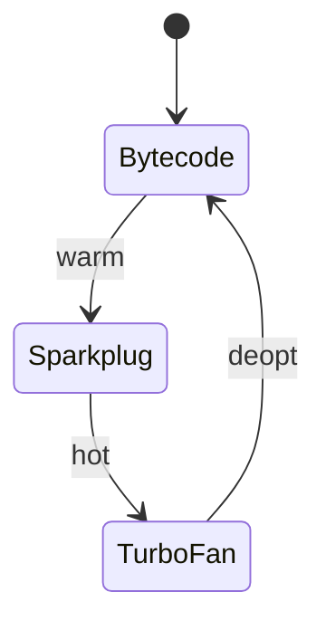
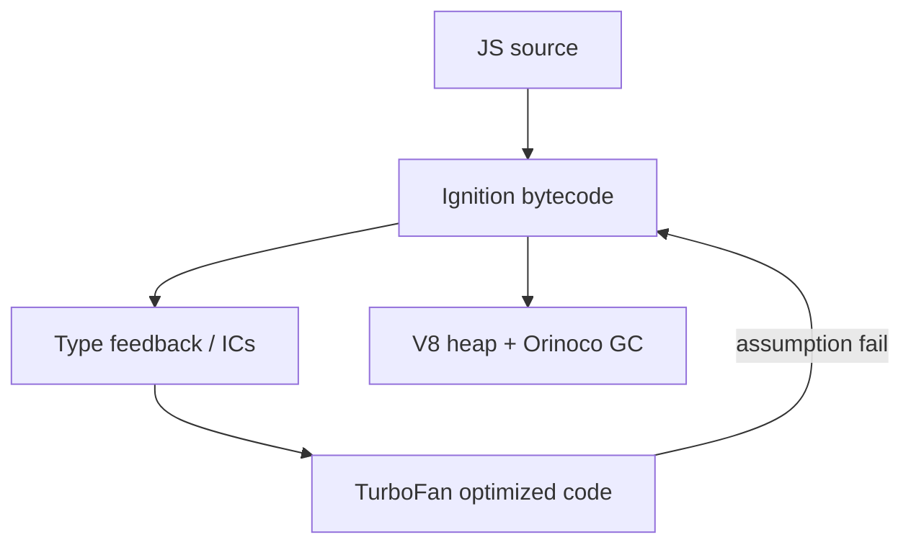

# V8

<TopicMeta />

<Prerequisites />

::: tip Published
This page meets the handbook **published** bar: deep explanation, ≥10 common mistakes, and official references. Further engine-level errata welcome via PR.
:::

## Introduction

**V8** is Google’s open-source JavaScript and WebAssembly engine used in Chromium and Node.js. For frontend engineers, V8 explains why some JS is fast, why megamorphic code hurts, and how GC pauses show up in traces. Pipeline headline: **Ignition** (interpreter/bytecode) + **TurboFan** (optimizing compiler), with **Sparkplug**/Maglev tiers in modern versions, and **Orinoco** garbage collection.

## Why does it exist?

Browsers need a high-performance ECMAScript implementation. V8’s design goals: quick startup, strong peak performance, tight integration with Blink’s bindings.

## Historical Background

Launched with Chrome 2008, disrupting interpreter-only norms. Has rewritten compilers multiple times (Crankshaft → TurboFan; Full-codegen → Ignition). Continuous GC and pointer compression improvements followed.

## Mental Model

Source → **parse** → **Ignition bytecode** → execute while collecting **feedback** → compile hot functions with **TurboFan** using speculative types → **deopt** if wrong → heap managed by generational GC (young/old) with concurrent/parallel phases.

## Internal Workflow

1. Script streaming/parsing (may parse idle).
2. Bytecode generation; lazy inner functions.
3. Inline caches (ICs) record shapes/types at call sites.
4. Hot functions optimized; OSR possible.
5. GC scavenges young generation; marking/sweeping old space concurrently when possible.

## Lifecycle



## Browser Perspective

V8 lives in the renderer; Blink exposes DOM as C++ objects with JS wrappers. Detached DOM + JS refs = leaks.

## JavaScript Engine Perspective

This topic *is* the engine deep dive for Chromium/Node.

## React Perspective

Large component trees allocate many objects; Concurrent features + fewer commits reduce churn. React Compiler aims to cut needless re-renders/allocs.

## Next.js Perspective

Node server uses V8 too — CPU profiles on server differ from field Chrome versions.

## Server Perspective

Not applicable.

## Network Perspective

Not applicable.

## Memory Perspective

Heap snapshots in DevTools are V8 heaps. Retainer paths matter more than “who allocated.”

## Performance

Minimize main-thread JS; avoid megamorphic ICs in hot loops; watch allocation rate; prefer monomorphic call sites; don’t fight the JIT with tiny micro-benches in isolation.

## Production Example

A reducer recreated deeply nested new objects every keystroke → GC + deopts. Structured persistent updates + debounce fixed INP.

## Code Examples

```js
// Hidden class / shape intuition
function Point(x, y) { this.x = x; this.y = y }
const a = new Point(1, 2)
const b = new Point(3, 4) // same shape — good
// a.z = 9 // shape transition — can hurt if done inconsistently
```

## Diagrams



## Common Mistakes

1. Treating V8 blog microbenchmarks as universal truths
2. Using `delete` on hot objects casually
3. Assuming `arguments` object is free in modern engines (still be careful)
4. Ignoring that Node and Chrome V8 versions diverge
5. Confusing DevTools “Performance” with “Memory” tools
6. Believing TypeScript types influence V8
7. Optimizing before profiling
8. Overlooking an edge case #1 specific to 03-browser.v8 in production traffic
9. Overlooking an edge case #2 specific to 03-browser.v8 in production traffic
10. Overlooking an edge case #3 specific to 03-browser.v8 in production traffic


## Best Practices

- Profile with Chromium Performance + V8 logs when needed
- Keep object shapes consistent in hot paths
- Ship less JS; parsing matters
- Use heap snapshots for leaks

## Anti-patterns

- `eval` / `with` in hot paths
- Polymorphic megamorphic APIs in animation frames

## Comparison

| Tier (concept) | Role |
| --- | --- |
| Ignition | Fast start bytecode |
| Sparkplug/Maglev | Mid tiers (version-dependent) |
| TurboFan | Peak optimizing compiler |

## Interview Questions

### Easy

**Q:** Where does V8 run?

**A:** Chromium browsers and Node.js (and others embedding V8).

### Medium

**Q:** What are Ignition and TurboFan?

**A:** Ignition interprets bytecode; TurboFan produces optimized machine code for hot functions.

### Hard

**Q:** How do inline caches speed property access?

**A:** ICs remember where a property lives for a given object shape so subsequent accesses skip full dictionary lookups — until the shape diverges (megamorphic).

## Summary

- V8: Ignition + optimizing tiers + GC
- Shapes and ICs drive property performance
- Deopts happen when speculation fails
- Profile real user engines/versions

## References

- [V8 documentation](https://v8.dev/docs)
- [V8 blog](https://v8.dev/blog)
- [Chrome DevTools — Memory](https://developer.chrome.com/docs/devtools/memory-problems/)

<RelatedTopics />


Prev: [`03-browser.javascript-engine`](/03-browser/javascript-engine/) · Next: [`03-browser.spidermonkey`](/03-browser/spidermonkey/)
