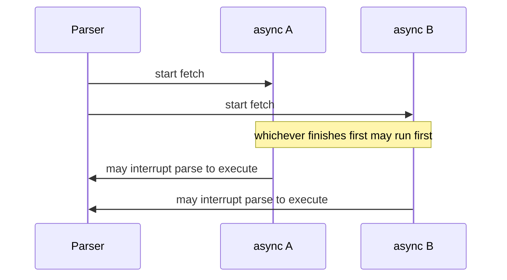
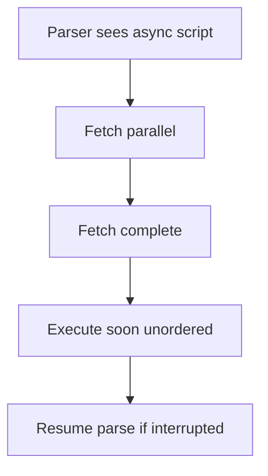

# async

<TopicMeta />

<Prerequisites />

::: tip Published
This page meets the handbook **published** bar: deep explanation, ≥10 common mistakes, and official references. Further engine-level errata welcome via PR.
:::

## Introduction

**`async`** on a classic external script means: download without blocking the HTML parser, then execute **as soon as the script is available**, interrupting parsing if it is still ongoing. Among multiple `async` scripts, **execution order is not guaranteed**.

## Why does it exist?

Independent tags (analytics, ads, non-critical widgets) should not serialize the parser or each other. `async` expresses “run when ready; I don’t depend on siblings.”

## Historical Background

Standardized with HTML5 loading attributes. Modules use `async` differently (for classic scripts vs dynamic import timing)—know which element type you annotate.

## Mental Model

`async` = **fire-and-forget scheduling**. If script B needs script A’s globals, do **not** use `async` on both. Use `defer`, modules, or bundling.

## Internal Workflow

1. Identify truly independent classic scripts.
2. Mark them `async`.
3. Guard usage: feature-detect globals, queue callbacks.
4. Never put payment/checkout critical path on unordered async without coordination.

## Lifecycle



## Browser Perspective

Async scripts can execute mid-parse, so DOM below the tag may be incomplete. Performance traces show execute bursts between parse chunks.

## JavaScript Engine Perspective

Same as any script once running; scheduling is the HTML loader’s job.

## React Perspective

Third-party snippets often request `async`. Isolate them from hydration-critical code.

## Next.js Perspective

`next/script` `lazyOnload` / `afterInteractive` approximate late strategies; still verify vendor requirements.

## Server Perspective

CSP `script-src` must allow the hosts; `async` does not relax CSP.

## Network Perspective

Many async third parties = many connections/contention. Consider partytown/workers or facades for ads.

## Memory Perspective

Third-party async scripts often retain trackers globally—audit long-lived listeners.

## Performance

Helps parser throughput vs blocking, but execution can still jank. Prefer loading after idle for non-critical tags.

## Production Example

Marketing added three pixels as `async`. Checkout randomly broke when a pixel redefined `$!`. Fix: sandbox vendors, don’t share globals, keep critical scripts deferred/modules.

## Code Examples

```html
<script src="https://cdn.example.com/pixel.js" async></script>
```

```js
// defensive: don't assume order vs other async tags
window.dataLayer = window.dataLayer || []
```

## Diagrams



## Common Mistakes

1. Using async for dependent classic scripts that need order
2. Assuming DOM below the tag exists when async runs early
3. Treating async as “non-main-thread” (it still runs on main thread)
4. Async-loading a script that calls document.write
5. Confusing async on classic scripts with async on module scripts
6. Too many async third parties thrashing main thread
7. Missing a production edge case for 04-html.async (#1)
8. Missing a production edge case for 04-html.async (#2)
9. Missing a production edge case for 04-html.async (#3)
10. Missing a production edge case for 04-html.async (#4)


## Best Practices

- Reserve async for independent classic scripts
- Prefer modules + bundling for first-party code
- Facade heavy third parties until interaction
- Monitor long tasks from vendors

## Anti-patterns

- Async everything and praying races go away
- Critical security/payment logic in unordered async tags
- Injecting async scripts that mutate shared prototypes

## Comparison

| | `async` | `defer` |
| --- | --- | --- |
| Order | Not preserved | Preserved |
| Typical use | Independent tags | Ordered classic app code |
| Mid-parse execute | Yes possible | After parse |

## Interview Questions

### Easy

**Q:** Does `async` preserve script order?

**A:** No. Scripts run when each finishes downloading.

### Medium

**Q:** Can an `async` script run before the DOM finished parsing?

**A:** Yes—if fetch completes early, it can interrupt parsing and run.

### Hard

**Q:** When would you choose `async` over `defer` for a vendor script?

**A:** When it has no ordering needs vs other scripts and you want earliest execution after download; if it must run after DOM parse in a stable order, use `defer` or a loader API.

## Summary

- async = unordered execute-when-ready for classic scripts
- Great for independent tags; dangerous for dependencies
- Still main-thread JS
- Modules remain the better first-party default

## References

- [MDN: script async](https://developer.mozilla.org/en-US/docs/Web/HTML/Element/script#async)
- [HTML Living Standard — async](https://html.spec.whatwg.org/multipage/scripting.html#attr-script-async)

<RelatedTopics />

Prev: [defer](/04-html/defer/) · Next: [Module Scripts](/04-html/module-scripts/)
