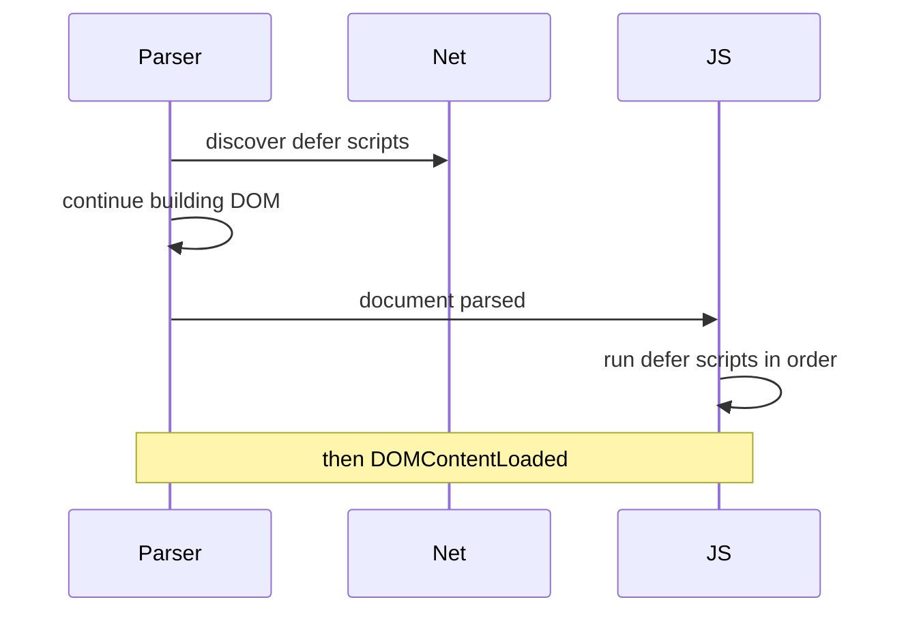
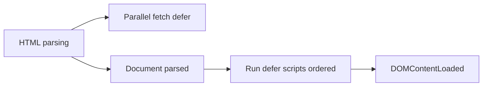

# defer

<TopicMeta />

<Prerequisites />

::: tip Published
This page meets the handbook **published** bar: deep explanation, ≥10 common mistakes, and official references. Further engine-level errata welcome via PR.
:::

## Introduction

**`defer`** on a classic external `<script src defer>` tells the browser: download in parallel with parsing, then execute **after** the document is parsed, **in document order** relative to other deferred classic scripts. It does not apply to `type="module"` (modules are already deferred-like).

## Why does it exist?

You often need scripts that assume a complete DOM (or relative order among files) without blocking first paint on fetch+execute. `defer` is that contract for classic scripts.

## Historical Background

`defer` existed in older IE behavior and was standardized with clearer semantics in HTML5. Modules later made “defer by default” the modern path for apps.

## Mental Model

Think **pipeline**: parse HTML ⟷ fetch deferred scripts → DOMContentLoaded-adjacent execution in order → then other work. Deferred scripts run before `DOMContentLoaded` fires (they can still delay it).

## Internal Workflow

1. Mark ordered classic dependencies with `defer`.
2. Keep them external (`defer` ignored on inline classic scripts without `src` in useful ways—use external).
3. Do not assume `async` ordering.
4. Migrate first-party code to modules when possible.

## Lifecycle



## Browser Perspective

Visible in Network + Performance: fetches overlap parse; execution stack appears after `Parse HTML` completes for the document.

## JavaScript Engine Perspective

Execution is still main-thread JS. Deferring fixes scheduling relative to parse, not the cost of the script itself.

## React Perspective

Bundlers usually emit module scripts; `defer` matters more for legacy classic bundles and some third parties.

## Next.js Perspective

Prefer `next/script` strategies; understanding `defer` helps debug injected classic tags.

## Server Perspective

HTML must include the `defer` attribute in the bytes; CDN-transformed HTML should not strip it.

## Network Perspective

Deferred scripts still compete for bandwidth—prioritize critical CSS first.

## Memory Perspective

Same as any script evaluation; ordering doesn’t change heap by itself.

## Performance

Great for moving classic JS off the parser-critical path. Still split large deferred bundles to protect INP.

## Production Example

A legacy jQuery + plugins stack switched from blocking footer hacks to `defer` in head order. DOM-ready plugins initialized reliably; FCP improved versus blocking head scripts.

## Code Examples

```html
<script src="/vendor.js" defer></script>
<script src="/app.js" defer></script>
<!-- app.js can assume vendor.js ran first -->
```

```js
// safe under defer: body nodes above exist
document.querySelector('#app').textContent = 'ready'
```

## Diagrams



## Common Mistakes

1. Expecting `defer` on inline scripts without `src` to work like external defer
2. Mixing `async` and `defer` and assuming a single global order
3. Putting `defer` on `type="module"` as if it changes module semantics meaningfully
4. Assuming deferred scripts run after `window.onload` (they run earlier)
5. Huge deferred bundles that still block DCL for too long
6. Reordering tags without realizing defer preserves document order
7. Missing a production edge case for 04-html.defer (#1)
8. Missing a production edge case for 04-html.defer (#2)
9. Missing a production edge case for 04-html.defer (#3)
10. Missing a production edge case for 04-html.defer (#4)


## Best Practices

- Use defer for ordered classic dependency chains
- Prefer modules for new code
- Keep deferred work short before DCL-sensitive UX
- Document script order in the HTML shell

## Anti-patterns

- Blocking scripts “just to be safe”
- Racey feature detection across async tags
- Injecting deferred scripts dynamically and assuming the same guarantees without care

## Comparison

| Attribute | When runs | Order |
| --- | --- | --- |
| (none) | Immediately, blocks parse | Document order |
| `defer` | After parse | Preserved |
| `async` | On fetch complete | Not preserved |

## Interview Questions

### Easy

**Q:** What does `defer` guarantee?

**A:** Parallel download and execution after document parsing, in order among deferred classic scripts.

### Medium

**Q:** Does `defer` wait for images/`load`?

**A:** No. It waits for document parse, not full resource `load`.

### Hard

**Q:** How do deferred scripts interact with `DOMContentLoaded`?

**A:** Deferred scripts run before DCL; slow deferred JS delays DCL listeners.

## Summary

- defer = parallel fetch + post-parse ordered run
- Classic-script tool; modules already defer-like
- Still costs main-thread time at execution
- Prefer modules for modern apps

## References

- [MDN: script defer](https://developer.mozilla.org/en-US/docs/Web/HTML/Element/script#defer)
- [HTML Living Standard — defer](https://html.spec.whatwg.org/multipage/scripting.html#attr-script-defer)

<RelatedTopics />

Prev: [Scripts](/04-html/scripts/) · Next: [async](/04-html/async/)
