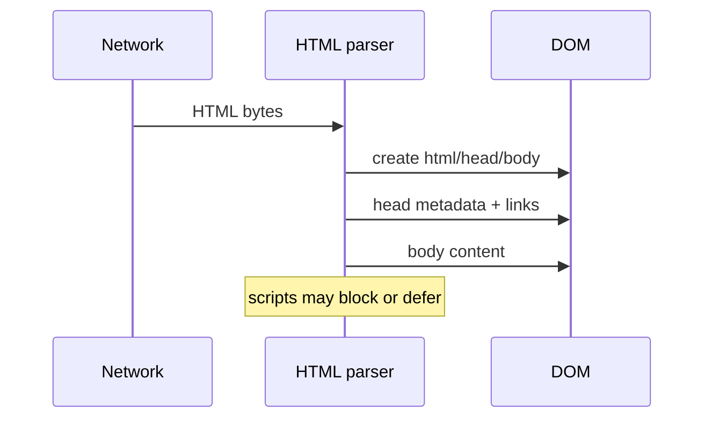
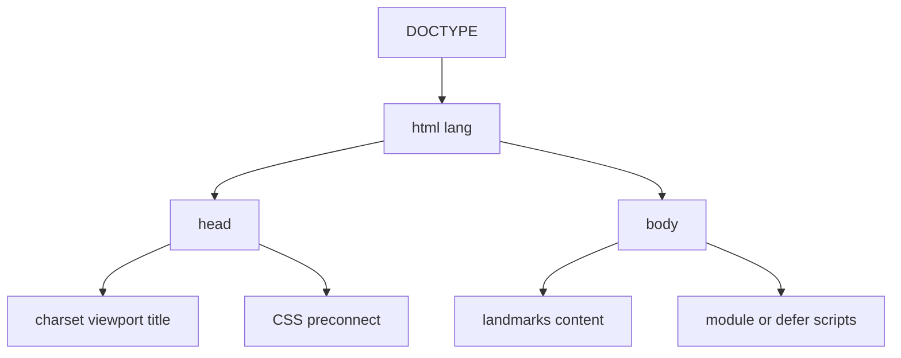

# Document Structure

<TopicMeta />

<Prerequisites />

::: tip Published
This page meets the handbook **published** bar: deep explanation, ≥10 common mistakes, and official references. Further engine-level errata welcome via PR.
:::

## Introduction

**Document structure** is the skeleton every page shares: `<!DOCTYPE html>`, `<html>`, `<head>` (metadata and resources), and `<body>` (rendered content). The HTML parser builds the DOM from this shape; mistakes here affect encoding, styling, scripting order, and SEO.

## Why does it exist?

Without a correct document shell, browsers enter quirks mode, mis-detect encoding, or block rendering on scripts in the wrong place. A predictable structure lets teams share layouts, inject metadata consistently, and reason about parse → style → script timing.

## Historical Background

SGML-era HTML required strict nesting; browsers became famously forgiving (“tag soup”). HTML5 defined a precise tokenization/tree-construction algorithm so recovery is interoperable. The Living Standard still centers on `html`/`head`/`body` even when tags are omitted in the source—the parser invents them.

## Mental Model

Imagine three layers:

1. **Shell** — doctype + root language/dir
2. **Head** — non-visible setup (charset, viewport, title, CSS, preconnect)
3. **Body** — visible tree, scripts at controlled points

The parser reads top-to-bottom; early head resources influence first paint; body scripts can block unless `defer`/`async`/modules are used.

## Internal Workflow

1. Emit doctype and `<html lang="...">`.
2. Put `<meta charset="utf-8">` within the first 1024 bytes.
3. Add viewport, title, canonical/social meta as needed.
4. Link critical CSS; prefetch/preconnect origins you will use.
5. Render body content; place classic scripts with `defer` or use `type="module"`.

## Lifecycle



## Browser Perspective

The HTML parser in the renderer process builds the DOM incrementally (speculative parsing may continue prefetching while a classic blocking script runs). View Source shows bytes; Elements shows the post-parse tree (with implied tags).

## JavaScript Engine Perspective

JS only sees the DOM after nodes exist. Scripts without `defer`/`async` run immediately when encountered, pausing tree construction. Modules are deferred by default.

## React Perspective

Frameworks still emit a document shell on SSR. Client-only roots hydrate inside `body`; don’t forget `lang`, title, and meta in the server template or Metadata APIs.

## Next.js Perspective

Next.js `app/layout.tsx` owns the shell (`html`/`body`). Use the Metadata API for head tags instead of manual `<head>` hacks in random components.

## Server Perspective

CDNs and origin servers deliver the shell HTML. Compression (gzip/br) and TTFB dominate first-byte; the shell should stay lean.

## Network Perspective

Document request is usually the critical path’s first RTT. Early hints / HTTP/2 push alternatives (`Link` preload) can warm critical assets referenced from head.

## Memory Perspective

The document owns the node tree. Detached trees from abandoned SPA roots cause leaks if listeners remain—structure teardown on navigation matters.

## Performance

Keep head lean: charset + viewport + critical CSS + necessary preconnects. Avoid megabytes of blocking CSS/JS in the shell. Measure with Web Vitals (FCP/LCP).

## Production Example

A multi-brand site centralized doctype, `lang`, charset, and viewport in one layout partial. Encoding bugs on localized titles disappeared; Lighthouse “charset” and “viewport” audits went green across brands.

## Code Examples

```html
<!DOCTYPE html>
<html lang="en">
  <head>
    <meta charset="utf-8" />
    <meta name="viewport" content="width=device-width, initial-scale=1" />
    <title>Handbook</title>
    <link rel="stylesheet" href="/assets/app.css" />
  </head>
  <body>
    <main id="main"><!-- content --></main>
    <script type="module" src="/assets/app.js"></script>
  </body>
</html>
```

## Diagrams



## Common Mistakes

1. Omitting charset early → mojibake on non-ASCII titles
2. Forgetting viewport → broken mobile layout
3. Putting large blocking scripts in `<head>` without defer/async
4. Invalid nesting that relies on browser “fixup” differently across engines
5. Multiple or missing `<title>` affecting SEO and tabs
6. Declaring XHTML-style self-closing habits that confuse teammates (HTML is not XML)
7. Missing a production edge case for 04-html.document-structure (#1)
8. Missing a production edge case for 04-html.document-structure (#2)
9. Missing a production edge case for 04-html.document-structure (#3)
10. Missing a production edge case for 04-html.document-structure (#4)


## Best Practices

- Always set `lang` on `<html>`
- Charset in the first 1024 bytes
- One coherent layout shell for the whole app
- Prefer modules or defer for app JS

## Anti-patterns

- Copy-pasting different shells per page with drifting meta tags
- Injecting CSS via huge inline style blocks without a strategy
- Document.write hacks for loading scripts

## Comparison

| Approach | Strength | Weakness |
| --- | --- | --- |
| Static shell + progressive JS | Predictable parse | Less dynamic head |
| Framework Metadata APIs | Per-route titles/meta | Must learn framework rules |
| Client-only SPA shell | Flexible | Weak first HTML for SEO/AT |

## Interview Questions

### Easy

**Q:** What does `<!DOCTYPE html>` do?

**A:** It puts standards-mode parsing/layout on modern browsers so you avoid quirks mode from legacy HTML.

### Medium

**Q:** Why must charset appear early in `head`?

**A:** Encoding is sniffed from the first bytes; late charset can mis-decode content already buffered.

### Hard

**Q:** How do classic blocking scripts interact with HTML parsing?

**A:** When the parser hits a blocking script, tree construction pauses until fetch+execute finish (though preload scanners may still fetch ahead). `defer`/`async`/modules change that scheduling.

## Summary

- Shell = doctype + html + head + body
- Head configures decoding, viewport, and critical resources
- Parse order governs when CSS/JS apply
- Frameworks still sit on this document model

## References

- [HTML Living Standard — Document](https://html.spec.whatwg.org/multipage/semantics.html#the-html-element)
- [MDN: Structuring the web](https://developer.mozilla.org/en-US/docs/Learn/HTML/Introduction_to_HTML/Document_and_website_structure)

<RelatedTopics />

Prev: [Semantic HTML](/04-html/semantic-html/) · Next: [Forms](/04-html/forms/)
