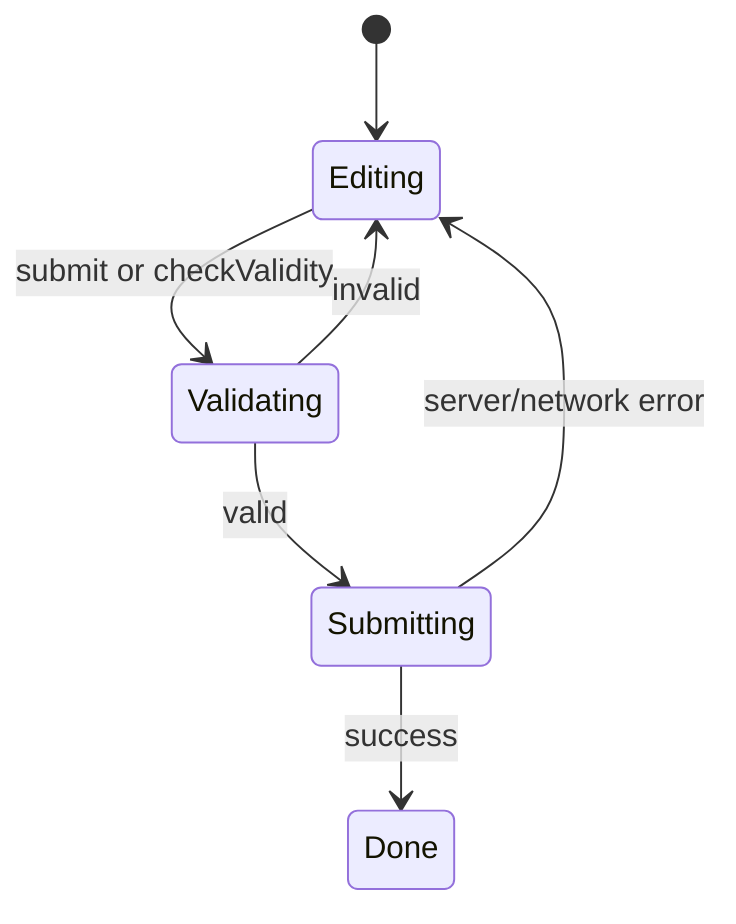
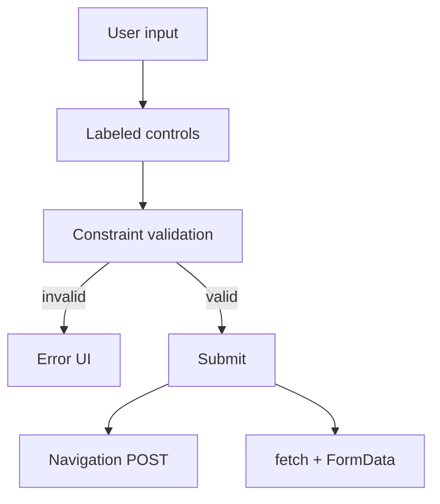

# Forms

<TopicMeta />

<Prerequisites />

::: tip Published
This page meets the handbook **published** bar: deep explanation, ≥10 common mistakes, and official references. Further engine-level errata welcome via PR.
:::

## Introduction

**Forms** collect user input through controls (`input`, `select`, `textarea`, `button`) associated with labels, grouped in `<form>`. The platform provides keyboard UX, constraint validation, serialization (`FormData`), and submit semantics (method, action, enctype).

## Why does it exist?

Custom “div forms” reimplement focus order, validation messaging, Enter-to-submit, and autofill poorly. Native forms integrate with password managers, accessibility APIs, and progressive enhancement (work without JS).

## Historical Background

Forms date to early HTML. HTML5 added types (`email`, `url`, `number`, `date`), constraint validation API, and `form` attribute for controls outside the form element. Frameworks layered controlled components on top without replacing the underlying model.

## Mental Model

A form is a **named set of controls** with:

- **Identity** — `name` keys in submission payloads
- **Labels** — accessible names via `<label for>` / wrapping
- **Constraints** — `required`, `pattern`, `min`/`max`, custom validity
- **Submission** — navigate or `fetch` with `FormData`

JS should enhance validation UX, not be the only gate.

## Internal Workflow

1. Wrap controls in `<form>` with explicit `method`/`action` or JS submit handler.
2. Wire labels; group with `fieldset`/`legend` when related.
3. Choose the right `type` and inputmode for mobile keyboards.
4. Use built-in constraints; mirror errors visibly and with `aria-describedby`.
5. On submit: `preventDefault` only if handling via `fetch`; otherwise allow navigation.

## Lifecycle



## Browser Perspective

Browsers show native validation UI unless `novalidate` or custom handling is used. Autofill uses `name`/`autocomplete` tokens. DevTools can reveal constraint validity state.

## JavaScript Engine Perspective

Form APIs are Web IDL on DOM objects. JS reads `form.elements`, listens to `input`/`change`/`submit`, and may call `reportValidity()`.

## React Perspective

Controlled inputs sync React state on each keystroke; uncontrolled + `defaultValue` + refs often simpler for large forms. Prefer native form submit + `FormData` over tracking every field unless you need live validation UX.

## Next.js Perspective

Server Actions and `<form action={fn}>` integrate progressive enhancement. Still use labels, names, and progressive validation on both client and server.

## Server Perspective

Always re-validate on the server. Client constraints are UX, not security. CSRF tokens / SameSite cookies apply to cookie-authenticated POSTs.

## Network Perspective

Classic submits are full navigations; `fetch` submits are XHR-like. `multipart/form-data` for files; `application/x-www-form-urlencoded` default for many posts.

## Memory Perspective

Large file inputs hold `File` objects in memory until upload completes—watch retention in SPA state.

## Performance

Avoid re-rendering huge controlled forms on every keypress without need. Debounce async uniqueness checks. Native validation is cheap.

## Production Example

A checkout form used `autocomplete` tokens (`name`, `email`, `cc-number` where appropriate), native `required`, and server-side Zod validation. Password manager fill rates improved; invalid card numbers failed fast before hitting payment APIs.

## Code Examples

```html
<form method="post" action="/api/subscribe">
  <label for="email">Email</label>
  <input id="email" name="email" type="email" required autocomplete="email" />
  <button type="submit">Subscribe</button>
</form>
```

```ts
form.addEventListener('submit', async (e) => {
  e.preventDefault()
  const data = new FormData(e.currentTarget as HTMLFormElement)
  const res = await fetch('/api/subscribe', { method: 'POST', body: data })
  if (!res.ok) throw new Error('Subscribe failed')
})
```

## Diagrams



## Common Mistakes

1. Missing labels (placeholder is not a label)
2. Using `div` + click instead of `button type="submit"`
3. Disabling validation with `novalidate` and forgetting custom messages
4. Wrong or missing `autocomplete` hurting password managers
5. Client-only validation with no server checks
6. Forgetting `enctype="multipart/form-data"` for file uploads
7. Missing a production edge case for 04-html.forms (#1)
8. Missing a production edge case for 04-html.forms (#2)
9. Missing a production edge case for 04-html.forms (#3)
10. Missing a production edge case for 04-html.forms (#4)


## Best Practices

- Associate every control with a visible label
- Use `fieldset`/`legend` for radio groups
- Match `autocomplete` to the field’s purpose
- Surface errors next to fields and in a summary when helpful

## Anti-patterns

- Clearing the whole form on a single field error
- Blocking paste on password fields
- Custom widgets that break mobile keyboards and autofill

## Comparison

| Approach | Strength | Weakness |
| --- | --- | --- |
| Native form + progressive JS | Works without JS | Styling validation UI varies |
| Fully controlled React form | Immediate UI sync | More code, easy to break a11y |
| Form library | Schema + helpers | Abstraction weight |

## Interview Questions

### Easy

**Q:** What does the `name` attribute do on inputs?

**A:** It defines the key used when the form is serialized for submission (`FormData` / URL-encoded fields).

### Medium

**Q:** How does constraint validation interact with `submit`?

**A:** Unless `novalidate` is set, browsers run checkValidity; if invalid, submit is canceled and UI reported. JS can call `reportValidity()` earlier.

### Hard

**Q:** Design a form that works without JavaScript but upgrades to `fetch` when available.

**A:** Provide real `action`/`method`, enhance with `submit` listener + `preventDefault` + `fetch`, keep names stable, mirror server errors into the DOM, preserve focus management.

## Summary

- Forms are a platform feature: labels, constraints, submit
- Names and autocomplete matter for real users
- Validate on server always
- Enhance with JS; do not require it for basics

## References

- [MDN: Web forms](https://developer.mozilla.org/en-US/docs/Learn/Forms)
- [HTML Living Standard — Forms](https://html.spec.whatwg.org/multipage/forms.html)
- [MDN: Constraint validation](https://developer.mozilla.org/en-US/docs/Web/HTML/Constraint_validation)

<RelatedTopics />

Prev: [Document Structure](/04-html/document-structure/) · Next: [Media Elements](/04-html/media-elements/)
